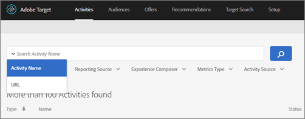
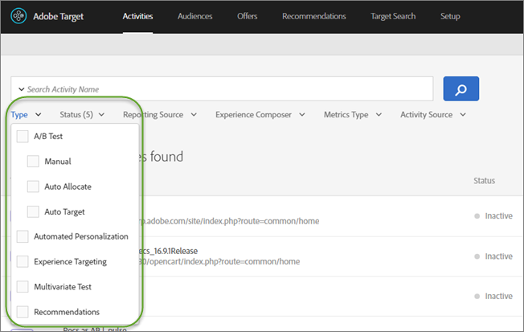
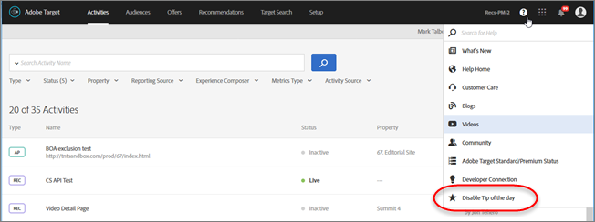

# Activities{#activities}

Activities let you test page designs and target content to specific audiences.

An activity determines the experiences a site visitor might encounter.

For example, you might design an activity that tests two different landing pages, one that highlights information about women's summer shoes, and one that highlights more general summer apparel. The activity determines the conditions that control when each of these landing pages appears, and the metrics that determine which page is more successful. The activity is configured to start and end when specific conditions are met, such as between specific dates, or to start when the activity is approved and to end when it is deactivated.

When designing an activity, you should plan carefully. Determine when the activity will start and how long it will last. Then, list your offers and assign a target audience to each one.

## Activity types

There are several types of activities:

| Activity Type | Description |
|--- |--- |
|[A/B Test](/help/c-activities/t-test-ab/test-ab.md)|A/B Testing compares two or more versions of your Web site content to see which version best improves your conversions during a pre-specified test period.|
|[Auto-Allocate](/help/c-activities/automated-traffic-allocation/automated-traffic-allocation.md)|Auto Allocate identifies a winner among two or more experiences and automatically reallocates more traffic to the winner to increase conversions while the test continues to run and learn.|
|[Auto-Target](/help/c-activities/auto-target-to-optimize.md) (Target Premium) |Auto Target uses advanced machine learning to identify multiple high performing marketer-defined experiences, and serves the most tailored experience to each visitor based on their individual customer profile and the behavior of previous visitors with similar profiles, in order to personalize content and drive conversions.|
|[Using Analytics Data](/help/c-activities/t-test-ab/t-test-create-ab/create-a4t.md)|You can configure an activity to use [!DNL Adobe Analytics] as the reporting source. This activity type requires that you link your  [!DNL Adobe Experience Cloud] account with both [!DNL Analytics] and [!DNL Target].|
|[Multivariate Test](/help/c-activities/c-multivariate-testing/multivariate-testing.md)|Multivariate Testing (MVT) compares combinations of offers in elements on a page to determine which combination performs the best for a specific audience, and identifies which element most impacts the activity's success.|
|[Experience Targeting](/help/c-activities/t-experience-target/experience-target.md)|Experience Targeting (XT) delivers content to a specific audience based on a set of marketer-defined rules and criteria.|
|[Automated Personalization](/help/c-activities/t-automated-personalization/automated-personalization.md) (Target Premium)|Automated Personalization (AP) combines offers or messages, and uses advanced machine learning to match different variations to each visitor based on their individual customer profile, in order to personalize content and drive conversions.|
|[Recommendations](/help/c-recommendations/recommendations.md) (Target Premium)|A recommendation determines how a product is suggested to a website user, depending on that user's activities on the site. For example, you might want to encourage people who purchase a backpack to consider buying hiking shoes and trekking poles. You could create a recommendation that shows items that are often purchased together, using the "People who bought this also bought that" algorithm. Or, you might want to encourage visitors to spend more time on your media site by recommending similar video to the one they are watching, using the "People who viewed this viewed that" algorithm.|

## Activities list {#section_DE8E2DB30D534962A931EF8BB48240F5}

The [!UICONTROL Activities] list provides an overview of all activities.

The Activities list displays the following information:

| Element | Description |
|--- |--- |
|Type|The activity type, such as A/B or MVT.|
|Name|The name of the activity.|
|Objective|The objective appears in lighter text next to the name. If the objective is too long for your screen width, it is truncated.|
|URL|The URL appears in lighter text below the name. The URL for the activity identifies where the activity is displayed. This helps you quickly identify an activity, and determine whether a particular page already has a test running on it. If a test runs on multiple URLs, a link shows how many more URLs are used. Click the link to view the complete list of URLs for that activity. You can search based on URL. Use the drop-down list next to search box and select [!UICONTROL Search URL].|
|Status|The status of the activity can be one of the following:<ul><li>**Live**: The activity is currently running.</li><li>**Draft**: The activity setup has started but the activity is not yet ready to run.</li><li>**Scheduled**: The activity is ready to be activated when the specified start date and time arrives.</li><li>**Inactive**: The activity has been paused or deactivated.</li><li>**Syncing**: The activity has been saved and is being synced to the Target delivery network.</li><li>**Ended**: The specified end date and time of activity has reached and the activity is no longer being served.</li><li>**Archived**: The activity has been archived. You can activate an archived activity to use it again.</li></ul>**Note**: When you perform certain actions, such as activating an activity outside of the UI using API methods, the update can take up to ten minutes to propagate to the UI.|
|Source|Shows where the activity was created:<ul><li>Adobe Target</li><li>Adobe Target Classic</li><li>Adobe Experience Manager (AEM)</li><li>Adobe Mobile Services (AMS)</li></ul>|
|Estimated Lift in Revenue|Shows the predicted increase in revenue if 100% of the audience sees the winning experience. Calculated using the following formula: `(<winning experience> - <control experience>)*<total number of visitors>` This number is rounded to one decimal place, maximum, if the condensed form has only a single digit before the decimal. For example: $1.6M, $60K, $900, $8.5K, $205K This column shows "---" for activities that do not have enough data to call a winner show or do not have a cost estimate. See [Estimating Lift in Revenue](/help/administrating-target/r-target-account-preferences/estimating-lift-in-revenue.md) for more information.|
|Last Updated|The date when the activity was last updated, and by whom.|

Mouse over an activity to see the available actions:

|Action|Description|
| --- | --- |
|Edit|Change the activity. Any activity can be edited. For more information about the various ways you can edit activities, see [Edit an activity or save as draft](/help/c-activities/edit-activity.md).|
|Deactivate|Stop a live or scheduled activity. A deactivated campaign can be reactivated or archived If you deactivate or archive an activity and then later reactivate it, a visitor will continue being a part of that activity after the reactivation if they were in it before it was deactivated or archived. Any conversion metrics recorded during the time between the two events won't be attributed to that activity.|
|Activate|Start an inactive or ready activity.|
|Archive|Send the activity to the archive. By default, archived activities no longer appear in the Activities list. Change the filter for the activities list to include archived activities to see them. You can activate an archived activity to use it again. If you deactivate or archive an activity and then later reactivate it, a visitor will continue being a part of that activity after the reactivation if they were in it before it was deactivated or archived. Any conversion metrics recorded during the time between the two events won't be attributed to that activity.|
|Copy|Copy an activity. Any activity can be copied. Copying an activity creates a new activity with the same name, appended with "Copy." For example, a test called "Browser Offers" is copied to "Browser Offers Copy." Visual offers are copied with the activity. You can safely edit the offers in the copy without impacting the original activity. The only exception is saved offers and images in the Content/Assets folder.|
|Delete|Delete a draft or ready activity. Deleted activities cannot be recovered.|

Note the following details about the Activity list:

* Archived and ended activities do not appear in the [!UICONTROL Activities] list. To view these activities, filter them using the advanced filter settings on left rail. 
* As soon as an activity originally created in [!DNL Target Classic] is deactivated or deleted, it is deleted from [!DNL Target Standard/Premium]. Deleted activities originally created in [!DNL Target Classic] are not sent to the [!UICONTROL Archive] folder in [!DNL Target Standard/Premium]. The archived folder functionality applies only to activities created in [!DNL Target Standard/Premium]. 
* All activity types other than [!UICONTROL Automated Personalization] (AP), [!UICONTROL Auto-Allocate], and [!UICONTROL Auto-Target] give you the choice to use either [!DNL Target] or [!DNL Adobe Analytics] as the data source. [!UICONTROL AP], [!UICONTROL Auto-Allocate], and [!UICONTROL Auto-Target] *always* use [!DNL Target] data. 
* Activities are available to several channels:

    * Web and mobile sites 
    * Internet-connected screens and devices, including kiosks and ATMs 
    * Email and other acquisition channels or partner sites 
    * Mobile apps 
    * Anywhere else you can deliver tagged content

## Sorting and filtering the Activities list {#section_41DAD479FFF740E2BB67BF4825955670}

By default, the list is sorted by the date the activity was last modified, with the most recent on top. However, there are several filtering options to help you customize the list to show the activities you want to see.

### Search

Use the search field to search for activities that match your search criteria.

The search field includes a drop-down menu to help you narrow your search by specifying one of the following search filters: [!UICONTROL Activity Name] and [!UICONTROL URL].

### Activity list filters

You can determine which activities appear in your Activities list by selecting list filters.

You can filter by the following options. In each category, if nothing is selected, the default is All.

| Filter Category | Filter |
|--- |--- |
|Type|A/B Test: A/B Test Manual, Auto-Allocate, and Auto-Target. Automated Personalization Experience Targeting Multivariate test Recommendations|
|Status|Live Draft Scheduled Inactive Syncing Ended Archived|
|Reporting Source|Target Analytics|
|Experience Composer|Visual Form-Based|
|Metrics Type|Conversion Revenue Engagement|
|Activity Source|Adobe Target Adobe Target Classic Adobe Experience Manager Adobe Mobile Services|

### Sort by activity attribute

Click one of the following headings to toggle whether the activities are listed in ascending or descending order according to the selected heading.

* Activity Name 
* Activity Type

## Tips and tricks {#section_F77F30A246A14B538D9363B7F3639F97}

Get the most out of Adobe Target by learning more about various features and see why you should give them a try. The Tips and Tricks feature provides links to videos, use-cases, blogs, documentation, and much more.

The Tips and Tricks feature displays periodically on the Activities list page. After you read or dismiss a tip, it does not display again until the next tip is available. You can optionally disable all tips from displaying by clicking the Help icon > [!UICONTROL Disable Tip of the Day].

## Limitations {#section_049D4684403A4E07B998067EB8E9BE56}

Each Target activity has the following content limitations:

| Item | Limit |
|--- |--- |
|Unique selectors|300  if a selector is repeated in a different experience, it is counted once. However, if it is repeated in the same experience, it is counted again.|
|Offers in each experience|350|
|Click track selectors in metrics|50|
|Mboxes in metrics|50|
|Audiences and locations|50 Audiences and locations (mbox) combination should not be more than 50.|

If you exceed any of these limits, the activity cannot be saved.

Increasing the numbers of these items in your activity also increases the length of time it takes to synchronize the activity across Target.

For additional limits of the Visual Experience Composer, see [Visual Experience Composer Limitations](../c-experiences/c-visual-experience-composer/experience-composer-best-practices.md#section_F33C2EA27F2E417AA036BC199DD6C721).

## Attributes imported into Target for activities updated outside of Target {#section_802B0D174E6A44E1A96F404CA81AAE44}

If activities created in [!DNL Target] are updated from outside of [!DNL Target] (for example, via Adobe I/O), the following activity attributes are imported back into [!DNL Target]:

`thirdpartyId`

`startDate`

`endDate`

`status`

`priority`

`marketingCloudMetadata(remoteModifiedBy)`

This import job will run when the activities page is opened, with a maximum delay of ten minutes. (KB-1526) 

## Training videos {#section_BE80D13A2E81460C885F902010E1AD87}

The following videos contain more information about the concepts discussed in this article.

### Activity Types ((9:03)

This video explains the activity types available in [!DNL Target Standard/Premium].

* Describe the types of activities included in [!DNL Adobe Target] 
* Select the appropriate activity type to achieve your goals 
* Describe the three-step guided workflow that applies to all activity types

>[!VIDEO](https://www.youtube.com/watch?v=vtHg1pPFJp8)

### Managing Activities (5:55)

This video explains how to use the Activities list to manage activities.

* Define the term *activity* 
* Find activities in the Activities list 
* Edit, deactivate, copy, and delete activities

>[!VIDEO](https://www.youtube.com/watch?v=tBSHwZaFhag)