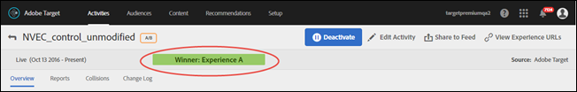
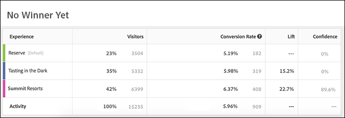
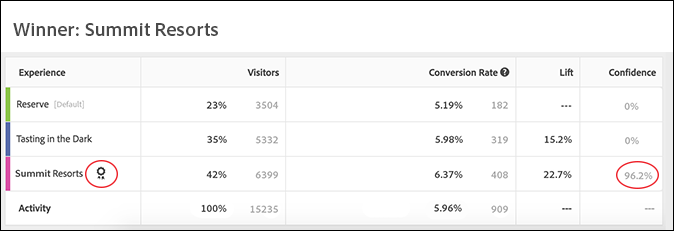

# Determine a winner

Determine a winner in an Auto-Allocate A/B activity by viewing indicators in the Target UI.

Many marketers make the mistake of prematurely declaring a winning experience before the results indicate the clear winner. We've now made it easier for you to determine the winner.

## View the Winner Badge in the Target UI {#section_24007470CF5B4D30A06610CE8DD23CE3}

When using the [!UICONTROL Auto-Allocate] feature, [!DNL Target] displays a badge at the top of the activity's page indicating "No Winner Yet" until the activity reaches the minimum number of conversions with sufficient confidence.

When a clear winner is declared, [!DNL Target] displays "Winner: Experience X."

>[!NOTE]
>
>Auto-Allocate activities are designed to find the best experience among all options and not just to do pairwise comparisons with control.

## Statistical Guarantees of Auto-Allocate {#section_7AF3B93E90BA4B80BC9FC4783B6A389C}

At the end of an A/B activity, Auto-Allocate guarantees that the determined winner has an effective false-positive rate of 5%. This means that only 5% of the time, the determined winner is not actually the best experience among all the experiences in the activity. For an A/A test (with identical experiences), we conclude a test less than 5% of the time. The expected behavior for an A/A test (with identical experiences) is for it to run indefinitely and so the winner badge should never appear.

We do not use p-value based confidence for Auto-Allocate.

The Confidence column in an Auto-Allocate activity (illustrated below) displays the probability of an experience being the winner within 1% margin of error (i.e. the algorithm uses a minimum detectable effect of 1% between the best and the second-best conversion rate). Note that the algorithm uses [Bernstein Inequality](https://en.wikipedia.org/wiki/Bernstein_inequalities_(probability_theory)) to compute this probability.

Normal A/B tests compute confidence based on p-values. Auto-Allocate does not use p-values. P-values "loosely" compute the probability that a given experience is different from the control. These p-values can be used only to determine whether an experience is different from the control. These values cannot be used to determine if an experience is different from another experience (not control).

The following illustration shows an activity that doesn't yet have a winner:

The following illustration shows an activity that has a winner:

## Frequently Asked Questions {#section_C8E068512A93458D8C006760B1C0B6A2}

**It has been a few days into the activity. Why are all confidence values still showing 0%?**

Any of the following reasons describe why 0% displays in the report's [!UICONTROL Confidence] column for all activities:

* Manual A/B tests and Auto-Allocate use different statistics to display Confidence values.

  Manual A/B tests use p-values based on [Student's t-test](https://en.wikipedia.org/wiki/Student%27s_t-test). P-values compute the probability that a given experience is different from the control. These p-values can be used only to determine whether an experience is different from the control. These values cannot be used to determine if an experience is different from another experience (not control).

  Auto-allocate shows the probability of a given experience being a true winner across all experiences in the activity. This means only a winning experience (which is most likely to be the winner), will have a non-zero confidence value. All others are most likely to be losers and will display 0%. 

* Auto-Allocate starts showing confidence only after the winning experience gathers 60% confidence. Auto-Allocate is roughly twice as fast as a normal A/B test. To determine how long a normal A/B test would run, please use a [sample size calculator](https://docs.adobe.com/content/target-microsite/testcalculator.html): plug control's conversion-rate in "Baseline conversion rate", "5%" for "Lift," and 95% for "Confidence." Typically, confidence starts showing after each experience has amassed at least 50% of the required samples per-experience. This will give you an idea of when confidence will start appearing. 
* If the report is showing 0% across the board, it is likely too early into the activity.

