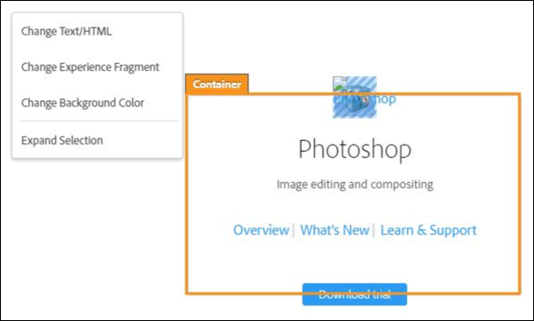
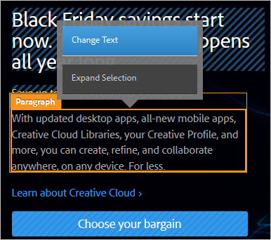
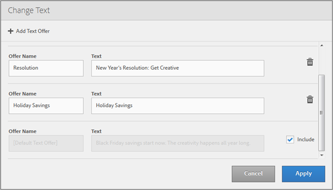

# Create combinations{#create-combinations}

Use the Visual Experience Composer to create the offers you want to include in your test.

>[!NOTE]
>
>You can click **[!UICONTROL Expand Selection]** when selecting objects on the page to select the parent element in addition to the originally selected element. When you select any parent element, all children of that element are automatically selected. You can expand the selection multiple times.

The Visual Experience Composer makes it possible to edit offers, offer names, and location names. An overlay appears to show you where you have made changes.

## Image Offers {#section_A48333211DB149ED926AE467D0032914}

Test multiple image offers within a location to determine which image is most successful.

1. Click an image on your page, and then select **[!UICONTROL Change Image]**.

   

1. Select all images you want to include in the test, then click **[!UICONTROL Add]**.

   

Each image becomes a separate experience in that location.

## HTML Offers {#section_DF016101AFA9412C9B99862C23DE77B1}

Test multiple HTML offers within a location to determine which offer is most successful.

1. Click an HTML offer on your page, then click **[!UICONTROL Change HTML]**.

   

1. Click **[!UICONTROL Add HTML Offer]**, name the offer, then type or paste the code for the HTML offer.

   

   >[!NOTE]
   >
   >Internet Explorer 10 does not support HTML5 input placeholders. As a result, if you use IE10, the "Add content" placeholder text remains in the Text field when you enter content.

   Repeat for any additional HTML offers you want to include. 

1. Click **[!UICONTROL Apply]**.

Each HTML offer becomes a separate experience in that location.

## Text Offers {#section_6CAD265D53534350BAC2780F10B140A8}

You can test alternative text in text elements on your page.

1. Click a text offer on your page, then click **[!UICONTROL Change Text]** 

1. Click **[!UICONTROL Add Text Offer]**, name the offer, and enter the text for the new offer.

   

   You can change the offer name for each offer.

   Repeat for any additional text offers you want to include. 

1. Click **[!UICONTROL Apply]**.

Each text offer becomes a separate experience in that location.

## Best Practices {#section_2E98C23D2F1A460FA732A31799CE6291}

* Don't include more locations than necessary for the test. Every experience you include in the test significantly increases the amount of traffic and time required to achieve acceptable results. For example, if you have page elements with three offers each, there are nine possible combinations (3x3). Three elements, where two contain three possible offers and one has two offers, provide 18 options (3x3x2). The numbers increase substantially with each additional element and offer. 
* When creating multivariate tests, you can now exclude more than 10 percent of experiences from the test, provided you acknowledge the warning that you must then use offline reporting for analysis. 
* Take advantage of the preview features to avoid undesirable combinations of content. For example, you might have two images that offer different discounts on the same item or service. Showing both of these images on the same page is illogical and is likely to create confusion. 
* Use the Traffic Estimator to make sure that your test is designed for the amount of traffic your page receives. Make sure the Traffic Estimator gives your test configuration the green light so you can get the results you desire. 
* You must have at least three elements to test. If you have fewer, run a series of A/B tests. 
* It is recommended that each element's alternatives be significantly different from each other. 
* Although not required, it is good practice for each element to have the same number of alternatives.

