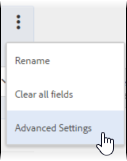
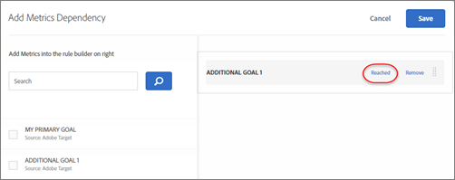

# Goals and settings{#goals-and-settings}

The Goals and Settings page is where you enter information about the goals of the test.

* Activity Settings 
* Reporting Settings 
* Other Metadata

The available settings depend on whether you use Target or Analytics as the data source.

## Activity Settings {#section_DCBDC354261F420EBD4B43EA34947BAC}

The following settings are available:

### Objective

Type an optional objective. The objective can be any information that helps you and your team members identify the campaign.

### Priority

Depending on your settings, the UI and options for Priority vary. You can use the legacy settings of Low, Medium, or High, or you can enable fine-grained priorities from 0 to 999.

The priority is used if multiple activities are assigned to the same location with the same audience. If two or more activities are assigned to the location, the activity with the highest priority displays.

If this option is not enabled in Setup (the default), specify a priority: Low, Medium, or High.

To enable fine-grained priorities, click Setup , then toggle the Enable Fine-Grained Priorities option to the "On" position.

If this option is enabled, specify a value between 0 and 999:

*   0 = Low
*   999 = High

For activities created in previous versions of Target Standard/Premium , Low priority is converted to 0, Medium is converted to 5, and High is converted to 10. You can adjust these values as necessary.

>[!NOTE]
>
>Before you can disable this option after using fine-grained priories, all priorities must be set back to 0, 5, and 10.

### Duration

The activity can start when approved, or you can set a specific date and time. Likewise, the activity can either end when it is deactivated or you can set a date and time. The time picker uses a 24-hour clock, with 00:00 being midnight. The time zone is set to the time zone configured in your browser. To use a different time zone, set your browser to another time zone and restart the browser.

## Reporting Settings {#section_13119392051044FBA6387D9B3B1C43CF}

The following settings are available:

### Reporting Solution

Specify whether data is collected from Adobe Target or from Adobe Analytics. See [Adobe Analytics as the Reporting Source for Target](https://marketing.adobe.com/resources/help/en_US/target/a4t/a4t.html) to learn about the differences between the reporting solutions and the advantages of each.

When selecting Analytics as the reporting source for Target, you select an Analytics report suite to receive Target activity data. To do this, first choose from any of the Analytics companies your account is tied to, and then select the appropriate report suite for the activity. Only report suites that are provisioned to connect to Adobe Target will be available for selection. If you don't see the report suite(s) you expect, first try logging out and logging back in to the Adobe Experience Cloud to try again. If the report suite is still missing from the list, please contact Customer Care.

Analytics for Target requires a tracking server to report results correctly. A default tracking server will appear in the Tracking Server field. If you use more than one tracking server, you should check to ensure you include the correct tracking server in this field. See [Using an Analytics Tracking Server](../../../c-integrating-target-with-mac/a4t/analytics-tracking-server.md#task_72077BA7E93C4A65A715A18F32228823) for more information.

If a reporting solution is specified in your account settings, the specified solution is used and this setting is not visible.

>[!NOTE]
>
>You cannot change your reporting source after the activity goes live in order to keep reports consistent.

### Goal

Select the action taken by a visitor to achieve the goal. For example, choose a Conversion metric, then set the parameters that determine when success is achieved.

>[!NOTE]
>
>If the reporting solution is set to Analytics, the only available goal metric is Conversion. Analytics metrics cannot be selected as a goal.

When you select your success metric, a selector displays. Use this selector to choose the specifics for the success metric.

If enabled, the Estimated Value of the Conversion field (not available for the Page Score metrics) provides a value for your goal, but not for other metrics. This value enables Target to calculate an estimated lift in revenue. This field is optional; however, incremental revenue for any non-revenue metric cannot be calculated without it. For all revenue metrics (Revenue per Visitor, Average Order Value, Total Sales, and Orders), the estimate uses Revenue per Visitor. The data type is currency.

After reaching the activity goal, a visitor continues to see the activity content, unless that visitor qualifies for a higher priority activity. If the visitor reaches the goal again, it is counted as another conversion. Note that this is different than the default behavior in Target Classic, which counts visitors as new if they see the test again.

### Additional Metrics

Create additional success metrics.

This setting is not available if the reporting solution is set to Analytics. In this case, the metrics defined for the Analytics report suite are applied.

Audiences for Reporting

### By default, reports show results for all qualified visitors. You can add report audiences to show only information about specific audiences.

## Advanced Settings {#section_E2FE441AFB324E498793ABB025ED9974}

Advanced settings are available for Multivariate Test goal metrics.

>[!NOTE]
>
>If you use Adobe Analytics as your reporting source, settings are managed by the Analytics server. The advanced settings option will not be available.

### Which success metric must be reached before incrementing this metric?

Use this option to only count someone as reaching the success metric if they’ve previously reached a different success metric. For example a test conversion might only be valid if the visitor clicks on the offer, or reaches a particular page before converting.

You can provided dependency on multiple metrics along with the flexibility to choose whether the metric should be reached or not reached for the count to increase.

You must define both (or multiple) success metrics before you can make one dependent on another.

The Add Dependency option allows the success metric to increment if another success metric has been reached or has not been reached.

To add a dependency:

1.  After adding additional metrics, click Advanced Settings .
2.  Click the Add Dependency option:
    
    
    
3.  Drag and drop the desired metrics from the left pane into the right pane, then click Reached to toggle the setting between Reached and Not Reached .
    
    
    

You can edit or remove dependencies after adding them.

### What will happen after a user encounters this goal metric?

There are three options for what happens after a visitor reaches the goal metric:

* Select Increment Count & Keep User in Activity to specify how the count is incremented.
* Select Increment Count, Release User & Allow Reentry to specify the experience the user sees if they reenter the activity.
* Select Increment Count, Release User & Bar from Reentry to specify what the user sees instead of the activity content.

See [Success Metrics](../../../c-activities/r-success-metrics/success-metrics.md#reference_D011575C85DA48E989A244593D9B9924) for more information about advanced settings.

## Other Metadata {#section_2E8917BEFB954480A4206B9E9E917F80}

The following setting is available:

### Notes

Type any information about your activity that is useful to keep on hand for yourself or other team members. The Notes pane is resizable.

## Training videos

The following videos contain details about information in this article.

### Activity Settings (3:02)

This video includes information about activity settings.

* Enter an objective for your activity 
* Set the priority level of your activities 
* Schedule activity start and end times 
* Add audiences for reporting to create report filters 
* Enter notes for your activities

>[!VIDEO](https://www.youtube.com/watch?v=6XNEM8tUADo)

### Creating Multivariate Tests (9:25)

This video demonstrates how to create a multivariate test using the Target three-step guided workflow. Goals and settings are discussed beginning at 7:00.

* Define and design a multivariate test 
* Create a multivariate test

>[!VIDEO](https://www.youtube.com/watch?v=X8w5IQqEOow)