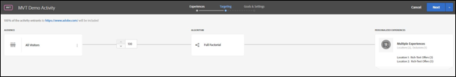

# Test summary{#test-summary}

The test summary provides a visual overview of your multivariate test.

 

The test summary shows:

* Test name 
* URL 
* Audience

  Click the audience to select a different one from the list of available audiences. 
* Algorithm

  Currently, the only available algorithm is Full Factorial. The algorithm name is provided for informational purposes, so you are aware of the algorithm being used. 
* The numbers of included and excluded experiences.

Click **[!UICONTROL Continue]** when you are satisfied with the test configuration. The Goals and Settings page opens. 
