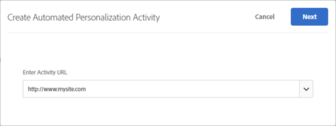
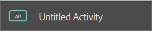
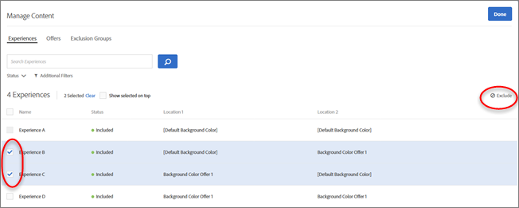

#  Create an Automated Personalization activity{#create-an-automated-personalization-activity}

The Automated Personalization activity workflow varies from the workflow of the other activity types.

1. From the Target Standard Activities list, click **[!UICONTROL Create Activity]** > **[!UICONTROL Automated Personalization]**.

   

1. Specify the desired channel: Web.

   You can also choose Mobile App, Email, or Other/API. 

1. To use the Visual Experience Composer (VEC), click **[!UICONTROL Visual (Default)]**.

   If you prefer to use the Form-Based Experience Composer, select **[!UICONTROL Form]**.

   For more information about both composers, see [Experiences](../../c-experiences/experiences.md#concept_A2E10F6AFB3D4AEAB6951EE14688848D). 
1. Verify or enter the activity URL, then click **[!UICONTROL Next]**.

   >[!NOTE]
   >
   >[!DNL Target] does not differentiate between URL protocols ( [!DNL https] and [!DNL http]). As a result, [!DNL `http://www.adobe.com`] and [!DNL `https://wwww.adobe.com`] both match.

   The page with the specified URL opens in the Visual Experience Composer.

   

   For troubleshooting information about the VEC, should you have problems, see [Troubleshooting the Visual Experience Composer](../../c-experiences/c-visual-experience-composer/r-troubleshoot-composer/troubleshoot-composer.md#reference_77743144F10143A3A89D56E116D296E4). 
1. To name the activity, click the Name field and type your activity name.

   

   The following characters are not allowed in an activity name:

   | Character | Description |
   |--- |--- |
   |/|Forward slash|
   |?|Question mark|
   |#|Number sign|
   |:|Colon|
   |=|Equals to|
   |+|Plus|
   |-|Minus|
   |@|At sign|

1. Modify page elements as explained in [Experiences](../../c-experiences/experiences.md#concept_A2E10F6AFB3D4AEAB6951EE14688848D), then click **[!UICONTROL Next]**.

   You can select multiple images at once from the asset manager. This enables you to quickly view the page with each of the images configured for the activity. You can also easily edit text elements in your offers. When you edit an element, bars appear on that element to indicate you have changed it.

1. Click **[!UICONTROL Manage Content]** to configure the available combinations.

   A dialogue box appears with three options at the top of the screen: Experiences, Offers, and Exclusion Groups.

   

   >[!NOTE]
   >
   >Although you can create up to 30,000 experiences in an AP activity, the activity performs best when fewer than 5,000 experiences are used.

   The [!UICONTROL Experiences] list shows each piece of content selected for the activity and the location it is assigned to. You can exclude specific experiences by hovering over the desired experience and then clicking the exclude icon, or you can batch exclude/include experiences by selecting the checkbox for the relevant experiences and then click the Exclude icon in the top right corner of the dialogue box.

   

   You can filter this list view to see only excluded or only included activities by clicking the **Status** drop-down list.. 
1. Click **[!UICONTROL Offers]** to select pieces of content and assign them to [reporting groups](../../c-reports/offer-reporting-groups-in-automated-personalization.md#concept_194128C0B56B4B26AAB57DB49892960C).

   Use the [!UICONTROL Location] list to filter offers by location. Use the [!UICONTROL Report Group] list to filter offers by reporting groups. You can also use the [!UICONTROL Report Group] list to filter for [!UICONTROL Unassigned Offers] so you can assign a reporting group to an offer that is not currently assigned to any reporting group.

   You can add specific experiences to a reporting group by hovering over the desired offer and then clicking the folder icon, or you can batch include experiences in a reporting group by selecting the checkbox for the relevant experiences and then click the Reporting Group folder icon button in the top right corner of the dialogue box.

   

   It is important to understand that reporting groups impact how Target builds its models. As a result, we recommend that you use reporting groups only if you plan to replace or add new offers while the activity is live. If a new offer is introduced into a live activity, putting the new offer into a group with existing similar offers allow the machine to use the data already collected for the other offers in its group to learn about the new offer. You should never put all offers into a single reporting group.

   For information about targeting an offer to specific audiences, see [Target AP Offers](../../c-activities/t-automated-personalization/ap-target-offers.md#task_F207ED7A41B84FD39BB6FCBFABF4B23E). 
1. (Conditional) Click **[!UICONTROL Offers]** to select pieces of content and assign them to reporting groups or only allow certain visitors to see certain offers with targeting.

   For more information, see [Offer Reporting Groups in Automated Personalization](../../c-reports/offer-reporting-groups-in-automated-personalization.md#concept_194128C0B56B4B26AAB57DB49892960C).

   For information about targeting an offer to specific audiences, see [Target Automated Personalization Offers](../../c-activities/t-automated-personalization/ap-target-offers.md#task_F207ED7A41B84FD39BB6FCBFABF4B23E). 
1. (Conditional) Click **[!UICONTROL Exclusion Groups]** to choose any combinations of elements that you want to exclude from the activity.

   

   Although you can create up to 30,000 experiences in an AP test, the algorithm performs its best when fewer than 10,000 distinct experiences are used.

   If you do not currently have any exclusion groups included in your activity, click **Create Exclusion Group**. You can filter to create a list that shows only the combinations you want to exclude. Name your exclusion group and click **Save**.

   To edit an existing exclusion group, hover over the group you want to edit, then click the pencil icon. 
1. Click **[!UICONTROL Next]** when you have finished setting up the content of your activity.
1. The **Targeting** step will look familiar if you have used other Target activity types. Here you can select an audience and specify the percentage of visitors who will see the control experience by clicking the **[!UICONTROL Custom Allocation]** drop-down list, then click **Next**.

   The [!UICONTROL Custom Allocation] drop-down list lets you choose from the following options:

   

   * **Evaluate Personalization Algorithm (50/50):** If your goal is to test the algorithm, use a 50/50 percent split of visitors between the control and the targeted algorithm. This split gives the most accurate estimate of the lift. 
   * **Maximizing Personalization Traffic (90/10):** If your goal is to create an “always on” activity, put 10% of the visitors into the control to ensure there is enough data for the algorithms to continue learning over time. Note the tradeoff here is that in exchange for personalizing a larger proportion of your traffic, you will have less precision in what the exact lift is. 
   * **Custom Allocation** Manually split the percentage as desired.

   The control experience provides a comparison to determine how much lift is provided by the automated test.

   Automated Personalization always measures performance against a control group. Best practice is to place at least 10% of entrants into the control group. If your goal is to test if the personalization algorithm on the data it is given performs better than no personalization (i.e. the randomly served control), then a 50/50 percent traffic split between the control and the personalization algorithm would be the fastest and most accurate way to achieve this goal. If you want to maximize the amount of traffic that is personalized and you are less concerned with understanding the exact lift your activity is generating, then a 10/90 percent traffic split between the control and the personalization algorithm would be the fastest and most accurate way to achieve this goal.

   >[!NOTE]
   >
   >In Automated Personalization activities, entry criteria (URL targeting, template rules, and audience target) are evaluated for each request. In previous versions, entry criteria were evaluated once per session.

1. Click **[!UICONTROL Continue]** to display the **[!UICONTROL Goals & Settings]** page.
1. Configure the activity with the following settings, then click **[!UICONTROL Save & Close]**.

   | Setting | Description |
   |--- |--- |
   |Name|Name the activity. Give the activity a name that is descriptive enough that team members can recognize it in the Activities list.  Consult the table above to see which characters are not allowed in an activity name.|
   |Objective|(Optional) Type the objective of the test. The objective helps you remember the purpose of the activity.|
   |Priority|Depending on your settings, the UI and options for Priority vary. You can use the legacy settings of Low, Medium, or High, or you can enable fine-grained priorities from 0 to 999. The priority is used if multiple activities are assigned to the same location with the same audience. If two or more activities are assigned to the location, the activity with the highest priority displays. If this option is not enabled in  Setup (the default), specify a priority: Low, Medium, or High. To enable fine-grained priorities, click [!UICONTROL Setup], then toggle the [!UICONTROL Enable Fine-Grained Priorities] option to the "On" position. If this option is enabled, specify a value between 0 and 999:<ul><li>0 = Low</li><li>999 = High</li></ul>For activities created in previous versions of Target Standard/Premium, Low priority is converted to 0, Medium is converted to 5, and High is converted to 10. You can adjust these values as necessary. **Note**: Before you can disable this option after using fine-grained priories, all priorities must be set back to 0, 5, and 10.|
   |Duration|Set the start and end dates for the activity.|
   |Optimization Goal|Specify the optimization goal, which consists of two parameters:<ul><li>What you want to measure with the activity</li><li>The action taken by an activity entrant that shows that the goal has been achieved.</li></ul>You can choose to name the optimization goal by selecting the three dots to the right of My Primary Goal. Automated Personalization activities can measure conversion, RPV, and AOV. Conversion can be achieved by viewing a page or viewing an mbox. Clicks can also be tracked. he primary goal also becomes the modeling metric, used by the modeling system to calculate the success of the experience. Visitors can be kept in the activity for tracking purposes after reaching the modeling goal. For example, often an Automated Personalization activity is used to improve click-rates, and that is set as the modeling goal. However, it's important to see how increased click-rates lead to final conversion, so tracking through the final conversion is essential. You can provide dependency on multiple metrics along with the flexibility to choose whether the metric should be reached or not reached for the count to increase. You must define both (or multiple) success metrics before you can make one dependent on another. The Add Dependency option allows the success metric to increment if another success metric has been reached or has not been reached. To add a dependency:<ol><li>After adding additional metrics, click [!UICONTROL Advanced Settings] under the three-dot menu to the right of Additional Goal.</li><li>Click the [!UICONTROL Add Dependency] option at the bottom of the [!UICONTROL Reporting Settings] section.</li><li>Drag and drop the desired metrics from the left pane into the right pane, then click [!UICONTROL Reached] to toggle the setting between [!UICONTROL Reached] and [!UICONTROL Not Reached]</li></ol>You can edit or remove dependencies after adding them.|
   |Conversion Metric|The conversion metric for Automated Personalization activities is always the same as the optimization goal. There is no input required in this section.|
   |Additional Metrics|Add any additional reporting metrics you want to use. You can add conversion or revenue metrics. **Note**: The Engagement metric is not supported as an additional metric as well. The UI might let you select the Engagement metric, but data will not display accurately in reports.|
   |Audiences for Reporting|Add audiences to enable filtering by audiences in reports. By default, the report shows results for all qualified visitors. Add audiences to filter results for more specific subsets of visitors. **Note**: Unlike other activity types, Automated Personalization cannot use Adobe Analytics as its reporting source.|
   |Notes|Type any information about your activity that is useful to keep on hand for yourself or other team members. The Notes pane is re-sizable.|

   Note that when you name or rename a metric, the following characters are not allowed:

   | Character | Description |
   |--- |--- |
   |/|Forward slash|
   |?|Question mark|
   |#|Number sign|
   |:|Colon|
   |=|Equals to|
   |+|Plus|
   |-|Minus|
   |@|At sign|

After you click **[!UICONTROL Create]**, the Activity Summary appears. Click **Preview Experiences** to preview how your experiences will look when delivered. A pop-up appears that you can use to view and share links to your AP experiences on your site to get a "true preview" of the experiences outside of Target's Visual Experience Composer. You must share the links from the message to share the preview. Clicking a link and then copying the URL directly from the page won't work because the URL contains a parameter that only displays the page correctly when you access the page from the link in the message. 

For information about reporting, see [Automated Personalization Reports](../../c-reports/reports-ap.md#concept_C02BAFC922114A44846998FD956E345A). 
