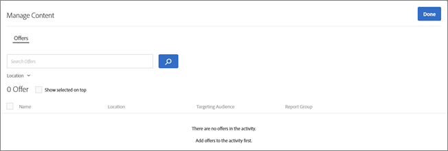
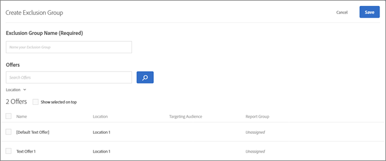
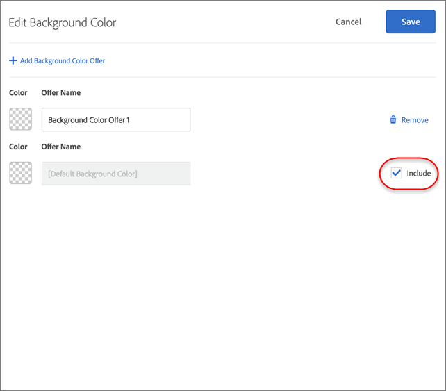
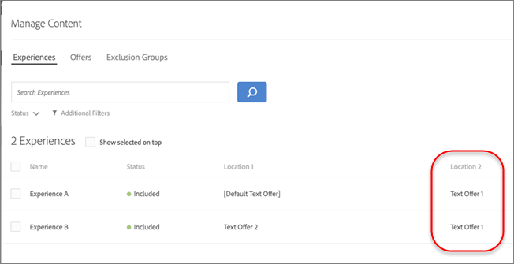

# Manage exclusions{#manage-exclusions}

Manage exclusion groups and duplicate offers in Automated Personalization (AP) activities.

## Manage exclusions {#topic_30B4E4F89C914EB2B20B038C0299ED2E}

Manage exclusion groups and duplicate offers in Automated Personalization (AP) activities. 

## Create Exclusion Groups {#task_AAAA6C7239A84F7696C8492F04B575A2}

Create exclusion groups in Automated Personalization (AP) activities to ensure that experiences with the designated offers are automatically excluded. 

Exclusion groups are a great way to ensure that incompatible offers are not presented in the same experience in different locations. For example, suppose you have two offers: one is for 20% off of all merchandise and the other is for 15% off. You would never want these two offers to be presented to visitors in the same experience. If you add these two offers to an exclusion group, you can ensure that this will never be the case.

**To create an exclusion group:** 

1. While creating or editing an AP activity, click **[!UICONTROL Manage Content]** in the header bar.
1. In the [!UICONTROL Manage Content] dialog box, click **[!UICONTROL Exclusion Group]**.

   

   If you have previously created exclusion groups, they display in the list. If you have not yet created an exclusion group, you are prompted to create one. 
1. Click **[!UICONTROL Create Exclusion Group.]**

   

1. (Required) Specify a descriptive name for the exclusion group.

   A descriptive name helps you or others quickly locate and understand a group's purpose. 
1. Locate and select the desired offers that you want to add to the exclusion group.

   You can select multiple offers from the same location in an exclusion group. 
1. Click **[!UICONTROL Save]**.

The offers in the exclusion group will be automatically excluded from the same experiences going forward. 

## Exclude Duplicate Offers {#concept_4EF78013F80E48EFA024AE0274C9F037}

Prevent offers from the offer library from being duplicated when used in different locations in [!UICONTROL Automated Personalization] activities. 

You might have an activity, for example, with six locations on a page with 12 offers. There is a chance that the same offer could be placed in one or more locations in the activity. This feature prevents duplicate offers from displaying at the same time in different locations within the same activity. 

>[!NOTE]
>
>If you select to exclude duplicate offers after creating exclusion groups, the experience count on the activity diagram may be incorrect. 

Click **[!UICONTROL Configure]** > **[!UICONTROL Duplicate Offers]**, then click **[!UICONTROL Allow Duplicates]** or **[!UICONTROL Disallow Duplicates]**. 

## Exclude Specific Experiences {#task_C17D36EF58AF4908B17A3D84CA6DE85A}

Exclude specific experiences if you want to exclude certain offer combinations from your Automated Personalization activity. 

There might be certain combinations that don't work well together, or you might be limiting the number of experiences tested to decrease traffic requirements for your activity. 

1. While creating or editing an AP activity, click **Manage Content** in the header bar.

   The [!UICONTROL Experiences] list shows each experience generated from the permutations of all content and location options. 

1. Exclude experiences, as desired.

   You can exclude specific experiences by hovering over the desired experience and then clicking the exclude icon. 

   
   Or you can batch exclude/include experiences by selecting the checkbox for the relevant experiences and then clicking the **Exclude** button in the top right corner of the dialogue box. The Exclude button appears when one or more experiences are checked. 

   
   You can filter this list view to see only excluded or only included activities by clicking on the [!UICONTROL Status] drop-down list. 

   The experiences will now be excluded from the activity and their [!UICONTROL Status] will show as [!UICONTROL Excluded]. 

   

## Exclude Default Content {#task_DCB4528989DF4C05A3A4729E5891D18F}

In some cases, you might not want to include your default content as part of your Automated Personalization activity. How you access this setting is different from creating exclusion groups. You can use this method to have only one offer (different from your default content) in a location as part of your Automated Personalization activity. 

Excluding default content is a great way to change the look and feel of the rest of the page to suit the offers you are testing with your Automated Personalization activity. For example, suppose you want to match the color palette of the offers you are testing, you could change the background color of your page and exclude the default background color. 

**To exclude default content using the Visual Experience Composer (VEC):** 

1. While creating or editing an AP activity, select the content you want to replace and click to access **[!UICONTROL Change Text/HTML]** or **[!UICONTROL Change Image]** or **[!UICONTROL Change Background Color]**.
1. In the dialog box, create your new content and uncheck **Include**to the right of the default content (or uncheck the Default Image/Video in the Select Content screen).

   Depending on the content/offer type, the [!UICONTROL Include] checkbox is in a slightly different place. 

   For Text/HTML content: 

   
   For Image/Video content: 

   
   For background color: 

   
   
1. Click **[!UICONTROL Save]**.

   You can see the experiences created from the offers you specified under [!UICONTROL Manage Content]. You'll notice no experiences are created in [!UICONTROL Manage Content] using the default offer you excluded. 

   

**To exclude default content using the Form-Based Experience Composer:** 

1. While creating or editing an AP activity, click **[!UICONTROL Change Text/HTML]** or **[!UICONTROL Change Image Offer]** under **[!UICONTROL Content]**. 
1. In the dialog box, create your new content and uncheck **[!UICONTROL Include]** to the right of the default content (or uncheck the Default Image/Video in the Select Content screen). 

   Depending on the content/offer type, the Include checkbox will be in a slightly different place. 

   For Text/HTML content: 

   

   For Image/Video content: 

   

1. Click **[!UICONTROL Save]**. 

   You can see the experiences created from the offers you specified under [!UICONTROL Manage Content]. You'll notice no experiences are created in [!UICONTROL Manage Content] using the default offer you excluded. 

   
