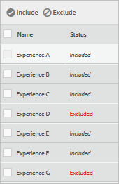

#  Preview experiences for Automated Personalization in the Visual Experience Composer{#preview-experiences-for-automated-personalization-in-the-visual-experience-composer}

Because an automated personalization test compares multiple offers on a page, it is helpful to preview the page with each experience.

1. From the Experience Composer, click **[!UICONTROL Preview]**.

   A list of all experiences appears.

   

1. Click a specific experience in the list to view it.

1. To exclude an experience from the activity, select that experience and click **[!UICONTROL Exclude]**.

   

   You might choose to exclude an experience that shows conflicting variations or an experience that is not aesthetically balanced.

   By default, all experiences are included in the Automated Personalization activity. To include an experience that has been excluded, select the excluded experience and click **[!UICONTROL Include]**. 

Click **[!UICONTROL Exit Preview Mode]** to return to the Experience Composer so you can make changes, or click **[!UICONTROL Continue]** to go to the Targeting step. 
