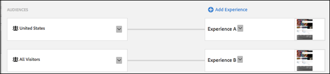
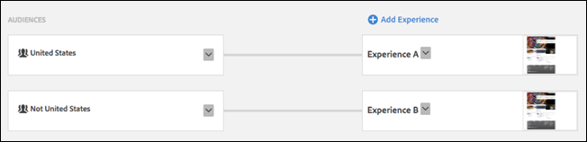

# Switching Experiences in Experience Targeting{#switching-experiences-in-experience-targeting}

Information about the how visitors can switch between experiences in an Experience Targeting (XT) activity as their profiles evolve.

>[!NOTE]
>
>**September 21, 2017**
>
>With the release on September 21, Target will change the way users are placed into experiences in Experience Targeting (XT) activities (Landing Page campaigns in Target Classic). For all new and existing activities in both Target Standard/Premium and Target Classic, users must meet the experience targeting rules on every impression to continue to see the experience's content and to be counted in reports. Previously, if the user no longer qualified for any experience, the user would continue to see the content from, and be counted in reports for, the last experience they did qualify for.
>
>This change will happen automatically as part of the release for all existing activities and for any new activities created post-release. If the previous method (prior to September 21) is desired, you can create audiences using profile scripts so a user only must meet a condition once to continue to fall into that audience in the future. Then, use those audiences for each experience in the activity.

With Experience Targeting, you can control which experience visitors see as their profiles evolve. The following list presents just a few scenarios in which visitors' profiles can evolve and you might want to present different content:

| Scenario | Details |
|--- |--- |
|Geographic Location|As visitors travel for business or pleasure, they might view your website or mobile app from different geographic locations.|
|Customer Status|Visitors might be considered prospects before creating an account or purchasing a product.|
|Category Affinity|The [category affinity](/help/c-target/c-visitor-profile/category-affinity.md) feature in  Target automatically captures the categories users visit and then calculates the users' affinity for the category for targeting purposes. For example, visitors who viewed several articles on your website about a particular subject could be presented with content related to that subject.|
|Day of Week|As the weekend approaches, you might want to show visitors content about movies, dining, or other forms of entertainment.|

To leverage these capabilities in [!DNL Target], it is important to understand the following information as you work with XT activities:

* **Priority is controlled by the order of experiences, top to bottom.** If a visitor qualifies for more than two audiences, he or she receives content from the higher priority experience. 
* **Visitors will switch between experiences in an XT activity if they start qualifying for the audience of a higher-priority experience.**

  For example, in the following activity setup, a visitor accessed your website from the United States and then traveled to Germany and visited your website a second time. During the first visit, this visitor qualified for Experience A (United States). After viewing your website from Germany, this visitor switched to Experience B (Germany).

  

* **Visitors will also switch between experiences if they stop qualifying for their current audience but start qualifying for a lower-priority experience.** 
* **If visitors stop qualifying for their current experience, and do not qualify for another experience, they will see default content.**

  For example, in the following activity setup, a visitor accessed your website from the United States and then traveled to France and visited your website a second time. During the first visit, this visitor qualified for Experience A (United States). After viewing your website from France, this visitor will remain in the original experience.

  

* **An experience targeted to "All Visitors" can be used as the last experience in the experience targeting activity to "catch" any visitors that have not fallen into any other experience. If an experience targeted to "All Visitors" is not the last in the order, other targeted experiences listed lower than this experience will still be evaluated.**

  For example, in the following activity setup, a visitor accessed your website from the United States and then traveled to Germany and visited your website a second time. During the first visit, this visitor qualified for Experience A (United States). After viewing your website from Germany, this visitor will remain in Experience A (United States).

  

  If this is undesirable, you can create a new audience that is explicitly defined as the inverse of your targeted audience, as shown in the following example:

  

* **With a single-experience XT activity, visitors will remain in an experience even if they cease to qualify for the audience that put them in that experience.**

  If this is undesirable, you could create another experience targeted to the inverse audience (for example, "Not United States" as opposed to "United States"). As another option, you could create an A/B activity targeted to your desired audience with 100% traffic allocation, as shown below:

  

* **The priority of experiences is defined by their order (top down) as they display in the Target UI.**

  This is important to keep in mind in scenarios where a visitor might qualify for more than one of your audiences. For example, if you have two experiences: one targeted to "United States" and one targeted to "New York," a visitor located in New York would qualify for both audiences. Therefore, you must ensure that the "New York" experience is defined before the "United States" experience in the Target UI. This ensures that the more targeted "New York" experience has the higher priority, as shown in the following example:

  

