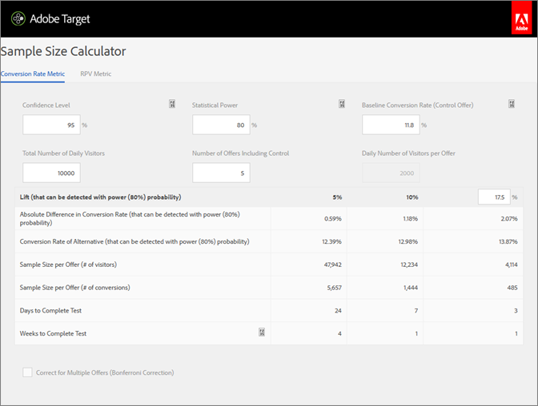
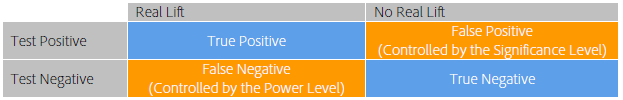

# How long should you run an A/B Test?{#how-long-should-you-run-an-a-b-test}

A successful A/B test requires an adequate number of visitors (sample size) to improve your conversion rate, but how do you know how long to run an A/B test? This article contains information about Auto-Allocate activities and the Target Sample Size Calculator to help you ensure that your activity has a sufficient number of visitors to achieve your goals.

It is tempting to stop an activity if one of the offers performs much better or worse than the others in the first few days of the activity. However, when the number of observations is low, there is a high likelihood that a positive or negative lift is observed by chance because the conversion rate is averaged over a low number of visitors. As the activity collects more data points, the conversion rates converge toward their true long-term values.

Stopping an activity prematurely is one of the nine significant pitfalls that you might fall prey to when performing A/B testing. For more information, see [Nine common A/B testing pitfalls and how to avoid them](../../c-activities/t-test-ab/c-common-ab-testing-pitfalls.md#concept_578A7947C9554868B30F12DFF9E3F8E3).

Target provides tools to help ensure that your activity has a large enough sample size to achieve your conversion goals:

* **Auto-Allocate:** An Auto-Allocate activity is a type of A/B test that identifies a winner among two or more experiences and automatically reallocates more traffic to the winner to increase conversions while the test continues to run and learn.

  Standard A/B tests have an inherent cost. You must spend traffic to measure performance of each experience and through analysis figure out the winning experience. Traffic distribution remains fixed even after you recognize that some experiences are outperforming others. Also, it's complicated to figure out the sample size, and the activity must run its entire course before you can act on a winner. After doing all of this, there is still a chance the identified winner is not a true winner.

  The solution is Auto-Allocate. Auto-Allocate reduces this cost and overhead of determining a winning experience. Auto-Allocate monitors the goal metric performance of all experiences and sends more new entrants to the high-performing experiences proportionately. Enough traffic is reserved to explore the other experiences. You can see the benefits of the test on your results, even while the activity is still running: optimization occurs in parallel with learning.

  Auto-Allocate moves visitors toward winning experiences gradually, rather than requiring that you wait until an activity ends to determine a winner. You benefit from lift more quickly because activity entrants who would have been sent to less-successful experiences are shown potential winning experiences.

  When using the Auto-Allocate feature, Target displays a badge at the top of the activity's page indicating "No Winner Yet" until the activity reaches the minimum number of conversions with sufficient confidence. Target then declares the winning experience by displaying a badge at the top of the activity's page.

  For more information, see [Auto-Allocate](../../c-activities/automated-traffic-allocation/automated-traffic-allocation.md#concept_A1407678796B4C569E94CBA8A9F7F5D4). 

* **Target Sample Size Calculator:** If you choose to use a manual A/B test rather than Auto-Allocate, the Target Sample Size Calculator helps you determine the sample size needed for a successful test. Continue reading for more information about how to use the calculator.

## Adobe Target Sample Size Calculator {#section_6B8725BD704C4AFE939EF2A6B6E834E6}

Before setting up your A/B test, access the Adobe Target [sample size calculator](https://docs.adobe.com/content/target-microsite/testcalculator.html) (https://docs.adobe.com/content/target-microsite/testcalculator.html).

It is important to determine an adequate sample size (number of visitors) prior to doing any A/B test, in order to establish the time that the test should be allowed to run before evaluating the results. Simply monitoring the test until statistical significance is achieved causes the confidence interval to be vastly underestimated, making the test unreliable. The intuition behind this result is that, in the event a statistically significant result is detected, the test is stopped and a winner is declared. However, if the result is not statistically significant the test is allowed to continue. This procedure strongly favors the positive outcome, which increases the false positive rate, and so distorts the effective significance level of the test.

This can result in a large number of false positives, which leads to implementation of offers that do not deliver the predicted lift in the long run. Poor lift itself is a dissatisfying outcome, but an even more serious consequence is that over time the inability to accurately predict lift erodes organizational trust in testing as a practice.

This article discusses the factors that must be balanced when a sample size is determined and introduces a spreadsheet calculator for estimating an adequate sample size. Calculating the sample size using the sample size calculator (link provided above) before any A/B test begins ensures that you always run high quality A/B tests that comply with statistical standards.

There are five user-defined parameters that define an A/B test. These parameters are interlinked so when four of them are established, the fifth can be calculated:

* Statistical significance 
* Statistical power 
* Minimum reliably detectable lift 
* Baseline conversion rate 
* Number of visitors

For an A/B test, the statistical significance, statistical power, minimum reliably detectable lift, and baseline conversion rate are set by the analyst and then the required number of visitors is calculated from these numbers. This article discusses these elements and gives guidelines for how to determine these for a specific test.

The figure below illustrates the four possible outcomes of an A/B test:

It is desirable to get no false positives or false negatives. However, this can never be guaranteed by a statistical test. It is always possible that observed trends are not representative of the underlying conversion rates. For example, in a test to see if heads or tails on a coin flip was more likely, even with a fair coin, you could get 10 heads on 10 tosses just by chance. The statistical significance and power help us quantify the false positive and false negative rates and allow us to keep them at reasonable levels for a given test.

## Statistical Significance {#section_8230FB9C6D1241D8B1786B72B379C3CD}

The significance level of a test determines how likely it is that the test reports a significant difference in conversion rates between two different offers when in fact there is no real difference. This is known as a false positive or a Type I error. The significance level is a threshold specified by the user and is a trade-off between the tolerance for false positives and the number of visitors that have to be included in the test.

In an A/B test, it is initially assumed that both offers have the same conversion rate. Then the probability of the observed outcome is computed based on this assumption. If this probability (the p-value) is smaller than some predefined threshold (the significance level) Target concludes that the initial assumption--that both offers have the same conversion rate--is incorrect and, therefore, the conversion rates of A and B are statistically different at the given significance level.

A commonly used significance level in A/B testing is 5%, which corresponds to a confidence level of 95% (confidence level = 100% - significance level). A confidence level of 95% means that every time you do a test, there is a 5% chance of detecting a statistically significant lift even if there is no difference between the offers.

Typical interpretations of the confidence level are summarized in the table below:

<table id="table_DC424DC8BF4A406E88E6D8FE493772E0"> 
 <thead> 
  <tr> 
   <th colname="col1" class="entry"> Confidence Level </th> 
   <th colname="col2" class="entry"> Interpretation </th> 
  </tr> 
 </thead>
 <tbody> 
  <tr> 
   <td colname="col1"> &lt; 90% </td> 
   <td colname="col2"> 
No evidence that there is a difference between the conversion rates 
 </td> 
  </tr> 
  <tr> 
   <td colname="col1"> 90-95% </td> 
   <td colname="col2"> 
Weak evidence that there is a difference between the conversion rates 
 </td> 
  </tr> 
  <tr> 
   <td colname="col1"> 95-99% </td> 
   <td colname="col2"> 
Moderate evidence that there is a difference between the conversion rates 
 </td> 
  </tr> 
  <tr> 
   <td colname="col1"> 99-99.9% </td> 
   <td colname="col2"> 
Strong evidence that there is a difference between the conversion rates 
 </td> 
  </tr> 
  <tr> 
   <td colname="col1"> +99.9% </td> 
   <td colname="col2"> 
Very strong evidence that there is a difference between the conversion rates 
 </td> 
  </tr> 
 </tbody> 
</table>

It is recommended to always using a confidence level of 95% or above.

It is desirable to use the highest possible confidence level, so that the test will yield few false positives. However, a higher confidence level requires a larger number of visitors, which increases the time required to do the test. Furthermore, an increase in the confidence level causes a decrease in the statistical power.

## Statistical Power {#section_1169C27F8E4643719D38FB9D6EBEB535}

The statistical power of an A/B test is the probability of detecting a real difference in conversion rate of a certain magnitude. Because of the random (stochastic) nature of conversion events it is possible that a statistically significant difference is not observed--just by chance--even though there is a real difference in conversion rate between the two offers. This is called a false negative or a Type II error.

The statistical power is often ignored because the determination of statistical power, in contrast to statistical significance, is not required to do an A/B test. However, by ignoring the statistical power there is a substantial chance that real differences between the conversion rates of different offers will not be detected by the test because the sample size is too small. This results in the tests being dominated by false positives.

It is desirable to have high statistical power so that the test has a high chance of identifying a real difference in conversion rates and yields fewer false negatives. However, a larger number of visitors is required to increase the statistical power of detecting any given lift, which increases the time required to do the test.

A commonly used value for statistical power is 80%, which means that the test has an 80% chance of detecting a difference equal to the minimum reliably detectable lift. The test has a lower probability of detecting smaller lifts and a higher probability of detecting larger lifts.

## Minimum Reliably Detectable Lift {#section_6101367EE9634C298410BBC2148E33A9}

Most organizations want to measure the smallest possible difference in conversion rate because even a small lift is worth implementing. However, if you want the A/B test to have a high probability of detecting a very small lift, the number of visitors that must be included in the test would be prohibitively large. The reason for this is that, if the difference in conversion rate is small, both conversion rates must be estimated with high accuracy to identify the difference, which requires a large number of visitors. Therefore, the minimum reliably detectable lift should be determined by the business requirements considering the trade-offs between detecting small lifts and running the test for longer periods of time.

For example, suppose that two offers (A and B) have true conversion rates of 10% and 15%, respectively. If these offers are shown to 100 visitors each, there is a 95% chance of observing conversion rates in the range 4% to 16% for offer A and 8% to 22% for offer B due to the stochastic nature of conversions. These ranges are known as confidence intervals in statistics. They represent the confidence in the accuracy of the estimated conversion rates. The larger the sample size (more visitors) the more confident you can be that the estimates of the conversion rates are accurate.

The figure below shows these probability distributions.

Because of the large overlap between the two ranges, the test cannot determine whether the conversion rates are different. Therefore, this test with 100 visitors cannot distinguish between the two offers. However, if we expose the offers to 5,000 visitors each, then there is a 95% chance that the observed conversion rates will fall in the ranges of 9% to 11% and 14% to 16%, respectively.

In this case, it is very unlikely that the test will come to a wrong conclusion, so the test with 5,000 visitors can distinguish between the two offers. The test with 5,000 visitors has a confidence interval of approximately +/-1%. This means the test can detect differences of about 1%. Therefore, even more visitors would be needed if the true conversion rates of the offers were, for example, 10% and 10.5% instead of 10% and 15%.

## Baseline Conversion Rate {#section_39380C9CA3C649B6BE6E1F8A06178B05}

The baseline conversion rate is the conversion rate of the control offer (offer A). Often, you have a good sense of the conversion level for the offer based on prior experience. If that is not the case, for example because it is a new type of offer or creative, the test can be allowed to run for a day or so to get a rough estimate of the baseline conversion rate that can be used in the sample size calculation.

## Estimating the Sample Size {#section_19009F165505429E95291E6976E498DD}

It can be difficult to balance the opportunity costs of running a test for a long time with the risk of false positives and false negatives. Obviously, you do not want to make the wrong decisions, but being paralyzed by too strict or rigid testing standards is not desirable either. As a general guideline, a 95% confidence level and an 80% statistical power are recommended.

The sample size calculator (link provided above) asks you to decide on the statistical significance (recommendation: 95%), and the statistical power (recommendation: 80%). After entering the baseline conversion rate and the daily traffic across all offers, the spreadsheet outputs the number of visitors required for detecting a lift of 1%, 2%, 5%, 10%, 15%, and 20% with a probability equal to the specified power of the test. The spreadsheet also allows the user to input a custom minimum reliably detectable lift. Furthermore, the spreadsheet outputs the number of weeks required for the test based on the traffic level entered by the user. The required number of weeks is rounded up to the nearest whole week in order to avoid day-of-week effects influencing the results.

There is a trade-off between the minimum lift that can be reliably identified by the test and the required number of visitors. The figure below, which is valid for a baseline (control) conversion rate of 5%, shows strong diminishing returns for increasing the number of visitors. The minimum lift that can be reliably detected improves tremendously when adding the first few visitors to the test, but it takes an increasingly larger number of visitors to improve the test. The figure helps in finding an adequate tradeoff between the time required to run the test (as determined by the number of visitors required and the site traffic) and the minimum lift that can be reliably detected by the test.

In this example, you might decide that being able to detect a lift of 5% (corresponding to a conversion rate of the alternative offer of (100%+5%)&#42;5% = 5.25%) in 80 out of 100 tests is adequate, so you need a sample size of 100,000 visitors to each offer. If the site has 20,000 visitors per day and you are testing two offers, the test should be allowed to run for 2&#42;100,000/20,000 = 10 days before it can be determined whether the alternative offer is statistically significantly superior to the control offer. Again, it is recommended that the required time always be rounded up to the nearest whole week, so day-of-week effects are avoided. Thus, in this example, the test would be run for two weeks before evaluating the results.

## Revenue per Visit Metric {#section_C704C0861C9B4641AB02E911648D2DC2}

When using Revenue per Visit (RPV) as a metric, an additional source of variance is added because RPV is the product of revenue per order and conversion rate (RPV = Revenue / #visitors = (Revenue per order &#42; #orders) / # visitors = Revenue per order &#42; (#visitors &#42; CTR) / #visitors = Revenue per Order &#42; CTR), each with its own variance. The variance of the conversion rate can be estimated directly using a mathematical model but the variance of revenue per order is specific to the campaign. Therefore, use knowledge of this variance from past campaigns or run the A/B test for a few days to estimate the variance in revenue. The variance is calculated from the values of Sum of Sales, Sum of Sales Squared, and Number of visitors that are found in the CSV download file. Once this is established, use the spreadsheet to calculate the required time to complete the test.

The sample size calculator (link provided above) can help you configure the RPV metric. When you open the calculator, you'll see a tab labeled RPV Metric. You'll need the following information when using the RPV version of the calculator:

* Number of visitors to the control offer 
* Total revenue for the control offer

  Make sure the extreme order filter is checked. 
* The sum of squares revenue for the control offer

  Make sure the extreme order filter is checked.

In general, using RPV as a metric requires 20-30% longer to achieve the same level of statistical confidence for the same level of measured lift, because RPV has the added variance of different order sizes per conversion. That should be a consideration when choosing between straight conversion rate and RPV as the metric on which to base your final business decision.

## Correction for Comparing Multiple Offers {#section_1474113764224D0B85472D8B023CCA15}

Each time you compare two offers the chance of getting a false positive (observing a statistically significant difference even when there is no difference in conversion rate) is equal to the significance level. For example, if five offers are present, A/B/C/D/E, and A is the control offer, then four comparisons are done (control to B, control to C, control to D, and control to E), and the probability of a false positive is 18.5% even when the confidence level is 95% because Pr(at least one false positive) = 1 - Pr(no false positives) = 1 - 0.95 = 18.5%. A false positive is in this context defined as either the control being reported to be better than the alternative or the alternative being reported to be better than the control when, in fact, there is no difference between them.

## Conclusion {#section_AEA2427B90AE4E9395C7FF4F9C5CA066}

By using an Auto-Allocate activity, Target identifies a winner among two or more experiences and automatically reallocates more traffic to the winner to increase conversions while the test continues to run and learn. Auto-Allocate makes it easy to achieve your conversion goals while removing the guess-work.

By using the sample size calculator (link provided above) introduced in this article and allowing the test to run for the amount of time suggested by it, you can ensure that you are always doing high quality A/B tests that adhere to the false positive and false negative rates you have decided are adequate for the specific test. This ensures that your tests are consistent and able to reliably detect the lift you are looking for. 
