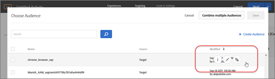
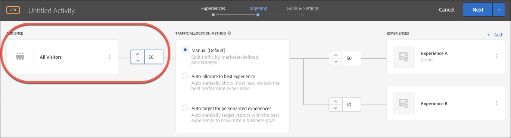

# Select audience

The audience determines which site visitors are entered into your activity.

>[!NOTE]
>
>In addition to selecting an existing audience, you can combine multiple audiences to create ad hoc combined audiences rather than creating a new audience. For more information, see [Combining Multiple Audiences](../../../c-target/c-audiences/c-combining-multiple-audiences.md#concept_A7386F1EA4394BD2AB72399C225981E5).

**Using Audiences in Adobe Target (6:21)**

This video explains how to use audiences in [!DNL Target Standard/Premium].

* Explain the term "Audience" 
* Explain the two ways audiences are used for optimization 
* Find audiences in the Audiences list 
* Target an activity to an audience 
* Use audiences for passive reporting in an activity

>[!VIDEO](https://vimeo.com/TAMBpW9vpOI)

In the [!UICONTROL Audience] box, click the Edit icon (three vertical ellipses), then click **[!UICONTROL Replace Audience]**.

By default, all visitors are your audience. However, you can change the audience. Audiences are selected from the audience library or you can create an activity-only audience. The audience library contains audiences that have previously been defined, including some common audiences that are pre-built as a part of Target. You can either select an audience from the library, [create a new audience](../../../c-target/c-audiences/t-create-audience.md#task_1D507519D3AD4390B507F188BD294DC1), or [create an activity-only audience](../../../c-target/c-audiences/creating-activity-only-audience.md#concept_A6BADCF530ED4AE1852E677FEBE68483). For an A/B test without specific audience targeting, choose the default, All Visitors.

Note that you can also edit or copy an audience by hovering over the desired audience in the [!UICONTROL Choose Audience] dialog box, as shown below. Copying an audience is helpful if you want to create a similar audience to an existing audience. You can make a copy of the audience, make your edits, then save it as a new audience. This hover functionality exists in other activity types as well.

When creating an audience, you can select a location (mbox) and specify parameters for that location. Under Custom Parameters, select the mbox, then specify the desired parameters.

>[!NOTE]
>
>Audiences are automatically imported in the background when you open the audience list and the imported audiences are more than 10 minutes old.

Click the down arrow to remove the existing audience or change the audience.

You can specify the percentage of qualifying visitors to include in the activity. For example, you might choose to include 50% of all visitors.

You can also choose to let Target [allocate traffic automatically](../../../c-activities/automated-traffic-allocation/automated-traffic-allocation.md#concept_A1407678796B4C569E94CBA8A9F7F5D4).

**Activity Workflow - Targeting (2:14)**

This video includes information about setting up audiences.

* Assign an audience to your activity 
* Throttle traffic up or down 
* Select your traffic allocation method 
* Allocate traffic between different experiences

>[!VIDEO](https://vimeo.com/LOmBgKPeBtA)

For detailed information, see [Audiences](../../../c-target/c-audiences/c-audiences.md#concept_65BE870D290E412D8BBF557EEA67C271). 
