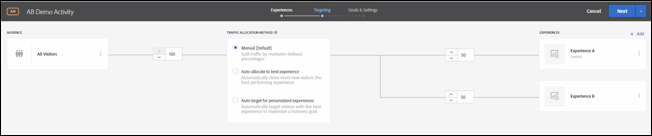
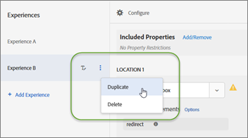

# Add experience{#add-experience}

The Visual Experience Composer provides a visual interface for editing the experiences on your page.

For additional detail about experiences, see [Experiences](../../../c-experiences/c-experiences.md#concept_A2E10F6AFB3D4AEAB6951EE14688848D). 

1. Click **[!UICONTROL Add Experience]**.

   >[!NOTE]
   >
   >If you are targeting an experience to an audience, you must select the audience before you can add an experience. A message appears to remind you to choose your audience.

1. When prompted, enter the activity URL. Type the complete URL (including `https://`), then click **[!UICONTROL Continue]**.

   The Experience Composer (see [Experiences](../../../c-experiences/c-experiences.md#concept_1D011219034B492BB03C08B3BB80E3F0)) opens the page that is specified in your Account Preferences. To display a different page, click the Globe icon and enter the URL in the Select URL box in the Experience Composer and click **[!UICONTROL Continue]**. If you entered a URL for a site that does not include the Target Standard JavaScript code, you cannot select page elements.

   By default, the Visual Experience Composer does not allow changes to elements containing JavaScript, such as rotating banners. You can select to disable JavaScript if you want to be able to alter those elements using the Visual Experience Composer.

   >[!NOTE]
   >
   >If you change the URL after making changes to a page for one or more experiences, the experience is reset using the new page and the changes you made are lost.

1. Select the elements you want to change and make the desired changes.

   As you hover the elements on your page, the elements are highlighted. Any highlighted element can be altered using the Experience Composer.

   The video below provides information about using the Visual Experience Composer options. (7:17)

   * Change the content of a page 
   * Change the layout of a page

   >[!VIDEO](https://www.youtube.com/watch?v=2KUDgu6Mscg)

      If you created an mbox on the page using Target Classic (formerly Test&Target), that mbox appears as an element that shows the mbox name, and can be modified like any other element.

      The following actions can be performed on an element on the displayed page to change the experience:

   | Menu Item | Option | Description |
   |--- |--- |--- |
   |Edit|Text/HTML|Change the HTML code for the element, such as the text for a text area, button, or link. In addition to HTML code, you can edit and inject custom JavaScript. Several rich text formatting options are available when editing text and HTML for A/B and Experience Targeting activities. You can choose a font, select a font style, change text alignment, and other standard text formatting options. When modifying HTML, you can toggle between the code view and rich-editing view of the HTML.|
   ||Background Color|Use the color picker to select or configure a background color. You can select a color swatch, and adjust it using RGB values or color hex codes. The red x in the color picker makes the background transparent. **Note:** This option is not available for an element where a background image is set.|
   ||CSS Class|Specify the predefined CSS class used for the element. If more than one element is selected, separate multiple CSS classes with a space. Available for A/B, Automated Personalization, and Multivariate test activities.|
   ||Link|Change the URL in the link. Use  Edit Link to update the selector to point to the same image element. However, linking to a different image element is not supported. To link to a different image element, delete the original action from the code editor and use the  Visual Experience Composer to apply the action on the other image element.|
   |Insert After|Image HTML Text|Add any kind of element to your page in addition to modifying existing content. Add text, code, lists, and more to create entirely different experiences to test. Select an element on the page, then click Insert After and choose whether you want to insert an image, HTML, or text. The inserted element appears after the selected element. The behavior of the inserted element depends on the structure of your page, your CSS, and other page configuration options. Valid HTML is required to make your page appear correctly. Always test your page after inserting an item to make sure it appears as expected. **Note:** Inserting an image requires that Adobe Scene7 Publishing System is enabled so you have access to the image library.|
   |Replace With|Image|Select a different image from the Content Library. The images available for swapping include the images uploaded to the Experience Cloud assets folder or uploaded in the Content Library in Target. During initial activity creation, the URL displayed is not the URL used for delivery. Upon activity synching, that URL is updated to a production Scene7 URL. For example, the initial URL might look like the following example: `https://test.marketing.adobe.com/content/dam/mac/scholasticinc/Aug_MBM.jpeg?ch_ck=1470774943867` After activity syncing, the delivery URL might look like the following example: `https://s7d2.scene7.com/is/image/TargetTest/Aug_MBM?tm=1470768352933&fit=constrain&hei=173&wid=300` **Note:** Swapping images requires an Adobe Scene7 Publishing System account.|
   ||HTML Offer|Select a different offer from the Content Library. **Note:** HTML Offers are stored on Target servers. An HTML offer can be up to 256KB in size.|
   ||Experience Fragment|Insert experience fragments created in Adobe Experience Manager (AEM) in Target activities to aid optimization or personalization. For more information, see [AEM Experience Fragments](../../../c-experiences/c-manage-content/aem-experience-fragments.md).|
   |Layout|Rearrange|Drag the element to another location inside the same parent element or `
`. Other elements shift location to make space for the rearranged element. **Note:** Click tracking does not work on rearranged items.|
   ||Resize|Resize an element on your page. When you select Resize, a handle appears in the bottom right corner of the element that lets you drag that corner to resize. Hold the Shift key to retain the same aspect ratio. **Note:** Inline elements cannot be resized.|
   ||Move|Move elements on your page. Unlike the Rearrange option,  Move does not shift other elements to make room for the element being moved. Use the arrow keys to fine tune the move. (Planned enhancement: support for making sure moved elements are not hidden behind other elements.)  In some cases, such as when a CSS restriction requires an element to remain inside its parent element, you cannot move the element outside its parent.|
   ||Hide|Hide the element. The white space remains, but the content is removed.|
   ||Remove|Remove the element. The white space behind the image is removed and the space where the element was is collapsed. **Note:** Items within a "classic" mbox (an mbox created within a  Target Classic campaign) cannot be removed using this option.|
   |Expand Selection|N/A|Select the parent element in addition to the originally selected element. When you select any parent element, all children of that element are automatically selected. You can expand the selection multiple times.|
   |Navigate to this Link|N/A|Open the destination of the link.|
   |Undo/Redo|N/A|Undo changes you make to your activities during an editing session. You can also redo changes that have been previously undone.|

      >[!NOTE]
      >
      >If you deliver an image from a source other than your main page (such as an image hosted on akamai.net and delivered on dell.com), then that image does not display in the thumbnail of the page shown in the flow diagram.

1. Click the Check Mark button when you are finished designing the experience.

   The activity diagram displays:

   

   If an experience includes cross-domain content, the thumbnail might not display accurately and is replaced by an icon. 
1. Specify the percentage of visitors who will see each experience in the activity.

   You can show multiple experiences to the same audience. A diagram displays showing your selected audience and the experiences you've added to the activity. Specify the percentage of times you want each experience to be shown. You can split the percentages evenly between all experiences, or specify higher or lower percentages for each experience. The total for all experiences must equal 100%. You can also click **[!UICONTROL Add Experience]** to add another experience to the activity.

   Click **[!UICONTROL Continue]** when you are finished with this step. 

Note that you can click the More (three vertical ellipses) icon on an experience in an A/B Test or Experience Targeting (XT) activity and choose from the following options, as necessary: 

* Rename 
* Edit 
* Delete 

Note that when you name or rename an experience, the following characters are not allowed: 

<table id="table_F5E365667FDC48AD8B4461E40CD669B8"> 
 <thead> 
  <tr> 
   <th colname="col1" class="entry"> Character </th> 
   <th colname="col2" class="entry"> Description </th> 
  </tr>
 </thead>
 <tbody> 
  <tr> 
   <td colname="col1"> 
/ 
 </td> 
   <td colname="col2"> 
Forward slash 
 </td> 
  </tr> 
  <tr> 
   <td colname="col1"> 
? 
 </td> 
   <td colname="col2"> 
Question mark 
 </td> 
  </tr> 
  <tr> 
   <td colname="col1"> 
# 
 </td> 
   <td colname="col2"> 
Number sign 
 </td> 
  </tr> 
  <tr> 
   <td colname="col1"> 
: 
 </td> 
   <td colname="col2"> 
Colon 
 </td> 
  </tr> 
  <tr> 
   <td colname="col1"> 
= 
 </td> 
   <td colname="col2"> 
Equals to 
 </td> 
  </tr> 
  <tr> 
   <td colname="col1"> 
+ 
 </td> 
   <td colname="col2"> 
Plus 
 </td> 
  </tr> 
  <tr> 
   <td colname="col1"> 
- 
 </td> 
   <td colname="col2"> 
Minus 
 </td> 
  </tr> 
  <tr> 
   <td colname="col1"> 
@ 
 </td> 
   <td colname="col2"> 
At sign 
 </td> 
  </tr> 
 </tbody> 
</table>

**Duplicate an Experience:** You can copy an experience in an A/B Test so you can make minor changes to it without having to re-create the experience from scratch. 

On the **[!UICONTROL Experiences]** page (the first step in the three-step guided workflow), click the three vertical ellipses > **[!UICONTROL Duplicate]**. 

