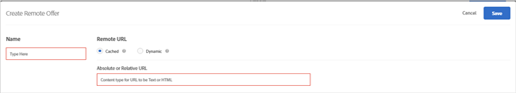

# Create remote offers

Use remote offers to host content outside of Target that Target references and delivers to users' websites. This content might be in a content management or other system, either for ease-of-use or for security reasons.

## Create remote offers {#concept_657016A0E6174C22B89036E9C8A0170F}

Use remote offers to host content outside of [!DNL Target] that Target references and delivers to users' websites. This content might be in a content management or other system, either for ease-of-use or for security reasons.

>[!NOTE]
>
>Remote offers can be created only in the forms-based composer. Content will be injected in the mbox locations, so these are most likely not appropriate for a global mbox.

>[!NOTE]
>
>[!DNL Target Classic] included similar features: [!UICONTROL Offer on Your Site] and [!UICONTROL Offer Outside Test&Target].

Some examples of remote offers include:

* Different versions of your cross-sells 
* Dynamic shopping cart messages 
* Forms 
* Calculators 
* Interest rate updates

**To create a remote offer:**

1. Click **[!UICONTROL Offers]**, then select the **[!UICONTROL Code Offers]** tab. 
1. Click **[!UICONTROL Create]** > **[!UICONTROL Remote Offer]**.

   

1. Provide a descriptive name for the offer.

   A descriptive name helps you and others quickly find the offer in the [!UICONTROL Assets] library. 

1. Specify the remote URL for the remote offer:

<table id="table_E030736D80514A53B65D26DFF62ED67C"> 
 <thead> 
  <tr> 
   <th colname="col1" class="entry"> Option </th> 
   <th colname="col2" class="entry"> Description </th> 
  </tr>
 </thead>
 <tbody> 
  <tr> 
   <td colname="col1"> 
Cached 
 </td> 
   <td colname="col2"> 
The content for a cached remote offer is served from  Target. 
 
Every two hours,  Target fetches the content at the remote URL and then stores the content inside  Target. When visitors load a site with an experience that includes a remote offer, the offer is delivered by  Target. 
 
Cached remote offers provide enhanced security because somebody logged in to Target cannot change the content. To change the content, someone would need to log in to the content management or other system and change the content there. 
 
You can specify an absolute or relative URL for a cached remote offer. 
 </td> 
  </tr> 
  <tr> 
   <td colname="col1"> 
Dynamic 
 </td> 
   <td colname="col2"> 
A dynamic remote offer is served from the content management or other system rather than from  Target. 
 
You might not want the content periodically cached and then delivered by  Target whenever visitors load a site with an experience that includes a remote offer. Instead, you want to call the system that is hosting the content, possibly pass in specific information so that the returned offer can be dynamic, or different, for each user. 
 
For example, if a user logs in to a website for a credit card that includes an experience with a dynamic remote offer, you could pass parameters into the URL for the user's account information. Then the website could provide user-specific information, such as account balance. 
 
Click  Add Parameter to add one or more mbox or request parameters. 
 </td> 
  </tr> 
 </tbody> 
</table>

1. Click **[!UICONTROL Save]**.

## Best Practices for Using Remote Offers {#section_7718512D08E14121B6F6B8C38134F4BC}

Best practices for using remote offers in your activities:

* If your offer resides in the same domain as the mboxes, using the [!UICONTROL Cached] option lets you use relative URLs in describing your offer location.

  This means that when you move your activity from your staging servers to production, the content will automatically be accessible without having to change the URL manually. 

* If your test involves data dynamically generated by your server, the [!UICONTROL Dynamic] option might be the right choice. 
* If you plan to test only the appearance of your existing remote offer content, use the [!UICONTROL Visual Experience Composer] to change the look and feel of the content that is returned from the content management system. 
* Use the Remote Offer Selection Matrix to help you choose the offer best suited for your specific case. Consult your account representative if you have questions.

## How Dynamic Remote Offers Work {#concept_CC2A969420B34364A9FA78C1CE251818}

Dynamic remote offers use your dynamic page technology to pass values to the offer.

<!-- 

target/c_how-remote-offers_work.xml

 -->

The offer is executed after you render the page. An invisible iframe gathers the data, copies it out of the frame and inserts in on the page, loading your passed values.

## Remote Offer Selection Matrix {#reference_B23BEDD29DDD47709A7651AFD27E776B}

The Remote Offer Selection Matrix helps you decide which type of remote offer to choose: [!UICONTROL Cached] or [!UICONTROL Dynamic].

<!-- 

target/r_remote-offer-selection-matrix.xml

 -->

<table id="table_6D4312DFE1A241958CE1E867FC20F9A8"> 
 <thead> 
  <tr> 
   <th colname="col1" class="entry"> Feature </th> 
   <th colname="col002" class="entry"> Cached </th> 
   <th colname="col2" class="entry"> Dynamic </th> 
  </tr> 
 </thead>
 <tbody> 
  <tr> 
   <td colname="col1"> 
Updates each time a visitor makes a request 
 </td> 
   <td colname="col002"> 
No 
 </td> 
   <td colname="col2"> 
Yes 
 </td> 
  </tr> 
  <tr> 
   <td colname="col1"> 
Content updates 
 </td> 
   <td colname="col002"> 
Cached every 2 hours 
 </td> 
   <td colname="col2"> 
Updated immediately upon each request 
 </td> 
  </tr> 
  <tr> 
   <td colname="col1"> 
Load time 
 </td> 
   <td colname="col002"> 
Faster 
 </td> 
   <td colname="col2"> 
Slower due to request processing 
 </td> 
  </tr> 
  <tr> 
   <td colname="col1"> 
Can see JavaScript on page 
 </td> 
   <td colname="col002"> 
Yes 
 </td> 
   <td colname="col2"> 
No, but can pass via URL 
 </td> 
  </tr> 
  <tr> 
   <td colname="col1"> 
Offers can include JavaScript 
 </td> 
   <td colname="col002"> 
Yes 
 </td> 
   <td colname="col2"> 
No 
 </td> 
  </tr> 
  <tr> 
   <td colname="col1"> 
Offer URL 
 </td> 
   <td colname="col002"> 
Absolute or Relative 
 </td> 
   <td colname="col2"> 
Relative 
 </td> 
  </tr> 
  <tr> 
   <td colname="col1"> 
Requesting computer 
 </td> 
   <td colname="col002"> 
Adobe servers 
 </td> 
   <td colname="col2"> 
The visitor's computer, which carries the visitor's cookies 
 </td> 
  </tr> 
 </tbody> 
</table>

