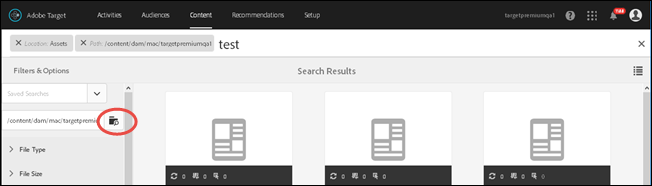
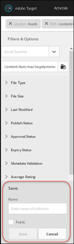
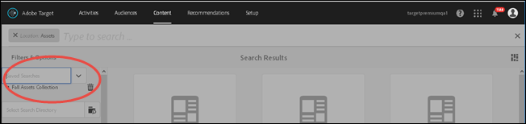

# Search content and create smart collections{#search-content-and-create-smart-collections}

Search for assets by keywords and save search folders, called smart collections, that are automatically updated with search results.

This section contains the following information:

* [Search for Assets by Keyword](../../c-experiences/c-manage-content/filter-and-search-content.md#section_2465A71BC95942588F586B1EC8B9E5DB) 
* [Save Smart Collection](../../c-experiences/c-manage-content/filter-and-search-content.md#section_5C95159543B5405EB8C8E47B518DF4AB)

## Search for Assets by Keyword {#section_2465A71BC95942588F586B1EC8B9E5DB}

1. Click **[!UICONTROL Offers]** > **[!UICONTROL Image Offers]** to access the [!UICONTROL Asset Library].

   You can click the [!UICONTROL Card View] icon in the top right corner to display assets in card-view format.

   Or

   You can click the [!UICONTROL List View] icon in the top right corner to display assets in list-view format. 

1. Click the **[!UICONTROL Content Only]** icon in the top left corner to display the search box.

   

1. In the search box, type a keyword for the asset(s) you want to locate, then press Enter.

## Save Smart Collection {#section_5C95159543B5405EB8C8E47B518DF4AB}

You can create saved searches, called smart collections, to save time when performing similar searches. A saved search creates a smart collection that is automatically updated with search results.

1. Click **[!UICONTROL Offers]** > **[!UICONTROL Image Offers]** to access the [!UICONTROL Assets Library].

   

1. Click the **[!UICONTROL Content Only]** icon in the top left corner to display the [!UICONTROL Filter & Options] panel in the left rail. 
1. Click the **[!UICONTROL Browse]** icon to display the [!UICONTROL Select Path] dialog box.

   

1. Browse to and select the desired folder that you want to base the smart collection on, then click the **[!UICONTROL Confirm]** icon.

   

1. (Optional) Select from among the various options to narrow your filter, for example, file type and size. 
1. Click **[!UICONTROL Save Smart Collection]** at the bottom of the [!UICONTROL Filter & Options] panel to display the Save options.

   

1. Specify a name for the smart collection, select the **[!UICONTROL Public]** check box if you want all users in your [!DNL Target] account to be able to access this smart collection, then click **[!UICONTROL Save]**.

   The smart collection is added to your saved searches list for future use:

   

You can edit a saved smart collection by selecting it from the [!UICONTROL Saved Searches] drop-down list to open it, then by clicking [!UICONTROL Edit Smart Collection]. 
