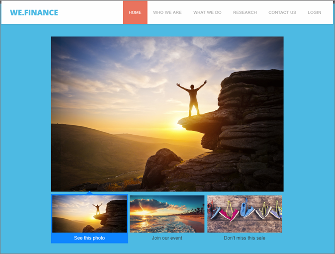
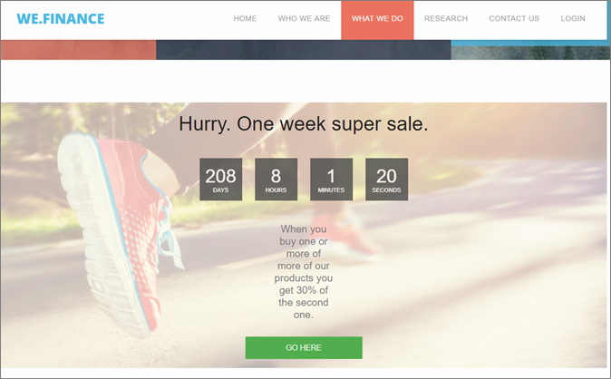
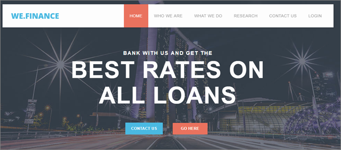
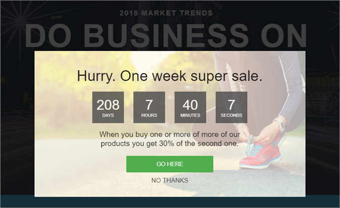
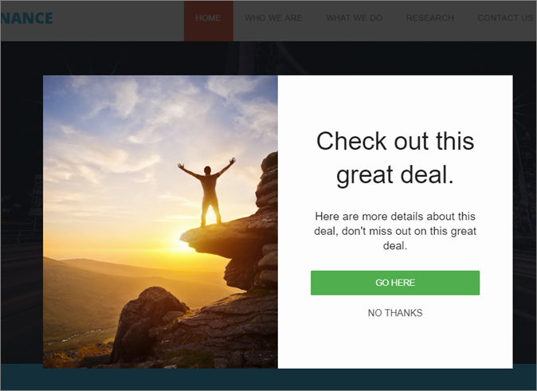

# Experience Templates{#experience-templates}

Information about Adobe Target Experience Templates for use in custom code. Target Experience Templates are pre-coded samples with configurable inputs to be used to execute common marketer use-cases.

These Experience Templates are provided free to developers and marketers as a starting point to execute common use-cases, either via the VEC or the Form-based Experience Composer.

The following templates are currently available on the Adobe Marketing Cloud GitHub, see [Target-Experience-Templates](https://github.com/Adobe-Marketing-Cloud/target-experience-templates).

## Banner Carousel with Thumbnails {#section_BEEE51D47CC44A478264BBF3FEC70DAE}

The [Banner Carousel with Thumbnails experience template](https://github.com/Adobe-Marketing-Cloud/target-experience-templates/tree/master/banner-carousel-thumbnails) is a rotating carousel, commonly used on home pages and landing pages or other high-volume entry pages. This carousel will not automatically rotate through the images and can be interacted with directly by clicking the smaller images below the primary image.

## Banner Carousel {#section_725D4C0C4FCD41FA92BCFC910A216E2A}

The [Banner Carousel experience template](https://github.com/Adobe-Marketing-Cloud/target-experience-templates/tree/master/banner-carousel) is a rotating carousel, commonly used on home pages and landing pages or other high-volume entry pages. This carousel will not automatically rotate through the images and can be interacted with directly by clicking the left and right arrows.

## Banner Countdown {#section_ED9501FE096C4CD7B6D9933E0322B4AD}

The [Banner Countdown experience template](https://github.com/Adobe-Marketing-Cloud/target-experience-templates/tree/master/banner-countdown) is a large banner with a central countdown, commonly used on home pages and landing pages or other high-volume entry pages.

## Button Builder {#section_DBDD1C9A9F294FB6BABBC04B4454E59B}

The [Button Builder experience template](https://github.com/Adobe-Marketing-Cloud/target-experience-templates/tree/master/button) is a small button with a text call to action. The button is configurable and can be placed anywhere on the page to add a new call to action, or replace an existing button with a more configurable alternative.

## Lightbox with Countdown {#section_E1177C52F1294EA5AC48312727CD3DF4}

The [Lightbox with Countdown experience template](https://github.com/Adobe-Marketing-Cloud/target-experience-templates/tree/master/lightbox-countdown) is a lightbox overlay popup with a central countdown, commonly used on home pages and landing pages or other high-volume entry pages.

## Lightbox with Exit Intent {#section_E624C867E4CD4F2294CFC7917EFAEBD7}

The [Lightbox with Exit Intent experience template](https://github.com/Adobe-Marketing-Cloud/target-experience-templates/tree/master/lightbox-exit-intent) is a lightbox overlay popup triggered on exit intent (moving mouse to top right of screen) and can be deployed on any web property where you want a last chance to capture attention.

## Lightbox {#section_EF4FBA08CE55407CAFB334340C6C1577}

The [Lightbox experience template](https://github.com/Adobe-Marketing-Cloud/target-experience-templates) is a lightbox overlay popup with a built in delay, commonly used on home pages and landing pages or other high-volume entry pages.

## Ribbon {#section_CCBB656265F140AEA1B200409D719000}

The [Ribbon experience template](https://github.com/Adobe-Marketing-Cloud/target-experience-templates/tree/master/ribbon) is a 100% width ribbon that inserts at the very top of the web page, typically used to indicate a flash sale, free shipping, safety or weather event, or other important announcement.

