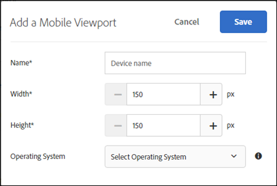
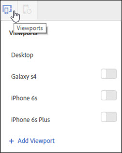

# Mobile Viewports for Responsive Experiences{#mobile-viewports-for-responsive-experiences}

Mobile viewports help you preview how your activities appear on screens of various sizes.

## Mobile Viewports for Responsive Experiences {#concept_8E45527C4ABC41D59AA3553BEDC76FA5}

Mobile viewports help you preview how your activities appear on screens of various sizes. 

The mobile viewport preview feature is designed for responsive sites. Use mobile viewports if your site is responsive and the same elements in your desktop page are used on your mobile page in a different configuration. If you have a separate mobile site with a separate structure, such as [!DNL m.mysite.com], use a [multipage activity](../../c-experiences/c-visual-experience-composer/multipage-activity.md#concept_277E096063E14813AC5D8EDFA1D2ED48).

>[!NOTE]
>
>Mobile viewports are not available if overlapped by a redirect offer overlay.

A viewport is defined by the size of the rectangle filled by a web page on your screen. It is the size of the browser window, minus the scrollbars and toolbars. Browsers use "CSS pixels." For many devices, such as those with retina screens, the viewport is smaller than the advertised device resolution.

Below are the viewports and resolutions for some popular devices. Remember to use the viewport size in Target.  

|  Device  | Viewport Size  | Device Resolution  |
|---|---|---|
|  iPhone X  | 375w x 812h  | 1125w x 2436h  |
|  iPhone 8 Plus  | 414w x 736h  | 1080w x 1920h  |
|  iPhone 8  | 375w x 667h  | 750w x 1334h  |
|  iPhone 7 Plus  | 414w x 736h  | 1080w x 1920h  |
|  iPhone 7  | 375w x 667h  | 750w x 1334h  |
|  iPhone 6  | 375w x 667h  | 750w x 1334h  |
|  iPhone 6s  | 414w x 736h  | 1080w x 1920h  |
|  iPad Pro  | 1024w x 1366h  | 2048w x 2732h  |
|  iPad Third & Fourth Generation  | 768w x 1024h  | 1536w x 2048h  |
|  iPad Air 1 & 2  | 768w x 1024h  | 1536w x 2048h  |
|  iPad Mini  | 768w x 1024h  | 768w x 1024h  |
|  iPad Mini 2 & 3  | 768w x 1024h  | 1536w x 2048h  |
|  Nexus 6P  | 411w x 731h  | 1440w x 2560h  |
|  Nexus 5X  | 411w x 731h  | 1080w x 1920h  |
|  Google Pixel  | 411w x 731h  | 1080w x 1920h  |
|  Google Pixel XL  | 411w x 731h  | 1440w x 2560h  |
|  Google Pixel 2  | 411w x 731h  | 1080w x 1920h  |
|  Google Pixel 2 XL  | 411w x 731h  | 1440w x 2560h  |
|  Samsung Galaxy Note 5  | 480w x 853h  | 1440w x 2560h  |
|  LG G5  | 480w x 853h  | 1440w x 2560h  |
|  One Plus 3  | 480w x 853h  | 1080w x 1920h  |
|  Samsung Galaxy S9  | 360w x 740h  | 1440w x 2960h  |
|  Samsung Galaxy S9+  | 360w x 740h  | 1440w x 2960h  |
|  Samsung Galaxy S8  | 360w x 740h  | 1440w x 2960h  |
|  Samsung Galaxy S8+  | 360w x 740h  | 1440w x 2960h  |
|  Samsung Galaxy S7  | 360w x 640h  | 1440w x 2560h  |
|  Samsung Galaxy S7 Edge  | 360w x 640h  | 1440w x 2560h  |
|  Nexus 7 (2013)  | 600w x 960h  | 1200w x 1920h  |
|  Nexus 9  | 768w x 1024h  | 1536w x 2048h  |
|  Samsung Galaxy Tab 10  | 800w x 1280h  | 800w x 1280h  |
|  Chromebook Pixel  | 1280w x 850h  | 2560w x 1700h  |

Various websites list viewport sizes for popular devices. For example, see [https://mediag.com/news/popular-screen-resolutions-designing-for-all/](https://mediag.com/news/popular-screen-resolutions-designing-for-all/) or consult the device maker's website.

**Visual Experience Composer (2 of 2) (7:29)**

The following demo video includes information about using the Visual Experience composer to work with mobile viewports:

* Rename and duplicate an experience 
* Create a redirect experience 
* Target an activity to a single URL or a group of URLs 
* Create a multi-page activity 
* Preview and build experience for responsive websites 
* Use overlays to highlight types of elements

>[!VIDEO](https://www.youtube.com/watch?v=qwUKEp8en_k)

If you want to deliver an activity to people on a particular device, choose the appropriate audience for that device in the activity diagram. Use the Mobile Web Composer to edit the page in the activity for that device. If you want to run an activity across your entire digital experience and make sure it looks good across all devices, don't apply targeting, and use mobile viewports to preview the activity on each screen size.

If you have a responsive site, typically your site is designed to open in a different view when accessed by a device with a specific screen size. Those screen sizes that trigger the new views are known as *CSS breakpoints*. Save your CSS breakpoints in Target so you can preview your experiences for each view you define. Each of these experiences is displayed in a mobile viewport in the Target interface. Open the view for each screen size by clicking that viewport along the top of the display.

If your site is not responsive, you can still use the Mobile Web Composer to view a site if your activity is targeted to a specific device.

>[!NOTE]
>
>While you can edit an experience from within mobile viewports, these changes apply to all viewports and devices, not just the viewport that you're working in. Similarly, editing an experience in the normal desktop view changes the page for all screen sizes, not just the desktop view. Currently, we don't support viewport-specific page changes.

## Mobile Viewport Configuration {#task_B4B161499DC0470584ED922A4D20FCAB}

Configure any mobile viewports you want to make available when creating your experiences.

<!-- 

target/t_mobile_viewport_configuration.xml

 -->

This video includes information about setting up mobile viewports in the account preferences, beginning at 4:40 in the video.

>[!VIDEO](https://www.youtube.com/watch?v=MJXhgxlP-KI) 

1. Click **[!UICONTROL Setup]** > **[!UICONTROL Preferences]**.
1. In the Mobile Viewports Configuration section of the Account Preferences page, click **[!UICONTROL Add new]** to add a mobile viewport.

   To change the configuration of an existing mobile viewport, select that viewport, then click the Edit (pencil) icon.

   

1. Type a name for the mobile viewport.

   Give your mobile viewport a descriptive name that is easy to recognize. The name can be up to 36 characters long. 
1. Enter the screen size of the mobile device, both width and height.

   The width can be between 150 and 968 pixels. The height can be between 150 and 1280 pixels.

   >[!NOTE]
   >
   
1. (Optional) Select the operating system of the device.

   Options:

   * Android 
   * iOS 
   * Windows 
   * Symbian 
   * Blackberry

   If you use the [Enhanced Experience Composer](../../c-experiences/experiences.md#section_34265986611B4AB8A0E4D6ACC25EF91D) and choose an operating system, Target emulates that device when you view the page. If, for example, there is a different look and feel for Android than iOS on your responsive site, Target mimics that behavior. 
1. Click **[!UICONTROL Save]**.

## Create Responsive Experience {#task_D6332438B5EE48CCA8AF199270F1CAEF}

Add mobile viewports to your Target activities to create responsive experiences for mobile screens.

<!-- 

target/t_responsive_experience.xml

 -->

1. Create an activity.
1. In the Visual Experience Composer, click the **[!UICONTROL Settings]** gear icon, then select **[!UICONTROL Add Mobile Viewports]**.
1. Click the **[!UICONTROL Devices]** icon, then enable each device that should have a mobile viewport.

   

   The mobile viewports are listed from smallest to largest according to width. 
1. Edit the mobile viewports as desired.

   Any changes you make to the experience (for example, if you change the text in a heading) are applied to the experience on all devices.

   Mouse over the name of a viewport to see the viewport's size. 
1. If desired, toggle between portrait and landscape modes by clicking the orientation icon.

<table id="table_63B970F1125A4577B87F8092DF5456F6"> 
 <thead> 
  <tr> 
   <th colname="col1" class="entry"> Mode </th> 
   <th colname="col2" class="entry"> Icon </th> 
  </tr> 
 </thead>
 <tbody> 
  <tr> 
   <td colname="col1"> 
Portrait 
 </td> 
   <td colname="col2"> 
 
 </td> 
  </tr> 
  <tr> 
   <td colname="col1"> 
Landscape 
 </td> 
   <td colname="col2"> 
 
 </td> 
  </tr> 
 </tbody> 
</table>

## Use Case: Target Two iPhone Versions {#task_CC3144BF5BA54034996E1D3DB0BC1A35}

This use case shows how to configure experiences for two iPhone versions, iPhone 6 and iPhone 6 Plus, using the Mobile Viewports feature of Target Standard.

<!-- 

target/t_viewports-two-iphones.xml

 -->

1. In Target Standard, click **[!UICONTROL Setup]** > **[!UICONTROL Preferences]**.
1. In the Mobile Viewport Configuration section of the Preferences page, create mobile viewports for iPhone 6 and iPhone 6 plus.

   Use the following settings for each viewport:

   |  Name  | Width  | Height  | Operating System  |
   |---|---|---|---|
   |  iPhone 6  | 375  | 667  | iOS  |
   |  iPhone 6 Plus  | 414  | 736  | iOS  |

   

1. Create an activity with the experience you would like to Target.
1. Select the experience you want to target to visitors who access your site from an iPhone 6 or iPhone 6 Plus.
1. When selecting your target, click **[!UICONTROL Create Audience]**, then configure an audience as shown in the image below:

   

   Because the phone could be rotated to landscape, requiring both height and width to be greater than 320 simultaneously creates a condition that only the 6 and 6 Plus would be able to meet, when combined with the iPhone Device Model. 
1. Click **[!UICONTROL Save]**.
1. Continue setting up your activity as you normally would.
