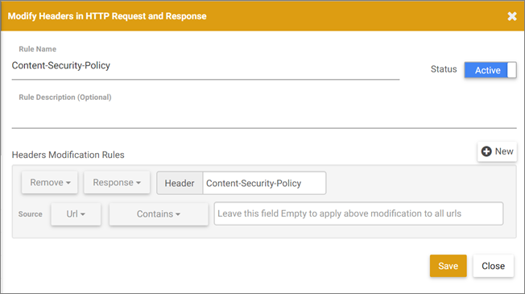

# Troubleshooting Issues Related to the Visual Experience Composer and Enhanced Experience Composer{#troubleshooting-issues-related-to-the-visual-experience-composer-and-enhanced-experience-composer}

Display problems sometimes occur in the Visual Experience Composer (VEC) and the Enhanced Experience Composer (EEC) under certain conditions.

## Does Target support multi-level iframes?

Target does not support multi-level iframes. If your website loads an iframe that has a child iframe, Target libraries (at.js and mbox.js) interact with the parent iframe only. Target libraries do not interact with the child iframe.

As a workaround, you can add a page in the experience with the URL of the child iframe.

## When I try to edit a page, all I see is a spinner instead of my page. (VEC and EEC) {#section_313001039F79446DB28C70D932AF5F58}

This can happen if the URL contains a # character. To fix the issue, switch into Browse mode in the Visual Experience Composer, and then switch back to Compose mode. The spinner should go away and the page should load.

## Content Security Policy (CSP) headers block the Target libraries on my website. (VEC and EEC) {#section_89A30C7A213D43BFA0822E66B482B803}

If your website's CSP headers block Target libraries, then loads the website but prevents editing, ensure that the Target libraries are not blocked.

>[!NOTE]
>
>In addition to the following information, you can use the [Adobe Target VEC Helper browser extension](/help/c-experiences/c-visual-experience-composer/r-troubleshoot-composer/vec-helper-browser-extension.md) for Google Chrome.

As a workaround, you can configure a Requestly rule to remove CSP headers, as shown below:

You can configure a similar Requestly rule for any header that causes a resource to not load inside the VEC.

For Requestly, whenever there is a need to remove headers, you should do either of following:

* Add URL rules for the URL that you want to open in the VEC so that headers are removed for those URLs only. 
* Enable the rule when you are editing in the VEC and disable the rule when you are not using the VEC.

## The VEC or EEC appears broken or does not initialize when re-editing a saved activity. (VEC and EEC) {#section_5AC3BA8F8FBB451EA814F298D0645E54}

If the website has changed outside of the Visual Experience Composer after the experience was defined, selectors on which actions were taken earlier cannot be found when the activity is opened for re-editing. The page appears broken, and no warning displays.

## The VEC or EEC does not show my rotating banners and other content containing JavaScript. (VEC and EEC) {#section_8B5BE6EB050B42D6A14A054724C41330}

By default, the Visual Experience Composer blocks JavaScript elements. You can work with these elements if you disable JavaScript in the Visual Experience Composer settings. Depending on how the site is set up, some items might continue to display incorrectly or to remain unavailable.

## My hosted target.js file fails to load on subsequent page reloads. (VEC and EEC) {#section_87F6418C2CD142A7B4D1E7037935F81F}

This issue happens when customers have an mbox.js version earlier than 57 (i.e. version 56 or earlier).

We recommend that all VEC users upgrade to the [latest version of mbox.js](../../../c-implementing-target/c-implementing-target-for-client-side-web/t-mbox-download/mboxjs-change-log.md#reference_DBB5EDB79EC44E558F9E08D4774A0F7A), or at least upgrade to version 57. You should also consider [making the transition to at.js](../../../c-implementing-target/c-implementing-target-for-client-side-web/t-mbox-download/c-target-atjs-implementation/target-atjs-implementation.md#concept_8AC8D169E02944B1A547A0CAD97EAC17).

## When I change one element on the page, multiple elements change. (VEC and EEC) {#section_309188ACF34942989BE473F63C5710AF}

If the same DOM element ID is used on multiple elements on the page, changing one of those elements changes all elements with that ID. To prevent this from happening, an ID should be used only once on each page. This is a standard HTML best practice. For more information, see [Page Modification Scenarios](../../../c-experiences/c-visual-experience-composer/r-troubleshoot-composer/vec-scenarios.md#concept_A458A95F65B4401588016683FB1694DB).

## I can't edit experiences for an iFrame-busting site. (VEC and EEC) {#section_9FE266B964314F2EB75604B4D7047200}

This issue can be addressed by enabling the Enhanced Experience Composer. Click **[!UICONTROL Setup]** > **[!UICONTROL Preferences]**, then select the check box that enables the Enhanced Experience Composer. The Enhanced Experience Composer uses an Adobe-managed proxy to load your page for editing. This allows editing on iFrame-busting sites and allows editing on sites and pages where you have not yet added Adobe Target code. The activities do not deliver to the site until the code has been added. Some sites may not load via the Enhanced Experience Composer, in which case you can uncheck this option to load the Visual Experience Composer via an iFrame. []

>[!NOTE]
>
>Your locally hosted pages or pages that are not accessible outside your network are not accessible to the Adobe proxy server and cannot be opened in the EEC. These pages might include staging URLs, User Acceptance Testing (UAT) URLs, or locally hosted pages.

## I want to set up tests on pages that don't have the mbox/target implementation done yet. (VEC and EEC) {#section_DE63BCCB5B124E10A71FA579B582A80A}

See "I can't edit experiences for an iFrame-bursting site" above.

## Bold and italic text styles with Edit Text/HTML or Change text/HTML do not show on my page. Sometimes the text disappears after applying these style changes. (VEC and EEC) {#section_7A71D6DF41084C58B34C18701E8774E5}

If you use **[!UICONTROL Edit Text/HTML]** in the Visual Experience Composer for A/B or Experience Targeting activities or **[!UICONTROL Change Text/HTML]** for Automated Personalization or Multivariate Test activities to make text bold or italic, those styles might not be applied on the page or the text disappears from the page in the Visual Experience Composer. This is because the way the rich-text editor applies these styles might interfere with the website markup.

If you see this issue:

1. Click the **[!UICONTROL HTML]** button in the rich-text editor to enter source editing mode. 
1. Find the styles text elements.

    * For bold text, change `<strong>` elements to `<b>`. 
    
    * For italic text, change `<em>` elements to `<i>`.

## For Automated Personalization activities, image swapping appears broken in the VEC or EEC. (VEC and EEC) {#section_88AABFDFE6A3420299B0D508B12A3994}

Adding an image offer to a location takes the full dimension of the original image space in the VEC or EEC. On delivery, the image is not expanded and is shown as it is, so there is no impact on delivery. 
