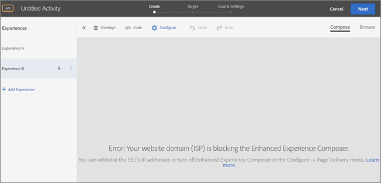

# Troubleshooting Issues Related to the Enhanced Experience Composer{#troubleshooting-issues-related-to-the-enhanced-experience-composer}

Display problems sometimes occur in the Enhanced Experience Composer (EEC) under certain conditions.

## The EEC won't load an internal QA URL that is not accessible on public IP. (EEC only) {#section_D29E96911D5C401889B5EACE267F13CF}

This can be resolved by whitelisting the following IP addresses. These IP addresses are for Adobe's server used for the Enhanced Experience Composer proxy. They are only required for activity editing. Visitors to your site do not need these IP addresses whitelisted

Ask your IT team to whitelist the following IP addresses:

<table id="table_E8DFD24B9B684CF182CEAFCA13ADD9C4"> 
 <thead> 
  <tr> 
   <th colname="col1" class="entry"> Region </th> 
   <th colname="col2" class="entry"> IP Addresses </th> 
  </tr>
 </thead>
 <tbody> 
  <tr> 
   <td colname="col1"> 
United States 
 </td> 
   <td colname="col2"> 
52.55.99.45 
 </td> 
  </tr> 
  <tr> 
   <td colname="col1"> 
Europe, Middle East, and Africa (EMEA) 
 </td> 
   <td colname="col2"> 
52.51.238.221 
 </td> 
  </tr> 
  <tr> 
   <td colname="col1"> 
Asia-Pacific (APAC) 
 </td> 
   <td colname="col2"> 
52.193.67.35 
 </td> 
  </tr> 
 </tbody> 
</table>

You might see the following error message in Target:

`Error: Your website domain (ISP) is blocking the Enhanced Experience Composer. You can whitelist the Enhanced Experience Composer's IP addresses or turn off Enhanced Experience Composer in [!UICONTROL Configure] > [!UICONTROL Page Delivery] menu.`

The following are reasons that you might see this error message and remedies to fix the situation:

* **Issue:** Your website domain (ISP) is blocking the Enhanced Experience Composer.

  **Remedy:** Whitelist the IP addresses listed above. 

* **Issue:** The IP addresses are whitelisted but your website does not support TLS version 1.2. Target currently uses the default configuration of 1.2. Prior to the Target 18.4.1 (April 25, 2018), the default configuration supported TLS 1.0. For more information, see [TLS (Transport Layer Security) Encryption Changes](../../../c-implementing-target/c-considerations-before-you-implement-target/tls-transport-layer-security-encryption.md#concept_CC1001E9D3AE4BABAF90B8311B0A6451).

  **Solution:** See the following question (The Enhanced Visual Experience Composer won't load on secure pages on my site that use TLS 1.2).

## The EEC won't load on secure pages on my site that use TLS 1.0. (EEC only) {#section_C5B31E3D32A844F68E5A8153BD17551F}

You might see the error message described above in "The Enhanced Visual Experience Composer won't load on secure pages on my site." if the above IP addresses are whitelisted but your website does not support TLS version 1.2. Target currently uses the default configuration of 1.2. Prior to the Target 18.4.1 (April 25, 2018), the default configuration supported TLS 1.0. For more information, see [TLS (Transport Layer Security) Encryption Changes](../../../c-implementing-target/c-considerations-before-you-implement-target/tls-transport-layer-security-encryption.md#concept_CC1001E9D3AE4BABAF90B8311B0A6451).

To check the TLS version on your website using Firefox (other browsers have similar steps):

1. Open the affected website in Firefox. 
1. Click the **[!UICONTROL Show Site Information]** icon on the browser's address bar.

   

1. Click **[!UICONTROL Show Connection Details]** > **[!UICONTROL More Information]**.

   

1. Examine the TLS version information under Technical Details:

   

1. If you find that your website is showing TLS 1.0, see [TLS (Transport Layer Security) Encryption Changes](../../../c-implementing-target/c-considerations-before-you-implement-target/tls-transport-layer-security-encryption.md#concept_CC1001E9D3AE4BABAF90B8311B0A6451) for information about Target's TLS support policy. To remedy the situation for now (valid until September 12, 2018), reach out to [Customer Care](../../../cmp-resources-and-contact-information.md#reference_ACA3391A00EF467B87930A450050077C) for configuration with your TLS version and the domain.

## I'm seeing timeouts or "access denied" errors when loading sites with proxy enabled. (EEC only) {#section_60CBB9022DC449F593606C0E6252302D}

Make sure proxy IPs are not blocked in your environment. 
