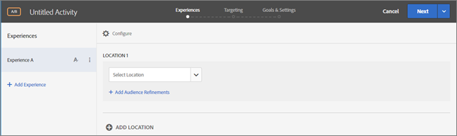
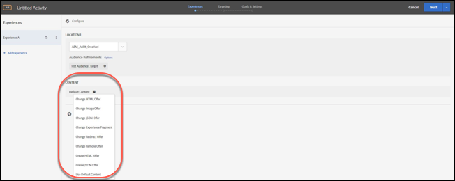
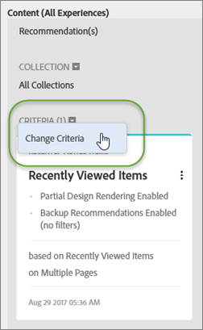
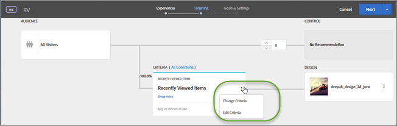

# Form-Based Experience Composer{#form-based-experience-composer}

The Form-Based Experience Composer provides non-visual experience creation.

 This feature enables Target Standard A/B tests, Experience Targeting, Automated Personalization, and Recommendations activities to be delivered in emails, mobile apps, kiosks, and other places that don't work with a Visual Experience Composer.

This video provides a demo of the form-based composer.

* Create an activity using the Form-Based Experience Composer 
* Understand when to use Form-Based Experience Composer vs. the Visual Experience Composer 
* Use refinements to target a location

>[!VIDEO](https://www.youtube.com/watch?v=R9hcD9D1VPY)

If you are creating a Recommendations activity, there are no experiences. Choose your criteria and design. If you choose multiple criteria or designs, Target automatically generates the experiences. 

1. Click **[!UICONTROL Create Activity]**, then select the type of activity you want to create.

   The Form-Based Experience Composer is available for A/B tests, Experience Targeting, Automated Personalization, and Recommendations activities. 
1. Select **[!UICONTROL Form-Based Experience Composer]** from the [!UICONTROL New Activity]dialog box.

   The Form-Based Experience Composer opens.

   

   This screen is different if you are creating a Recommendations activity. Recommendations activities do not include experiences. 
1. Name the activity.
1. Select a location.

   When you click in the Select Location box, a list of available locations appears. Select one of those locations. To choose the global location delivered via target.js, choose “target-global-mbox.”

   You can also enter a location that is not listed here. This can be useful if the mbox has not yet been created or viewed on a page. Type the name of the location. Be careful when entering a location that does not yet exist. If the spelling or capitalization does not match the spelling and capitalization when the mbox call is made, the activity will not deliver. Manually entered locations are saved to the list. 
1. Click **[!UICONTROL Add Audience Refinements]**, then choose one or more [audience](../c-target/c-target.md#concept_A782F8481A5041EBA75103CB26376522) for this activity.

   

   In the Form-based Experience Composer, Refinements have been replaced with full audience functionality. Refinements for existing activities have been migrated to [activity-only audiences](../c-target/creating-activity-only-audience.md#concept_A6BADCF530ED4AE1852E677FEBE68483). 
1. Select the type of content you want to appear in that location.

   

1. For the content type you selected, specify the content.

   **Change HTML Offer:** Choose an HTML offer.

   **Change Image Offer:** Choose an image saved in the content library in Target.

   You can also add a link to an image (click-through, destination, landing, and so forth.)

      1. Click [!UICONTROL Change Image Offer].
      1. Select the desired image, then click [!UICONTROL Edit Links].
      1. Specify the desired URL or page on your site, then click [!UICONTROL Update].

   **Change JSON offer:** Choose a json offer.

   **Change Experience Fragment:** Choose an Experience Fragment.

   **Change Redirect Offer:** Choose a redirect offer.

   **Change Remote Offer:** Choose a remote offer.

   **Create HTML Offer:**

      1. Click [!UICONTROL Offers], then select the [!UICONTROL Code Offers] tab.
      1. Click [!UICONTROL Create] > [!UICONTROL HTML Offer].
      1. Type an offer name.
      1. Type or paste your HTML code in the Code box.
      1. Click [!UICONTROL Save].

   **Create JSON Offer:**

      1. Click [!UICONTROL Offers], then select the [!UICONTROL Code Offers] tab.
      1. Click [!UICONTROL Create] > [!UICONTROL JSON Offer].
      1. Type an offer name.
      1. Type or paste your JSON code in the Code box.
      1. Click [!UICONTROL Save].

   For a Recommendations activity, the Content drop-down gives you the Add Recommendation option. Click **[!UICONTROL Add Recommendation]**, then select the page type. Then follow the usual steps as defined in the interface to [create a Recommendations activity](https://marketing.adobe.com/resources/help/en_US/target/recs/t_create_recs_activity.html).

   While selecting Recommendations criteria in the Form-Based Experience Composer, there is now a direct link to the selected Criteria card so you can quickly and easily edit the criteria.

   

   From the Targeting page of the Target three-step guided workflow:

   

1. (Optional, for AB activities, Automated Personalization, and Experience Targeting) To repeat this process for additional locations, click `Add Location` and configure the location and content.
1. Click **[!UICONTROL Continue]**, then complete the activity creation steps as usual for your activity type.

* [Create an A/B Test](../c-activities/t-test-ab/t-test-create-ab/t-test-create-ab.md#task_68C8079BF9FF4625A3BD6680D554BB72) 
* [Create an Experience Targeting Activity](../c-activities/t-experience-target/t-xt-create/t-xt-create.md#task_D6B3429AC31549E1A70EDF04B3DDC765) 
* [Create a Recommendations Activity](../c-recommendations/t-create-recs-activity/t-create-recs-activity.md#task_6874328773C64C44A73F0A130AD3F96F)

