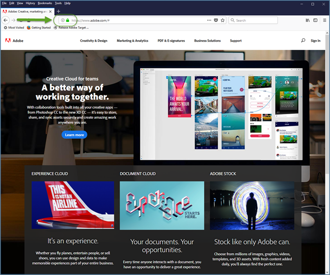
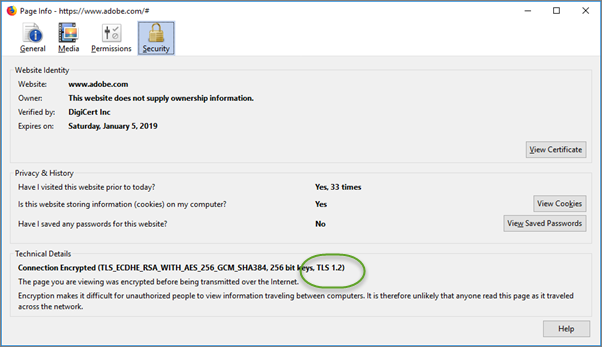

# TLS (Transport Layer Security) encryption changes{#tls-transport-layer-security-encryption-changes}

Information about changes to how Adobe and Target use TLS (Transport Layer Security) to maintain the highest security standards and promote the safety of customer data.

 Transport Layer Security (TLS) is the most-widely deployed security protocol used today for web browsers and other applications that require data to be securely exchanged over a network. Adobe has security compliance standards that require the end-of-life of older protocols and is mandating the use of TLS 1.2 in order to have the most up-to-date and secure version in use. Starting with the Target 18.4.1 release (April 25, 2018), Adobe Target will take steps to move towards TLS 1.2 encryption and phase out support for TLS 1.0. The date when TLS 1.0 support will be removed will be announced at a later date; however, It is important that you go through the specifics and plan out the changes for a smooth transition.

## Visual Experience Composer (VEC) with Enhanced Experience Composer (EEC) Enabled {#section_B374B62DEC3344C194AC7BECC2EE0AA0}

Until now, Adobe Target's [Enhanced Experience Composer](../../c-experiences/c-experiences.md#section_34265986611B4AB8A0E4D6ACC25EF91D) (EEC) used TLS 1.0 by default. Starting with the Target 18.4.1 release (April 25, 2018), Target is moving to TLS 1.2 by default.

Adobe will be moving customers in a phased manner to TLS 1.2. For those, whose domains are already 1.2 compliant, we will move them to TLS 1.2 without any changes needed from you. Most customer domains already support TLS 1.2; however, if your domain does not support TLS 1.2, we will keep those domains on TLS 1.0 like today (until February 2019).

You should not face any issue during this migration phase. If the VEC has stopped loading a site that was earlier working, [open a Client Care ticket](../../cmp-resources-and-contact-information.md#reference_ACA3391A00EF467B87930A450050077C) citing this migration as a possible cause.

If, however, you are one of those customers who are on TSL 1.0 without supporting TLS 1.2, then you should plan for movement of your domains/infrastructure to TLS 1.2. We will continue to support the TLS 1.0 protocol until February 2019. Starting in February 2019, Target will not support the TLS 1.0 protocol to be used for the VEC via the Enhanced Experience Composer capability.

Although we strongly recommend everyone to be on TLS 1.2 going forward, if you are a new customer but do *NOT* support TLS 1.2, please reach out to Customer Care informing them that you need to be on TLS 1.0 for the Enhanced Experience Composer. However, please plan to move to TLS 1.2 as you will also not be supported beyond February 2019.

## Activity Delivery {#section_46CA5943E4354B259014C2BF340AECD6}

Starting February 2019, Target servers will no longer support TLS 1.0. With this change, Target servers will no longer accept requests from end users with older devices or web browsers that do not support TLS 1.1 or later. As a result, older devices and browsers that support only TLS 1.0 (or support TLS 1.0 by default) will not receive activity content from Adobe Target. The site's default content will render.

Some of the older devices and browsers that will be affected include:

* Android 4.3 and earlier versions 
* Internet Explorer 8-10 on Windows 7 and earlier versions 
* Internet Explorer 10 on Windows Phone 8.0 
* Safari 6.0.4/OS X10.8.4 and earlier versions

As you plan for this change, consider the following (note that the February 2019 deadline affects all of these items):

* You must ensure that your default site is ready in a manner that is consumable for compliant devices and browsers. 
* Be aware that the number of visitors in your Target reports can potentially see an insignificant drop in the number of visitors. 
* You might need to change audiences created specifically to target older devices or browsers that do not support TLS 1.0—delivery to those devices an browsers will no longer work.

For more details about supported browsers and their versions, see [Supported Browsers](../../c-implementing-target/c-considerations-before-you-implement-target/r-supported-browsers.md#reference_01B4BF99E7D545A7998773202A2F6100).

## Adobe Target APIs {#section_88797FA5434049EC89F908853CC76903}

Starting February 2019, Target APIs will no longer support TLS 1.0 encryption. Customers who access the API should verify that they will not be impacted.

* API clients using Java 7 with default settings will need modifications to support TLS 1.2. For more information, see " [Changing default TLS protocol version for client end points: TLS 1.0 to TLS 1.2](https://www.java.com/en/configure_crypto.html)" on the Java website. 
* API clients using Java 8 should not be impacted because the default setting is TLS 1.2. 
* API clients using other frameworks will need to contact their vendors for details on TLS 1.2 support.

## Access to Experience Cloud Solutions Interfaces {#section_748870ADE77B4CBEB18518DC784E64E5}

Because the Target Standard/Premium interface already requires a [modern web browser](../../c-implementing-target/c-considerations-before-you-implement-target/r-supported-browsers.md#reference_01B4BF99E7D545A7998773202A2F6100), we do not anticipate issues. If you are unable to connect to Target, you should upgrade your browser to the latest version.

## How to Check Which TLS Version Your Browser Uses {#section_44716DA2CEFF492BABD95AE32B1A3FC6}

To check the TLS version on your website using Firefox (other browsers have similar steps):

1. Open the affected website in Firefox. 
1. Click the **[!UICONTROL Show Site Information]** icon on the browser's address bar.

   

1. Click **[!UICONTROL Show Connection Details]** > **[!UICONTROL More Information]**.

   

1. Examine the TLS version information under Technical Details:

   

## Expected Behavior with Browsers Supporting TLS 1.0 Only {#section_B5DA97A34EF248EB927610A5DA71EF2F}

This section describes what to expect with browsers that support TLS 1.0 only when using an at.js or mbox.js implementation. For comparison purposes, this section also describes what to expect with browsers that support TLS 1.1 and 1.2.

**Central Endpoints:**

<table id="table_E60D987C6C2A4E229DC4436AC2A261AE"> 
 <thead> 
  <tr> 
   <th colname="col1" class="entry"> Target JavaScript Implementation </th> 
   <th colname="col2" class="entry"> Details </th> 
  </tr> 
 </thead>
 <tbody> 
  <tr> 
   <td colname="col1"> 
at.js 
 </td> 
   <td colname="col2"> 
With TLS 1.0 enabled: 
 
 
     <ul id="ul_270CFC790AD04B318F16D2DB764B71F5"> 
      <li id="li_1FC9328ABE8745EAA8B708871849F4FC"> 
Using browser dev tools, on the Network tab, you'll see "200 OK." This means the request has succeeded. 
 </li> 
      <li id="li_23E36AF8FDAF4596A576B1467A5F9636"> 
User sees a "Can't connect securely to this page" message. The message explains that this might be caused because the site uses outdated or unsafe TLS security settings. 
 </li> 
      <li id="li_970ED746F08642A8A1566AF1E1724170"> 
No console errors are displayed. 
 </li> 
     </ul> 
 
With TLS 1.1 or 1.2 enabled: 
 
 
     <ul id="ul_D57A346186BD46839B2F37404FE2F05A"> 
      <li id="li_13C75AF0F05D4F2B895539D36621FA69"> 
at.js file is downloaded. 
 </li> 
     </ul> 
 </td> 
  </tr> 
  <tr> 
   <td colname="col1"> 
mbox.js 
 </td> 
   <td colname="col2"> 
With TLS 1.0 enabled: 
 
 
     <ul id="ul_C8F4D5FDC8DA45C7B2A2A4E0BF7810A1"> 
      <li id="li_6AAC9BBE5D2A451689A4B90760FE8C60"> 
Using browser dev tools, on the Network tab, you'll see "200 OK." This means the request has succeeded. 
 </li> 
      <li id="li_73D61A33DD194CD6B130FD2BE85A6AC5"> 
User sees a "Can't connect securely to this page" message. The message explains that this might be caused because the site uses outdated or unsafe TLS security settings. 
 </li> 
      <li id="li_00EF96FEC3D24BA28F4FAF95E563F054"> 
No console errors are displayed. 
 </li> 
     </ul> 
 
With TLS 1.1 or 1.2 enabled: 
 
 
     <ul id="ul_7DAE222103C4409CB7AC2E2BB50DC200"> 
      <li id="li_67801BCFB22A43D7A872CF8BD3D5BA08"> 
mbox.js file is downloaded. 
 </li> 
     </ul> 
 </td> 
  </tr> 
 </tbody> 
</table>

**Edge Endpoints:**

<table id="table_B9FAC297BFAB42D7832AE98C4932461A"> 
 <thead> 
  <tr> 
   <th colname="col1" class="entry"> Target JavaScript Implementation </th> 
   <th colname="col2" class="entry"> Details </th> 
  </tr> 
 </thead>
 <tbody> 
  <tr> 
   <td colname="col1"> 
at.js 
 </td> 
   <td colname="col2"> 
With TLS 1.0 enabled: 
 
 
     <ul id="ul_C020DE535496486288BCE0EC7768BB8D"> 
      <li id="li_B9F6CE7AB7FF473EAF5C30DBE5D3E698"> 
Using browser dev tools, on the Network tab, you'll see "200 OK." This means the request has succeeded. 
 </li> 
      <li id="li_B50D26A7E6AC4E02B3181C4837F68393"> 
User sees a "Can't connect securely to this page" message. The message explains that this might be caused because the site uses outdated or unsafe TLS security settings. 
 </li> 
      <li id="li_56BFA49475E94899A7B058407B09D277"> 
No console errors are displayed. 
 </li> 
      <li id="li_0F7E6197E8414B1FBF2FC1797D5B23A3"> 
Default content is served. 
 </li> 
     </ul> 
 
With TLS 1.1 or 1.2 enabled: 
 
 
     <ul id="ul_60ADD51FB668472BACD1865192836822"> 
      <li id="li_621705FB2B9048998961C5F442993C0E"> 
Offer content is served. 
 </li> 
     </ul> 
 </td> 
  </tr> 
  <tr> 
   <td colname="col1"> 
mbox.js 
 </td> 
   <td colname="col2"> 
With TLS 1.0 enabled: 
 
 
     <ul id="ul_F40202B115224956B814132C874CE611"> 
      <li id="li_4ECFE25802B04E158B9E5751B195635C"> 
Using browser dev tools, on the Network tab, you'll see "200 OK." This means the request has succeeded. 
 </li> 
      <li id="li_BC6FC66BB22845BD8C4DE3FA716B7A11"> 
User sees a "Can't connect securely to this page" message. The message explains that this might be caused because the site uses outdated or unsafe TLS security settings. 
 </li> 
      <li id="li_B6ACF978FFC444709AAAF4F869D7FE89"> 
No console errors are displayed. 
 </li> 
      <li id="li_B7AB5F235A874D7089EF4D95BF907F0B"> 
Default content is served. 
 </li> 
     </ul> 
 
With TLS 1.1 or 1.2 enabled: 
 
 
     <ul id="ul_EFF50216F5BF422B880F45A6F36D8610"> 
      <li id="li_31312A706A5F4DF2AFB7BACC6CCD877B"> 
Offer content is served 
 </li> 
     </ul> 
 </td> 
  </tr> 
 </tbody> 
</table>

**Activity Targeted with Browser-Version Audience (Internet Explorer, Versions 6, 7, or 8):**

>[!NOTE]
>
>Audiences stop working.

<table id="table_D9353B78684C44C2879582DF1644A0FB"> 
 <thead> 
  <tr> 
   <th colname="col1" class="entry"> Target JavaScript Implementation </th> 
   <th colname="col2" class="entry"> Details </th> 
  </tr> 
 </thead>
 <tbody> 
  <tr> 
   <td colname="col1"> 
at.js 
 </td> 
   <td colname="col2"> 
at.js is not supported on Internet Explorer versions earlier than version 10. 
 </td> 
  </tr> 
  <tr> 
   <td colname="col1"> 
mbox.js 
 </td> 
   <td colname="col2"> 
With TLS 1.0 enabled: 
 
 
     <ul id="ul_4E019DB1B0FC402FAB7BC988A29CB751"> 
      <li id="li_096305D082504BCA89AF66E7F01A160A"> 
Default content is served. 
 </li> 
      <li id="li_3BE6892C6C3F42EEA4C1BDF7043C6F57"> 
No Target requests are fired. 
 </li> 
      <li id="li_2A007C866C234C6CBFBEF4328B0881E6"> 
No console error is displayed. 
 </li> 
      <li id="li_7175E97918D54844B3B9A01D54FFEC6B"> 
Using browser dev tools, on the Network tab, you'll see "200 OK." This means the request has succeeded. 
 </li> 
     </ul> 
 
With TLS 1.1 or 1.2 enabled: 
 
 
     <ul id="ul_20428922DD474806988742097B370602"> 
      <li id="li_BB87D2C5CD944CC1BC26B8566877CCE5"> 
Offer content is served. 
 </li> 
     </ul> 
 </td> 
  </tr> 
 </tbody> 
</table>

