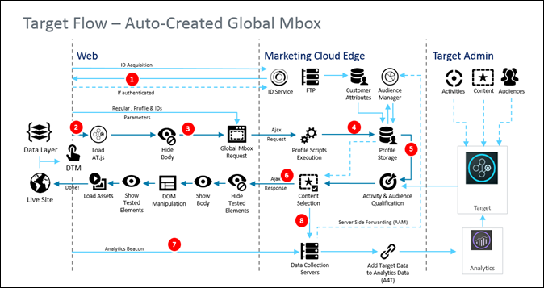

# How at.js works{#how-at-js-works}

To implement [!DNL Adobe Target] client-side, you must use the at.js library. In a client-side implementation of [!DNL Adobe Target], [!DNL Target] delivers the experiences associated with an activity directly to the client browser. The browser decides which experience to display and displays it. With a client-side implementation, you can use a WYSIWYG editor, the [Visual Experience Composer](/help/c-experiences/c-visual-experience-composer/visual-experience-composer.md) (VEC), or a non-visual interface, the [Form-based Experience Composer](/help/c-experiences/form-experience-composer.md), to create your test and personalization experiences.

In the [!DNL Target] implementation illustrated below, the following [!DNL Adobe Experience Cloud] solutions are implemented: Analytics, Target, and Audience Management. In addition, the following Experience Cloud core services are implemented: Adobe Launch, Audiences, and Visitor ID Service.

## What is the difference between At.js 1.*x* and At.js 2.0.0 workflow diagrams?

See [Upgrading from at.js 1.x to at.js 2.0.0](/help/c-implementing-target/c-implementing-target-for-client-side-web/upgrading-from-atjs-1x-to-atjs-20.md) for more information on the differences that were introduced in 2.O from 1.*x*.

From a high level view, there are a couple of differences between the two versions:

* at.js 2.0.0 does not have a global mbox request concept but rather a page-load request. A page-load request can be viewed as a request to retrieve content that should be applied on the initial page load of your website.
* at.js 2.0.0 manages concepts of Views that are use for Single Page Applications (SPAs). at.js 1.*x* is not aware of this concept.

## at.js 2.0.0 diagrams

The following diagrams help you understand the workflow of at.js 2.0.0 with Views and how this enhances the SPA integration. To get a better introduction of the concepts used in at.js 2.0.0, see [Single Page Application implementation](/help/c-implementing-target/c-implementing-target-for-client-side-web/how-to-deployatjs/target-atjs-single-page-application.md).

|Step|Details|
| --- | --- |
|1|Call returns the [!DNL Experience Cloud ID] if the user is authenticated; another call syncs the customer ID.|
|2|The at.js library loads synchronously and hides the document body. at.js can also be loaded asynchronously with an option prehiding snippet implemented on the page.|
|3|A page load request is made including all configured parameters (MCID, SDID, and customer ID).|
|4|Profile scripts execute and then feed into the Profile Store. The Store requests qualified audiences from the Audience Library (for example, audiences shared from Adobe Analytics, Audience Management, etc.). Customer attributes are sent to the Profile Store in a batch process.|
|5|Based on URL request parameters and profile data, [!DNL Target] decides which activities and experiences to return to the visitor for the current page and future views.|
|6|Targeted content is sent back to the page, optionally including profile values for additional personalization. Targeted content on the current page is revealed as quickly as possible without flicker of default content. Targeted content for views that are shown as a result to user actions in a SPA that is cached in the browser so it can be instantly applied without an additional server call when the views are triggered through `triggerView()`.|
|7|Analytics data is sent to Data Collection servers.|
|8|Targeted data is matched to Analytics data via the SDID and is processed into the Analytics reporting storage. Analytics data can then be viewed in both Analytics and Target via Analytics for Target (A4T) reports.|

Now, wherever `triggerView()` is implemented on your SPA, the Views and actions are retrieved from cache and shown to the user without a server call. `triggerView()` also makes a notifications request to the [!DNL Target] backend in order to increment and record impression counts. For more information on at.js for SPAs with Views, see [Single Page Application implementation](/help/c-implementing-target/c-implementing-target-for-client-side-web/how-to-deployatjs/target-atjs-single-page-application.md).

|Step|Details|
| --- | --- |
|1|`triggerView()` is called in the SPA to render the View and apply actions to modify visual elements.|
|2|Targeted content for the view is read from the cache.|
|3|Targeted content is revealed as quickly as possible without flicker of default content.|
|4|Notification request is sent to the [!DNL Target] Profile Store to count the visitor in the activity and increment metrics.|
|5|Analytics data sent to Data Collection Servers.|
|6|Target data is matched to Analytics data via the SDID and is processed into the Analytics reporting storage. Analytics data can then be viewed in both Analytics and Target via A4T reports.|

## at.js 1.x diagram

| Step | Description | Call | Description |
|--- |--- |--- |--- |
|1|Call returns the [!DNL Experience Cloud ID] (MCID) if the user is authenticated; another call syncs the customer ID.|2|The at.js library loads synchronously and hides the document body.|
|3|A global mbox request is made including all configured parameters, MCID, SDID, and customer ID (optional).|4|Profile scripts execute and then feed into the Profile Store. The Store requests qualified audiences from the [!UICONTROL Audience Library] (for example, audiences shared from [!DNL Adobe Analytics], [!DNL Audience Manager], etc.). Customer attributes are sent to the [!DNL Profile Store] in a batch process.|
|5|Based on the URL, mbox parameters, and profile data, [!DNL Target] decides which activities and experiences to return to the visitor.|6|Targeted content is sent back to page, optionally including profile values for additional personalization. The experience is revealed as quickly as possible without flicker of default content.|
|7|[!DNL Analytics] data is sent to Data Collection servers.|8|[!DNL Target] data is matched to [!DNL Analytics] data via the SDID and is processed into the [!DNL Analytics]  reporting storage. [!DNL Analytics] data can then be viewed in both [!DNL Analytics] and  [!DNL Target] via [!DNL Analytics for Target] (A4T) reports.|

## Training video: at.js 2.0.0 architectural diagram

at.js 2.0.0 enhances Adobe Target's support for SPAs and integrates with other Experience Cloud solutions. This video explains how everything comes together.

>[!VIDEO](https://video.tv.adobe.com/v/26250)

See [Understanding how at.js 2.0.0 works](https://helpx.adobe.com/target/kt/using/atjs20-diagram-technical-video-understand.html) for more information.