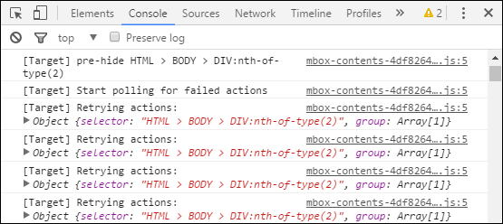

# How to Migrate to at.js from mbox.js{#how-to-migrate-to-at-js-from-mbox-js}

Migrating from mbox.js to at.js is a straightforward process.

Use the following steps to migrate from [!DNL mbox.js] to [!DNL at.js] and to check your migration: 

1. Determine your organization's [browser support](../../../../c-implementing-target/c-considerations-before-you-implement-target/supported-browsers.md#reference_01B4BF99E7D545A7998773202A2F6100) requirements.
1. Check your website's current [!DNL mbox.js] implementation for capabilities that are not supported by [!DNL at.js].

   When auditing your implementation, look for the following:

   **What types of mboxes do you currently use?**

   | Type | Details |
   |--- |--- |
   |Auto-created global mbox|The auto-created global mbox is created when the only line of  Target  code on your site is the  mbox.js  file. That file automatically generates an mbox call.|
   |Global, empty mboxCreate|It is recommended that you switch to the auto-created global mbox.|
   |Wrapping  mboxCreate|Migration should be simple, as long as your `mboxCreate()` is preceded by the  `<div class="mboxDefault"></div>`.|
   |mboxUpdate|Migration should be simple when `mboxUpdate()` is used in conjunction with `mboxDefine()` or `mboxCreate()`. `mboxUpdate()` does not update the auto-created global mbox or an mbox originally created by `getOffer()`. In these circumstances, a combination of `getOffer()` and `applyOffer()` should be used to replace `mboxUpdate()` when migrating to at.js.|
   |Custom clicktracking mboxes, including mboxTrack|We recommend that you update your code to use `trackEvent()`.|

   >[!NOTE]
   >
   >For more information about the various functions mentioned in the preceding table, see [at.js functions](/help/c-implementing-target/c-implementing-target-for-client-side-web/cmp-atjs-functions.md).

   **Do you have any customizations to your [!DNL mbox.js] file?**

   * mboxParameters() 
   * mboxSupported() 
   * mboxCookieDomain() 
   * Extra Javascript 
   * Other locations

   Most of the [mbox.js objects and methods](../../../../c-target/c-visitor-profile/variables-profiles-parameters-methods.md#section_8C78059D15D9452F95636A5640188537) (such as `mbox`, `mboxCurrent`, `mboxFactoryDefault`, `mboxFactories`, and others) are not supported. Alternate approaches might be possible to accomplish what you are trying to do.

   **Do you have [!DNL mbox.js] on any of your web pages?**

   You cannot use both [!DNL at.js] and [!DNL mbox.js] on the same web page. However, you can use the two JavaScript libraries on two different pages of the same website.

   The mbox cookie is the main way Adobe stitches the visitor from page to page. As part of your QA process, you should confirm that the cookie is being preserved and read correctly as the visitor moves back and forth between pages with [!DNL at.js] and those with [!DNL mbox.js]. Make sure the same `mboxPC` and `mboxSession` values are passed in the mbox calls, regardless of which section of the site ( [!DNL at.js] or [!DNL mbox.js]) the visitor first lands on and which section originally sets the cookie. If you use 3rd-party cookies in your implementation, ensure that those values stay the same as you browse the site.

   **Do you integrate [!DNL Target] with any other Adobe solutions?**

   * Analytics (A4T) 
   * Analytics (legacy integration) 
   * AAM (backend) 
   * AAM (legacy frontend) 
   * AEM 
   * Data Workbench

   Some of the legacy integrations are not supported by [!DNL at.js]. For more information, see the [Integrations](../../../../c-implementing-target/c-implementing-target-for-client-side-web/c-how-atjs-works/target-atjs-integrations.md#concept_C100BC4F073C4B57A608B309D0157B39) page.

   **Do you integrate [!DNL Target] with any 3rd-party tools?**

   * Other Analytics tools 
   * Other DMPs 
   * Demandbase 
   * Click-tale 
   * Other

   These integreations might need to be adjusted to work with [!DNL at.js]. For more information, see the [Integrations](../../../../c-implementing-target/c-implementing-target-for-client-side-web/c-how-atjs-works/target-atjs-integrations.md#concept_C100BC4F073C4B57A608B309D0157B39) page.

   **Do you use a tag manager?**

   * Dynamic Tag Management 
   * Ensighten 
   * Tealium 
   * Signal/BrightTag

   For more information, see [at.js Integrations](../../../../c-implementing-target/c-implementing-target-for-client-side-web/c-how-atjs-works/target-atjs-integrations.md#concept_C100BC4F073C4B57A608B309D0157B39).

   >[!NOTE]
   >
   >If you are not currently using a tag manager to deploy [!DNL Target], now might be a good time to consider it. Adobe's [Dynamic Tag Management](https://dtm.adobe.com) is free to [!DNL Target] customers and is the recommended method to deploy [!DNL Target]. For more information, see [Best Practices for Implementing Adobe Target using Dynamic Tag Management](https://marketing.adobe.com/resources/help/en_US/dtm/target/).

1. Verify that all current activities and integrations are working as expected.

   Here are some things you can do while testing to confirm that [!DNL at.js] is working as expected:

   * Make sure all of your current activities work with the new JavaScript library. 
   * Confirm that all [integrations](../../../../c-implementing-target/c-implementing-target-for-client-side-web/c-how-atjs-works/target-atjs-integrations.md#concept_C100BC4F073C4B57A608B309D0157B39) and [plugins](../../../../c-implementing-target/c-implementing-target-for-client-side-web/t-mbox-download/c-target-atjs-implementation/target-atjs-plugins.md#concept_F5D4C0A4DACF41409CC42FDD93B13FAF) work as expected. 
   * Make sure you are comfortable [debugging](../../../../c-implementing-target/c-implementing-target-for-client-side-web/c-target-debugging-atjs/target-debugging-atjs.md#concept_CAE591DA8C404C22917584ECD4F7494F) with the approaches available with [!DNL at.js].

**Possible Issues When Migrating to at.js** Some customers have reported the following issues after performing the migration to at.js: 

* Some VEC activities that were built on a page with [!DNL mbox.js] might need to be updated to work with [!DNL at.js]. 

  This issue occurs most frequently on websites that don't use many id or class attributes in HTML elements. You can confirm if you are experiencing this issue by loading the page and determining whether the experience is being delivered as expected by loading the page with `?mboxDebug=true` and reviewing the console statements. 

  
  In these instances, element selectors might start with something like 

  ```
  HTML > BODY > DIV:nth-of-type(2)
  ```

  and were built with the expectation that [!DNL mbox.js] added an extra `<div>` element to the top of the page. Because [!DNL at.js] doesn't add a `<div>` element to the top of the page, this selector would no longer work with [!DNL at.js]. 

  This issue can be addressed by recreating the activity in the VEC on the URL using [!DNL at.js] or by manually updating the selector using the **[!UICONTROL </> Code]** > **[!UICONTROL Modifications]** option in the VEC. 

  To remedy this problem, you should subtract 1 from the nth-of-type number in the first DIV element after BODY. In the above example the edited code would be: 

  ```
  HTML > BODY > DIV:nth-of-type(1)
  ```

  For more information about how to use the code editor to do this, see [Code Editor](../../../../c-experiences/c-visual-experience-composer/c-vec-code-editor/vec-code-editor.md#concept_B3A6E9EE3A60406DB640E205EA1745B5). 

* Because all mboxes are now asynchronous, they won't block page rendering or return in the order in which they fired. For more information, see "Asynchronous Considerations" in [at.js Limitations](../../../../c-implementing-target/c-implementing-target-for-client-side-web/t-mbox-download/c-target-atjs-implementation/target-atjs-limitations.md#concept_FA99E4D6EC274552BF45E01AFB76CCAE). 
