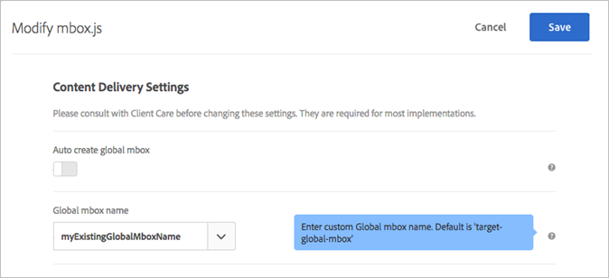
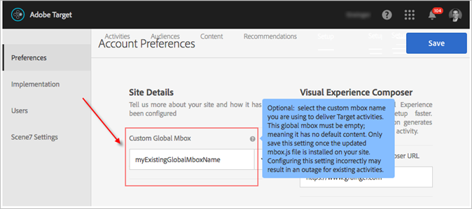

# Customize a Global mbox

Information to help you customize a global mbox for both at.js and mbox.js.

1. Edit mbox.js.

   Go to **[!UICONTROL Target]** > **[!UICONTROL Setup]** > **[!UICONTROL Implementation]**.

* For mbox.js, click **[!UICONTROL Edit mbox.js Settings]**. 
* For [!DNL at.js], select **[!UICONTROL at.js]** under the Implementation Method, and then click **[!UICONTROL Edit mbox.js Settings]**.

   

1. Edit [!DNL mbox.js] or [!DNL at.js].

   Disable **[!UICONTROL Auto create global mbox]**, then add the name of the custom global mbox that you would like to use to deliver activities from [!DNL Target Standard/Premium]. This custom global mbox is also used for click tracking.

   

   Click **[!UICONTROL Save]** when you are finished. 
1. Implement the [!DNL mbox.js] or [!DNL at.js] library on your site.

* For mbox.js, see [Mbox.js Implementation](../../../../c-implementing-target/c-implementing-target-for-client-side-web/t-mbox-download/t-mbox-download.md#task_4EAE26BB84FD4E1D858F411AEDF4B420). 
* For at.js, see [at.js Implementation](../../../../c-implementing-target/c-implementing-target-for-client-side-web/t-mbox-download/c-target-atjs-implementation/c-target-atjs-implementation.md#concept_8AC8D169E02944B1A547A0CAD97EAC17).

1. Time the transition with your release.

   As soon as you are ready for [!DNL Target Standard/Premium] to start using your global mbox for all activities moving forward, you can proceed with this step.

   Update the name of the custom global mbox to match the name used in Step 2, above.

   

   >[!IMPORTANT]
   >
   >When you save, all activities in your account sync with this mbox. If this mbox is not on your site, all activities will stop functioning.

   Click **[!UICONTROL Save]**. 
