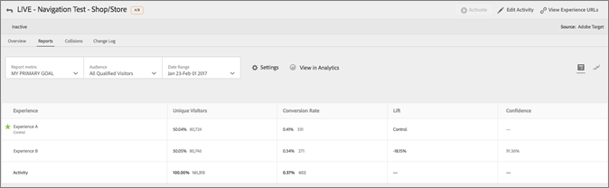

# Adobe Analytics as the reporting source for Adobe Target (A4T){#adobe-analytics-as-the-reporting-source-for-adobe-target-a-t}

Adobe "Analytics for Target" (A4T) is a cross-solution integration that lets you create activities based on Analytics conversion metrics and audience segments. This integration lets you use Analytics reports to examine your results. If you use Analytics as the reporting source for an activity, all reporting and segmentation for that activity is based on Analytics data collection.

## A4T Overview {#section_92B66069210C40DBA937790E8CC596CF}

The Analytics for Target integration between Analytics and Target provides powerful analysis and timesaving tools for your optimization program.

The three primary benefits of using Analytics data in Target are:

* Marketers can dynamically apply Analytics success metrics or reporting segments to Target activity reports at any time. It is not required to specify everything before running the activity. 
* A single source of data eliminates the variance that occurs when collecting data in two separate systems. 
* Your existing Adobe Analytics implementation collects all required data. There is no need to implement mboxes on pages for the sole purpose of collecting data for reports. Although, it is still recommended that you implement an order confirmation mbox for Automated Personalization (AP) activities.

>[!IMPORTANT]
>
>Before you can begin using A4T, you need to request that your account be provisioned for the integration. Use [this form](https://www.adobe.com/go/audiences) to request to be provisioned.

>[!NOTE]
>
>The integration that enables Adobe Analytics as the data source for Adobe Target (A4T) represents the next generation of the Test&Target to SiteCatalyst plug-in. This plug-in has been deprecated, but is still supported for customers who already use it.

If you use Analytics as the reporting source for an activity, all reporting and segmentation for that activity is based on Analytics.

All Analytics metrics, including calculated metrics, are available in Target Standard/Premium and the Target Activities report in Analytics. Likewise, any segment available in Analytics can be applied to both solutions. You can apply the metric or audience to the report in Target Standard/Premium after the test has started, or even after the test has completed.

Every metric is included, including any customer or calculated metrics that are built-in in Analytics.

After the classification period, data appears in these reports approximately an hour after it is collected from the website. All metrics, segments, and values in the reports come from the report suite you selected when you set up the activity.

Keep the following points in mind when considering using A4T:

* To use Adobe Analytics as the reporting source for Adobe Target, both you and your company must have access to Adobe Analytics and to Adobe Target. [Contact your account representative](../../cmp-resources-and-contact-information.md#concept_34A1CA16F2244D42930BB77846A5ABBB) if you need either solution. 
* The reporting source is set for each activity. Target continues to collect data to use in reporting and Target data is still available if you prefer to base an activity on data collected by Target. 
* You must use one reporting source or the other. You cannot collect data for a single activity from both sources. 
* When using A4T, all success metrics available to your activities are Analytics metrics. However, your goal metric can be based on an mbox call. For example, you can use Target's out-of-the-box click-tracking capabilities with A4T instead of having to implement Analytics click-tracking code. 
* When viewing reporting of an A4T activity in the Target UI, you are viewing Analytics data. For example, if you use the Visitor metric in Target, you are using the Analytics Visitor metric, not the Target Visitors metric, which is now called Entrants. This difference is especially important for basic traffic metrics (Visitors, Visits, Page Views) and conversion metrics. 
* Any existing Target activities continue to use Target data collection and are not affected by enabling A4T. 
* Only one mbox-based metric is allowed when using Analytics as the reporting source. 
* A server-to-server call from Target to Analytics sends activity and experience information to Analytics. This integration does not result in additional server calls for either Target or Analytics.

## Analytics & Target: Best Practices for Analysis Tutorial {#section_3438E6E77A464424B717A4FD333B84B2}

Open the [Analytics & Target: Best Practices for Analysis](https://spark.adobe.com/page/Lo3Spm4oBOvwF/) tutorial, provided by Adobe Experience League.

## Training Videos {#section_3CD2B02C87B948D1AE37D54382B2745E}

**Analytics for Target (A4T) (4:32)**

This video explains how to use Adobe Analytics as a reporting source in Adobe Target to drive the analysis of your optimization program.

* Explain what A4T is and why you would use it 
* Explain how A4T works 
* Understand the prerequisites needed before using A4T

>[!VIDEO](https://www.youtube.com/watch?v=eS_LeNmcJug)

**Analytics / Target Integration (A4T) (40:33)**

This video is a recording of " [Office Hours](../../cmp-resources-and-contact-information.md#concept_58EA30379D3B48C4848BA2A8C464A5B7)," an initiative led by the Adobe Customer Care team.

* How to set up and validate that the integration is working 
* How the integration works 
* Learn about the ideal reports to use in Analytics 
* Answers to common questions about A4T

>[!VIDEO](https://video.tv.adobe.com/v/22223/)

## Supported Activity Types {#section_F487896214BF4803AF78C552EF1669AA}

The following table shows you which activity types support Analytics as the reporting source (A4T):

<table id="table_3FB19416FBDD441ABC338554D34BED0A"> 
 <thead> 
  <tr> 
   <th colname="col1" class="entry"> Activity Types </th> 
   <th colname="col3" class="entry"> A4T Compatible? </th> 
   <th colname="col5" class="entry"> Notes, if applicable </th> 
  </tr>
 </thead>
 <tbody> 
  <tr> 
   <td colname="col1"> 
A/B activity with manual traffic split 
 </td> 
   <td colname="col3"> 
Yes 
 </td> 
   <td colname="col5"> </td> 
  </tr> 
  <tr> 
   <td colname="col1"> 
A/B activity with Auto-Allocate 
 </td> 
   <td colname="col3"> 
No 
 </td> 
   <td colname="col5"> </td> 
  </tr> 
  <tr> 
   <td colname="col1"> 
A/B activity with Auto-Target 
 </td> 
   <td colname="col3"> 
No 
 </td> 
   <td colname="col5"> </td> 
  </tr> 
  <tr> 
   <td colname="col1"> 
Experience Targeting (XT) 
 </td> 
   <td colname="col3"> 
Yes 
 </td> 
   <td colname="col5"> </td> 
  </tr> 
  <tr> 
   <td colname="col1"> 
Multivariate test (MVT) 
 </td> 
   <td colname="col3"> 
Yes 
 </td> 
   <td colname="col5"> 
Requires mbox-based goal metric goal to get the Element Contribution report. 
 
The Element Contribution Report does not currently support Analytics metrics. 
 </td> 
  </tr> 
  <tr> 
   <td colname="col1"> 
Automated Personalization (AP) activity 
 </td> 
   <td colname="col3"> 
No 
 </td> 
   <td colname="col5"> </td> 
  </tr> 
  <tr> 
   <td colname="col1"> 
Recommendations activity 
 </td> 
   <td colname="col3"> 
Yes 
 </td> 
   <td colname="col5"> </td> 
  </tr> 
  <tr> 
   <td colname="col1"> 
Mobile App 
 </td> 
   <td colname="col3"> 
Yes 
 </td> 
   <td colname="col5"> 
Supported with the  Mobile Services SDK, version 4.13.1 or later. 
 
For more information, see the <a href="https://marketing.adobe.com/resources/help/en_US/mobile/" format="https" scope="external"> Mobile Services documentation</a>. 
 </td> 
  </tr> 
  <tr> 
   <td colname="col1"> 
Email 
 </td> 
   <td colname="col3"> 
No 
 </td> 
   <td colname="col5"> </td> 
  </tr> 
  <tr> 
   <td colname="col1"> 
Server Side Delivery API 
 </td> 
   <td colname="col3"> 
Yes 
 </td> 
   <td colname="col5"> For more information, see <a href="../../c-implementing-target/c-api-and-sdk-overview/c-api-and-sdk-overview.md#concept_5718EC1FF2ED4436935D0BCCD7AA29A6" format="dita" scope="local"> Server Side: implement Target</a>. </td> 
  </tr> 
  <tr> 
   <td colname="col1"> 
NodeJS SDK 
 </td> 
   <td colname="col3"> 
Yes 
 </td> 
   <td colname="col5">For more information, see <a href="../../c-implementing-target/c-api-and-sdk-overview/c-api-and-sdk-overview.md#concept_5718EC1FF2ED4436935D0BCCD7AA29A6" format="dita" scope="local"> Server Side: implement Target</a>. </td> 
  </tr> 
  <tr> 
   <td colname="col1"> 
AEM 6.1 (or earlier) Cloud Service Integration 
 </td> 
   <td colname="col3"> 
No 
 </td> 
   <td colname="col5"> </td> 
  </tr> 
  <tr> 
   <td colname="col1"> 
AEM 6.2 (or later) Cloud Service Integration 
 </td> 
   <td colname="col3"> 
Yes 
 </td> 
   <td colname="col5"> 
For more information, see <a href="https://docs.adobe.com/docs/en/aem/6-2/administer/integration/marketing-cloud/target.html" format="html" scope="external"> Integrating with Adobe Target</a> in the Adobe Experience Manager 6.2 documentation. 
 </td> 
  </tr> 
  <tr> 
   <td colname="col1"> 
Any activity using a Redirect offer 
 </td> 
   <td colname="col3"> 
Yes 
 </td> 
   <td colname="col5"> 
There are stricter minimum requirements for using redirect offers with A4T. For more information, see <a href="../../c-integrating-target-with-mac/a4t/r-a4t-faq/c-a4t-faq-redirect-offers.md#concept_21BF213F10E1414A9DCD4A98AF207905" format="dita" scope="local"> Redirect Offers - A4T FAQ</a>. 
 </td> 
  </tr> 
  <tr> 
   <td colname="col1"> 
Node.JS 
 </td> 
   <td colname="col3"> 
Yes 
 </td> 
   <td colname="col5"> </td> 
  </tr> 
 </tbody> 
</table>

Because all activity types do not yet support A4T, it is recommended that you keep or implement important conversion mboxes, such as the "orderConfirmPage" mbox.

## Examples of A4T Reports {#section_F0A43A1CB2F04E8282B909E4D7034361}

To view A4T reports in [!DNL Target], click **[!UICONTROL Activities]**, click the desired activity from the list that uses [!DNL Analytics] as its reporting source > then click the **[!UICONTROL Reports]** tab.

>[!NOTE]
>
>You can use the [!UICONTROL Reporting Source] drop-down list at the top of the [!UICONTROL Activities] page to display only activities that use [!DNL Analytics] as the reporting source.

You can toggle between the Table View and [!UICONTROL Graph View] of the report by clicking the appropriate icon at the top right side of the report.

The following illustration shows the [!UICONTROL Graph View] of an A4T report with the [!UICONTROL Report Metric] drop-down list displaying the available [!DNL Analytics] goal metrics:

The following illustration shows the [!UICONTROL Graph View] of an A4T report with the [!UICONTROL Audience] drop-down list displaying the available [!DNL Analytics] audiences:

The following illustration shows the [!UICONTROL Table View] of an A4T report:

To view the report in [!DNL Analytics] rather than in [!DNL Target], click **[!UICONTROL View in Analytics]** along the top of the report. 
