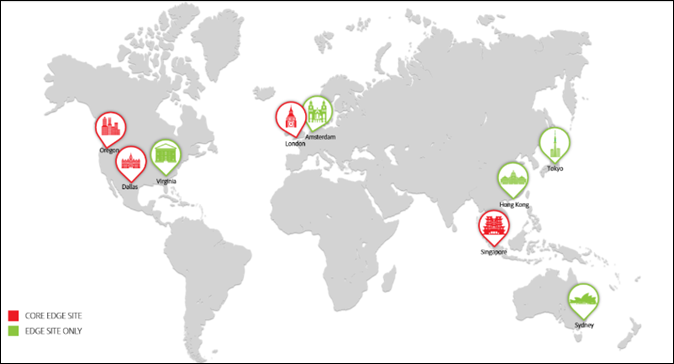

# How Adobe Target works{#how-adobe-target-works}

Adobe Target integrates with websites by means of one of two JavaScript libraries. at.js or mbox.js

## How Adobe Target works {#concept_459AB4DEE7364A9290C2FD405DC29584}

Adobe Target integrates with websites by means of one of two JavaScript libraries. at.js or mbox.js

* **at.js:** The [at.js library](../c-implementing-target/c-implementing-target-for-client-side-web/t-mbox-download/c-target-atjs-implementation/target-atjs-implementation.md#concept_8AC8D169E02944B1A547A0CAD97EAC17) is the new implementation library for Target. The at.js library improves page-load times for web implementations and provides better implementation options for single-page applications. at.js is the recommended implementation library and is updated frequently with new capabilities. We recommend that all customers implement or migrate to the [latest version of at.js](../c-implementing-target/c-implementing-target-for-client-side-web/target-atjs-versions.md#reference_DBB5EDB79EC44E558F9E08D4774A0F7A). 
* **mbox.js:** The mbox.js library is the legacy implementation library for Target. The mbox.js library is still supported, but there will be no feature updates.

>[!IMPORTANT]
>
>All customers should migrate to at.js. For more information, see [Migrate to at.js from mbox.js](../c-implementing-target/c-implementing-target-for-client-side-web/t-mbox-download/c-target-atjs-implementation/target-migrate-atjs.md#task_DE55DCE9AC2F49728395665DE1B1E6EA)

You must reference one of the Target JavaScript files on every page on your site. For example, you might add it to your global header.

Each time a visitor requests a page that has been optimized for Target, a request is sent to the targeting system to determine what content to serve to a visitor. This process occurs in real-time—every time a page is loaded, a request for the content is made and fulfilled by the system. The content is governed by the rules of marketer-controlled activities and experiences and is targeted to the individual site visitor. Content is served that each site visitor is most likely to respond to, interact with, and ultimately purchase, to maximize response rates, acquisition rates, and revenue.

In Target, each element on the page is part of a single experience for the entire page. Each experience includes multiple elements on the page. A page is optimized with a single line of code in the `<head>` of each page you want to track.

The content that displays to visitors depends on the type of activity you create:

<table id="table_7D980A8C299F462EACB22ABD650D701F"> 
 <thead> 
  <tr> 
   <th colname="col1" class="entry"> Activity Type </th> 
   <th colname="col2" class="entry"> Details </th> 
  </tr>
 </thead>
 <tbody> 
  <tr> 
   <td colname="col1"> 
<a href="../c-activities/t-test-ab/t-test-create-ab/test-create-ab.md#task_68C8079BF9FF4625A3BD6680D554BB72" format="dita" scope="local"> Create an A/B Test</a> 
 </td> 
   <td colname="col2"> 
The content that displays in a basic A/B test is randomly chosen from the assets you assign to the activity, according to the percentages you choose for each experience. As a result of this random splitting of traffic, it can take a lot of initial traffic before the percentages even out. For example, if you create two experiences, the starting experience is chosen randomly. If there is little traffic, it's possible that the percentage of visitors can be skewed toward one experience. As traffic increases, the percentages should become more equal. 
 
You can specify percentage targets for each experience. In this case, a random number is generated and that number is used to choose the experience to display. The resulting percentages might not exactly match the specified targets, but more traffic means that the experiences should be split closer to the target goals. 
 
 
     <ol class="- topic/ol " id="ol_074AC9DDC5604981AA883F0CC5107391"> 
      <li class="- topic/li " id="li_7DC54492E73F431FBA7ED0CF93CB7A77"> A customer requests a page from your server and it displays in the browser. </li> 
      <li class="- topic/li " id="li_0372A6E46F014DB7B8179C8173667BB3"> A first party cookie is set in the customer's browser to store customer behavior. </li> 
      <li class="- topic/li " id="li_C2520C49CB454392A0B7C13809F96C1A"> The page calls the targeting system. </li> 
      <li class="- topic/li " id="li_3AD0BEAA7FDF43AF851468E3E951E9ED"> Content displays based on the rules of your campaign. </li> 
     </ol> 
 </td> 
  </tr> 
  <tr> 
   <td colname="col1"> 
<a href="../c-activities/automated-traffic-allocation/automated-traffic-allocation.md#concept_A1407678796B4C569E94CBA8A9F7F5D4" format="dita" scope="local"> Auto-Allocate</a> 
 </td> 
   <td colname="col2"> 
Auto Allocate identifies a winner among two or more experiences and automatically reallocates more traffic to the winning experience to increase conversions while the test continues to run and learn. 
 </td> 
  </tr> 
  <tr> 
   <td colname="col1"> 
<a href="../c-activities/auto-target-to-optimize.md#concept_67779E5B7F67427A97D7EA2A6FB919B3" format="dita" scope="local"> Auto-Target</a> 
 </td> 
   <td colname="col2"> 
Auto-Target uses advanced machine learning to select from multiple high-performing marketer-defined experiences, and serves the most tailored experience to each visitor based on his or her individual customer profile and the behavior of previous visitors with similar profiles, in order to personalize content and drive conversions. 
 </td> 
  </tr> 
  <tr> 
   <td colname="col1"> 
<a href="../c-activities/t-automated-personalization/automated-personalization.md#task_8AAF837796D74CF893CA2F88BA1491C9" format="dita" scope="local"> Automated Personalization</a> 
 </td> 
   <td colname="col2"> 
Automated Personalization (AP) combines offers or messages, and uses advanced machine learning to match different offer variations to each visitor based on their individual customer profile, in order to personalize content and drive lift. 
 </td> 
  </tr> 
  <tr> 
   <td colname="col1"> 
<a href="../c-activities/t-experience-target/experience-target.md#task_A53DF336CB9F4D7BB87EF2106099EFC4" format="dita" scope="local"> Experience Targeting</a> 
 </td> 
   <td colname="col2"> 
Experience Targeting (XT) delivers content to a specific audience based on a set of marketer-defined rules and criteria. 
 
Experience Targeting, including geotargeting, is valuable for defining rules that target a specific experience or content to a particular audience. Several rules can be defined in an activity to deliver different content variations to different audiences. When visitors view your site, Experience Targeting (XT) evaluates them to determine whether they meet the criteria you set. If they meet the criteria, they enter the activity and the experience designed for qualifying audiences is displayed. You can create experiences for multiple audiences within a single activity. 
 </td> 
  </tr> 
  <tr> 
   <td colname="col1"> 
<a href="../c-activities/c-multivariate-testing/multivariate-testing.md#concept_628695CDC71B449B8DCC2F5654C11499" format="dita" scope="local"> Multivariate Test</a> 
 </td> 
   <td colname="col2"> 
Multivariate Testing (MVT) compares combinations of offers in elements on a page to determine which combination performs the best for a specific audience, and identifies which element most impacts the activity's success. 
 </td> 
  </tr> 
  <tr> 
   <td colname="col1"> 
<a href="../c-recommendations/recommendations.md#concept_7556C8A4543942F2A77B13A29339C0C0" format="dita" scope="local"> Recommendations</a> 
 </td> 
   <td colname="col2"> 
Recommendations activities automatically display products or content that might interest your customers based on previous user activity or other algorithms. Recommendations help direct customers to relevant items they might otherwise not know about. 
 </td> 
  </tr> 
 </tbody> 
</table>

## The Edge Network {#concept_0AE2ED8E9DE64288A8B30FCBF1040934}

“Edge” is a geographically distributed serving architecture that ensures optimum response times for end-users requesting content, regardless of where they are located around the globe.

<!-- 

ov/c_edge_network.xml

 -->

To improve response times, Edge environments house only activity logic and cached profile and offer information. Activity and content databases, [!DNL Analytics] data, APIs, and marketer user interfaces are housed in Adobe’s central data environments. Updates are then sent to the Edge nodes. The central environments and Edge nodes are automatically synched to continually update cached activity data. 1:1 modeling is also stored at each edge, so those more complex requests can also stay on the Edge.

Each Edge node has all the information required to respond to the user's content request, and track analytics data on that request. User requests are routed to the nearest Edge node.

Core Edge site locations contain both a data collection center and a data processing center. Edge site locations contain only a data collection center. Each report suite is assigned to a specific data processing center.

Adobe currently has data centers on several continents, including multiple regional locations across North America, Europe, and Asia.

Rather than respond to all targeting requests from a single location, requests from the Edge environment closest to the point of request mitigate the impact of network/Internet travel time.

The network also serves as a fail-over mechanism. If one edge node is not functioning, the request is redirected to the next nearest node, to ensure that the user is not served default content (a typical backup response when a request cannot be completed). 

## Protected User Experience {#concept_40A5E781D90A41E4955F80EA9E5F8F96}

Adobe ensures that the availability and performance of the targeting infrastructure is as reliable as possible. However, a communication breakdown between an end-user’s browser and Adobe’s servers can cause an interruption in content delivery.

<!-- 

ov/c_protected_user_experience.xml

 -->

To safeguard against service interruptions and connectivity issues, all locations are set up to include default content (defined by the client), which is surfaced if the user’s browser cannot connect to [!DNL Target].

No changes are made to the page if the user’s browser cannot connect within a defined timeout period (by default,15 seconds). If this timeout threshold is reached, a setting is changed in the cookie so the user sees default content for all other locations immediately. This state lasts for a half hour, after which the user’s browser again attempts to contact Adobe’s servers for content requests.

Adobe protects the user experience by optimizing and safeguarding performance.

* Adobe ensures performance benchmarks based on industry standards, which are guaranteed by the Adobe Service Level Agreement. 
* The Edge Network ensures timely data delivery. 
* Adobe employs a multi-tiered approach to securing its applications to provide the highest level of availability and reliability for customers. 
* [!DNL Target] Consulting offers implementation assistance and ongoing product support.

## Search Engine Optimization (SEO) Friendly Testing {#concept_C0C865663CAB4251B66A1F250FD25E6A}

[!DNL Adobe Target] aligns with search engine guidelines for testing.

<!-- 

ov/c_effect_on_seo.xml

 -->

Google encourages user testing and has stated in its documentation that A/B and multivariate testing will not harm organic search engine rankings as long as a few simple guidelines are followed.

For more information, see the following Google resources:

* [Website testing and Google Search](https://webmasters.googleblog.com/2012/08/website-testing-google-search.html) 
* [Experiments and Cloaking](https://support.google.com/analytics/answer/2576845?hl=en&ref_topic=1745207)

Guidelines were presented in a [Google Webmaster Central Blog](https://webmasters.googleblog.com/2012/08/website-testing-google-search.html) post. Although the post dates back to 2012, it remains Google's most recent statement on the matter and the guidelines remain relevant.

* ** No cloaking** - Cloaking is showing one set of content to your users and a different set of content to search engine bots by specifically identifying them and purposely feeding them different content.

  Target, as a platform, has been configured to treat search engine bots the same as any user. This means that the bots might get included in tests you are running, if they are randomly selected, and "see" the test variations. 

* ** Use rel="canonical"** - Sometimes an A/B test needs to be set up using different URLs for the variations. In these instances, all variations should contain a `rel="canonical"` tag that references the original (control) URL. For instance, if Adobe were testing its home page using different URLs for each variation, the following canonical tag for the home page would go in the `<head>` tag for each of the variations:

  `<link rel="canonical" href="https://www.adobe.com" />` 

* ** Use 302 (temporary) redirects** - In the instances where separate URLs are used for the variation pages in a test, Google recommends using a 302 redirect to direct traffic into the test variations. This tells the search engines that the redirect is temporary and will only be active as long as the test is running.

  A 302 redirect is a server-side redirect, and Target, along with most optimization providers, uses client-side capabilities. Therefore, this is an area where Target is not fully compliant with Google's recommendations. This, however, impacts only a small fraction of tests. The standard approach for running tests through Target calls for changing content within a single URL, so no redirects are necessary. There are instances when clients need to use multiple URLs to represent their test variations. In these instances, Target uses the JavaScript `window.location` command to direct users to test variations, which does not explicitly signify whether the redirect is a 301 or 302.

  Although we continue to look for viable solutions to completely align with search engine guidelines, for those clients that must use separate URLs for testing, we are confident that proper implementation of the canonical tags mentioned above mitigates the risk associated with this approach. 

* ** Run experiments only as long as necessary** - We believe "as long as necessary" to be as long as it takes to reach statistical significance. Target [provides best practices](https://docs.adobe.com/content/target-microsite/testcalculator.html) to determine when your test has reached this point. We recommend that you incorporate the hardcoded implementation of winning tests into your testing workflow and allot the appropriate resources.

  Using the Target platform to "publish" winning tests is not recommended as a permanent solution, but as long as the winning test is published for 100% of users 100% of the time, this approach can be used while the process of hardcoding the winning test is completed.

  It's important to consider what your test has changed as well. Simply updating the color of buttons or other minor non-text-based items on the page will not have any influence over your organic rankings. Changes to text should be hardcoded, however.

  It's also important to consider the accessibility of the page you're testing. If the page is not accessible to the search engines and was never designed to rank in organic search in the first place, such as a dedicated landing page for an email campaign, then none of the considerations above apply.

Googles states that following these guidelines "should result in your tests having little or no impact on your site in search results."

In addition to these guidelines, Google also provides one more guideline in the documentation to their Content Experiments tool:

* "Your variation pages should maintain the spirit of the content on your original pages. Those variations shouldn't change the meaning of or your user's general perception of that original content."

Google states as an example that "if a site's original page is loaded with keywords that don't relate to the combinations being shown to users, we may remove that site from our index."

We feel that it would be difficult to unintentionally change the meaning of the original content within test variations, but we do recommend being aware of the keyword themes on a page and maintaining those themes. Changes to page content, especially adding or deleting relevant keywords, can result in ranking changes for the URL in organic search. We recommend that you engage with your SEO partner as part of your testing protocol. 
