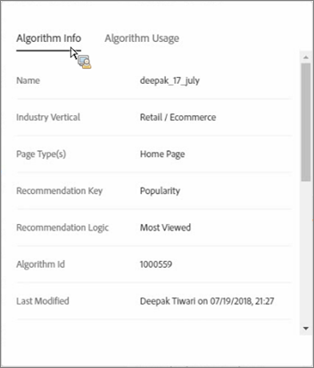
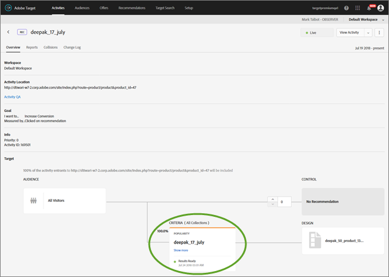

#  Criteria{#criteria}

Criteria are rules that determine which products to recommend based on a predetermined set of visitor behaviors.

## Criteria {#concept_4BD01DC437F543C0A13621C93A302750}

Criteria are rules that determine which products to recommend based on a predetermined set of visitor behaviors. 

Criteria determine which action will result in which recommendation. You can test multiple recommendation types against each other by adding multiple criteria.

## Industry Vertical {#section_936BCFCF234C49A2BEC1C38AAC2D71AF}

You select an industry vertical based on the goals of your recommendations activity:

| Industry Vertical | Goal |
|--- |--- |
|Retail/Ecommerce|Conversion resulting in purchase|
|Lead Generation/B2B/Financial Services|Conversion with no purchase|
|Media/Publishing|Engagement|

## Recommendation Key {#section_885B3BB1B43048A88A8926F6B76FC482}

The recommendation key you select determines the criteria type. There are several criteria types, which are represented as criteria cards when you set up a [!DNL Recommendations] activity.

| Criteria Type | Keys |
|--- |--- |
|Current Page Activity|Recommend items based on what users do on the current page. For example, visitors who view a particular article might want to see other articles from the same category.<ul><li>Current Item</li><li>Current Category</li></ul>|
|Custom|Recommend items based on custom attributes.<ul><li>Custom Attribute</li></ul>When you base recommendations on custom attributes, you must select the custom attribute and then select the recommendation type. You can perform real-time filtering on top of your own custom criteria output. For example, you can limit your recommended items to only those from a visitor's favorite category or brand. This gives you the power to combine off-line calculations with real-time filtering. This functionality means that you can use Target to add personalization on top of your offline calculated recommendations or custom-curated lists. This combines the power of your data scientists and research with Adobe's tried-and-true delivery, run-time filtering, A/B testing, targeting, reporting, integrations, and more. With the addition of inclusion rules on Custom criteria, this turns otherwise static recommendations into dynamic recommendations based a visitor's interests.<ul><li>Custom criteria are configurable, like other criteria in recommendations.</li><li>You can use [collections](/help/c-recommendations/c-products/collections.md), [exclusions](/help/c-recommendations/c-products/exclusions.md), and [inclusions](/help/c-recommendations/c-algorithms/use-dynamic-and-static-inclusion-rules.md) (including the special rules for Price and Inventory) in the same way as any other criteria.</li></ul>Possible use-cases include:<ul><li>You want to recommend movies from a custom-curated list, but only if the visitor hasn't already watched them.</li><li>You want to run an offline algorithm and use the results to power your recommendations, but you need to ensure that out-of-stock items are never recommended.</li><li>You want to include only items that are from this visitor's favorite category.</li></ul>|
|Past Behavior|Recommend items based on how visitors have responded to an item in the past. For example, people who have purchased a particular brand have been more likely to purchase another item from that brand.<ul><li>Last Purchased Item</li><li>Last Viewed Item</li><li>Most Viewed Item</li><li>Favorite Category</li></ul>|
|Popularity|Recommend the most popular items, such as the most popular videos in a related category or the products that have been viewed most often on your site.<ul><li>Popularity</li></ul>|
|Recently Viewed Items|Recommend the items a visitor has viewed most recently, such as the items a visitor looked at the last time he or she visited your site, or the articles that are trending most highly right now. The Recently Viewed Items algorithm returns results specific to a visitor’s activity within an [environment](/help/administrating-target/hosts.md). If two sites belong to different environments and a visitor switches between the two sites, the algorithm will return only recently viewed items from the appropriate site. This criteria type is not limited by collections.<ul><li>Recently Viewed Items</li></ul>**Note:** You cannot use the Recently Viewed Items criteria for backup recommendations. Recently Viewed Items/Media can be filtered so that only items with a particular attribute are displayed.<ul><li>Recently Viewed criteria are configurable, like other criteria in recommendations.</li><li>You can use [collections](/help/c-recommendations/c-products/collections.md), [exclusions](/help/c-recommendations/c-products/exclusions.md), and [inclusions](/help/c-recommendations/c-algorithms/use-dynamic-and-static-inclusion-rules.md) (including the special rules for Price and Inventory) in the same way as any other criteria.</li></ul>Possible use-cases include:<ul><li>A multi-national company with multiple businesses might have a visitor view items across multiple digital properties. In this case, you can limit the recently viewed items to display only for the respective property where it was viewed. This prevents Recently Viewed items from displaying on another digital property's site.</li></ul>|

## Criteria/Algorithms {#section_DC4E38A00B9744959F05F8E10A0087A1}

[!DNL Target Recommendations] uses sophisticated algorithms to determine when a visitor's actions qualify for the criteria set in your activity. The recommendation key determines the recommendations logic options that are available.

| Criteria | Description |
|--- |--- |
|Items/Media with Similar Attributes|Recommends items or media similar to items or media based on current page activity or past visitor behavior. **Note:** If you select  Items/ Media with Similar Attributes, you will have the option to set  content similarity rules.|
|People Who Viewed This, Viewed That|Recommends items that are most often viewed in the same session that the specified item is viewed.|
|People Who Viewed This, Bought That|Recommends items that are most often purchased in the same session that the specified item is viewed. This criteria returns other products people purchased after viewing this one, the specified product is not included in the results set.|
|People Who Bought This, Bought That|Recommends items that are most often purchased by customers at the same time as the specified item.|
|Site Affinity|Recommends items based on the certainty of a relationship between items. You can configure this criteria to determine how much data is required before a recommendation is presented using the  Inclusion Rules slider. For example, if you select  very strong, the products with the strongest certainty of a match are recommended. For example, if you set a very strong affinity and your design includes five items, three of which meet the strength of connection threshold, the two items that do not meet the minimum strength requirements are not displayed in your recommendations and are replaced by your defined backup items. The items with the strongest affinity display first. Some customers with diverse product collections and diverse site behaviors might get the best results if they set a weak site affinity.|
|Top Sellers|The items that are included in the most completed orders. Multiple units of the same item in a single order are counted as one order.|
|Most Viewed|The items or media that are viewed most often.|
|Recently Viewed Items/Media|Items that have been viewed recently by the visitor. When using this criteria, you should update the  Target design to handle cases where blank recommendations would show when there are not enough previously viewed items to display.|

>[!NOTE] {class="- topic/note "}
>
>If you are running a recommendation and change its criteria, you will lose your reporting data.

You can also use additional known information about a visitor to enhance your recommendations.

All one-day criteria run twice daily. All one-week and longer criteria run once daily. Site Affinity criteria run once daily. Backup criteria run twice daily.

## Viewing Criteria Information {#section_7162DE58E4594FD688A4D7FDB829FD8B}

You can view criteria details on a pop-up card by hovering over a card and by clicking the Information icon on a criteria card without opening the criteria.

Click the **[!UICONTROL Algorithm Info]** tab to view general information about the selected criteria, including its Name, Descriptions, Industry Vertical, Page Type(s), Recommendation Key, Recommendation Logic, and Algorithm ID.

Click the **[!UICONTROL Algorithm Usage]** tab to view a list of activities that reference the selected criteria. The card lists active and inactive activities. Click the Live Activities or Inactivities drop-down lists to view the entire list of activities that reference that criteria. You can click the activity link to open the activity for editing.

## Determining When Criteria Results are Ready to Display {#section_03F328C07F234692B6D996DF745584B3}

From the activity diagram, Criteria cards now indicate when results are ready to display. Knowing if results are ready to display helps you determine if your activity is ready to activate to push it live. Knowing if results are ready to display also helps you know if there are any issues with the criteria.

>[!NOTE]
>
>For a discussion about load times, see "Expected Criteria Processing Time" in [Creating Criteria](../../c-recommendations/c-algorithms/create-new-algorithm.md#task_8A9CB465F28D44899F69F38AD27352FE).

The following illustration shows the activity diagram on a Recommendations activity's Overview page. You can also see the activity diagram with criteria status results from step 2 during the activity-creation workflow.

Status results include the following: Results Ready, Results Not Ready, and Feed Failure, as illustrated in the following diagram:

