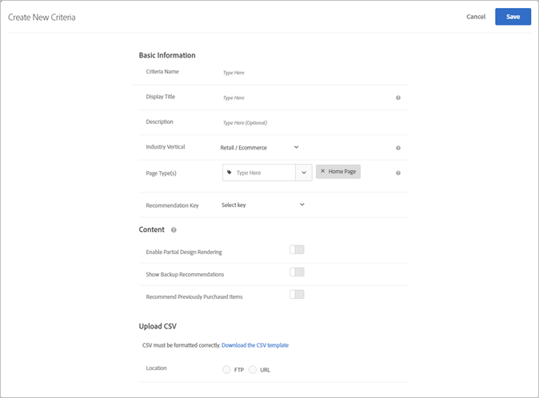

# Upload custom criteria{#upload-custom-criteria}

Upload a CSV file to customize your recommendations.

There are multiple ways to reach the [!UICONTROL Create New Criteria] screen. Some screen options vary depending on how you reach the screen.

* When you are creating a [!UICONTROL Recommendations] activity, click **[!UICONTROL Create New]** on the [!UICONTROL Select Criteria] screen. You will have the option to save your new criteria for use with other [!UICONTROL Recommendations] activities. 
* When you are editing a [!UICONTROL Recommendations] activity, click in a [!UICONTROL Recommendations Location] box on your page, and select **[!UICONTROL Change Criteria]**. On the [!UICONTROL Select Criteria] screen, click **[!UICONTROL Create New]**. You will have the option to save your new criteria for use with other [!UICONTROL Recommendations] activities. 
* On the **[!UICONTROL Recommendations]** > **[!UICONTROL Criteria]** library screen, click **[!UICONTROL Create Criteria]**. Criteria you create here are automatically made available for all [!UICONTROL Recommendations] activities.

1. Click **[!UICONTROL Create Criteria]**.

   

1. Select **[!UICONTROL Upload Custom Criteria]**.

   

1. Type a **[!UICONTROL Criteria Name]**.

   This is the "internal" name used to describe the criteria.  For example, you might want to call your criteria "Highest margin products," but you don't want that title to display publicly. See the next step to set the public-facing title. 
1. Type a public-facing **[!UICONTROL Display Title]** to appear on the page for any recommendations that use this criteria.

   For example, you might want to display "People who viewed this viewed that" or "Similar products" when you use this criteria to show recommendations. 
1. Type a short **[!UICONTROL Description]** of the criteria.

   The description should help you identify the criteria, and might include information about the purpose of the criteria. 
1. Select an **[!UICONTROL Industry Vertical]**.

   Other criteria options might change depending on the industry vertical you select. 1. Select a **[!UICONTROL Page Type]**.

   You can select multiple page types.

   Together, the industry vertical and page types are used to categorize your saved criteria, making it easier to reuse criteria for other [!UICONTROL Recommendations] activities. 
1. Select a **[!UICONTROL Recommendation Key]**.

   For more information about basing criteria on a key, see [Base the Recommendation on a Recommendation Key](../../c-recommendations/c-algorithms/t-create-new-algorithm.md#task_2B0ED54AFBF64C56916B6E1F4DC0DC3B). 
1. Set your **[!UICONTROL Content]** rules.

   Content rules determine what happens if the number of recommended items does not fill your design. For example, if your design has space for five items, but your criteria causes only three items to be recommended, you can leave the remaining space empty, or you can use backup recommendations to fill the extra space. Select the appropriate toggles. See [Content Settings](../../c-recommendations/c-algorithms/t-create-new-algorithm.md#concept_BC16005C7A1E4F1A87E33D16221F4A96). 
1. Set your **[!UICONTROL Inclusion Rules]**.

   Inclusion rules help you narrow the items that display in your recommendations. See [Inclusion Rules](../../c-recommendations/c-algorithms/t-create-new-algorithm.md#task_28DB20F968B1451481D8E51BAF947079). 1. Select the **[!UICONTROL Location]** of your CSV file.

   The CSV file must be formatted correctly to upload successfully. Click **[!UICONTROL Download the CSV template]** to get a correctly formatted CSV file.

   You have two location options:

* **FTP: **To upload your CSV file from an FTP server, select **[!UICONTROL FTP]**, then enter the required information. You have the option to use SSL, which uses the FTPS protocol to transfer your CSV file securely. 
* **URL: **To upload your CSV file from a URL, select **[!UICONTROL URL]**, then and enter a feed URL.

1. Click **[!UICONTROL Save]**.

   >[!NOTE]
   >
   >Custom criteria entities (rows) can contain up to 1,000 recommended items (columns).

Custom criteria updates are by default "cumulative." New key-value pairs specified in the CSV upload file overwrite existing key-value pairs. Existing key-value pairs that don't have keys specified in the CSV upload will still be available for delivery.

Contact Client Care to enable the setting to discard the existing results that aren't included in the next CSV upload. If this setting is enabled, only the keys present in the custom CSV feed file will be available for delivery. This setting applies to all custom criteria.

Custom criteria feeds update once every 24 hours.

You can see the upload and sync status of your custom criteria upload at the bottom of each criteria card on the Recommendations > Criteria page. You can also see the status in the Edit dialog box when editing custom criteria.

The flow for an error-free upload should be Scheduled > Downloading Feed File > Importing > Successful.

The following are possible error messages you might receive if Target encounters a problem with the upload:

<table id="table_183BD638E0F2465A836671ABDED77FC3"> 
 <thead> 
  <tr> 
   <th colname="col1" class="entry"> Error Message </th> 
   <th colname="col2" class="entry"> Details </th> 
  </tr>
 </thead>
 <tbody> 
  <tr> 
   <td colname="col1"> 
Unknown Error 
 </td> 
   <td colname="col2"> 
Indicates an internal technical error. 
 </td> 
  </tr> 
  <tr> 
   <td colname="col1"> 
Parsing Error 
 </td> 
   <td colname="col2"> 
There is likely an issue with the feed file format. Correct the file format and re-save the algorithm, which will re-start the file download process. 
 </td> 
  </tr> 
  <tr> 
   <td colname="col1"> 
Server Not Found 
 </td> 
   <td colname="col2"> 
Provide an IP or Host Name that is visible on the internet. 
 </td> 
  </tr> 
  <tr> 
   <td colname="col1"> 
Credentials Error 
 </td> 
   <td colname="col2"> 
Provide a valid user and password for an active account on the server. 
 </td> 
  </tr> 
  <tr> 
   <td colname="col1"> 
Directory Not Found 
 </td> 
   <td colname="col2"> 
Provide a directory that exists on the server. 
 </td> 
  </tr> 
  <tr> 
   <td colname="col1"> 
File Not Found 
 </td> 
   <td colname="col2"> 
 Provide the name of a file that exists on the server in the directory indicated. 
 </td> 
  </tr> 
 </tbody> 
</table>

