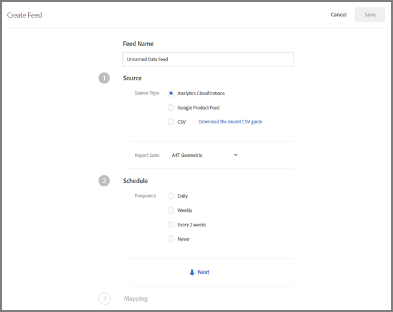
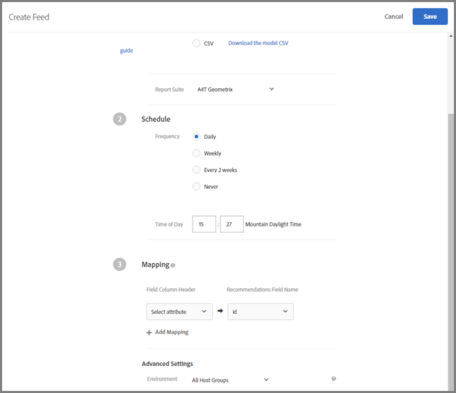

# Feeds{#feeds}

Use feeds to get entities imported into Recommendations. Entities can be sent using CSV files, the Google Product Search feed format, and/or Adobe Analytics product classifications.

## Feeds Overview {#concept_D1E9C7347C5D4583AA69B02E79607890}

Use feeds to get entities imported into Recommendations. Entities can be sent using CSV files, the Google Product Search feed format, and/or Adobe Analytics product classifications. 

Feeds allow you to pass [Entities](../../c-recommendations/c-products/c-products.md#concept_FD935A24D98745FFB2447933FCEB8062) or augment your mbox data with information that is either unavailable on the page or is unsafe to send directly from the page, such as margin, COGS, and so on.

You can select which columns from your Adobe Target product classifications file or Google Product Search file you want to send to the [!DNL Recommendations] server. These pieces of data about each item can then be used in template display and for controlling recommendations.

If data is collected by both an entity feed and an mbox, the most recent data wins. Usually, the most recent data comes from an mbox, because it is viewed more often. In the rare event that entity feed data and mbox data hit at the same time, the mbox data is used.

The [!UICONTROL Feeds] list ( **[!UICONTROL Recommendations]** > **[!UICONTROL Feeds]**) provides information about any feeds you have created. To edit the name of a feed, you must edit the feed itself. When you save with the new name, the feed is refreshed.

>[!NOTE]
>
>If the [!UICONTROL Last Updated] feed says "undefined," then the feed is coming in from [!DNL Recommendations Classic] and cannot be changed from within [!DNL Target Premium Recommendations].

## CSV {#section_65CC1148C7DD448FB213FDF499D35FCA}

You can create a `.csv` file using the Adobe proprietary CSV upload format. The file contains display information about the reserved and custom attributes for your products. To upload attributes specific to your implementation, replace `CustomN` in the header row with the name of the attribute you want to use. In the example below, `entity.Custom1` has been replaced by: `entity.availability`. You can then bulk upload the file to the [!DNL Recommendations] server.

Using the .csv format has the following advantages over the Google Feed format:

* It doesn't require field mappings. 
* It supports multi-value attributes (see example below). 
* It supports up to 100 custom attributes. If you need more than 100 custom attributes, you can create a second feed file with a different set of custom attributes specified.

Use the bulk upload method to send display information if you don't have mboxes on your page, or you want to supplement your display information with items that are not available on your site. For example, you might want to send inventory information that might not be published on your site.

Any data uploaded using the [!DNL .csv] file, Google product feed, or Analytics Product classification feed overwrites the existing entity attribute value in our database. If you send price information via mbox requests and then send different price values in the file, the values in the file overwrite the values set with the mbox request. An exception to this is the `categoryId` entity attribute where the category values are appended instead of being overwritten up to the 250-character limit.

>[!IMPORTANT]
>
>Do not enclose values in double quotes ( " ) in your [!DNL .csv] file unless they are intentional. If you enclose values in double quotes you must escape them by enclosing them in another set of double quotes. Double quotes that are not escaped will prevent the recommendations feed from loading properly.

For example, the following syntax is incorrect:

`"Apples "Bananas" Grapes"",`

The following syntax is correct:

"Apples ""Bananas"" Grapes""",

>[!NOTE]
>
>You can't overwrite an existing value with a blank value. You have to pass another value in its place to overwrite it. In the case of sale price, a common solution is to either pass in an actual "NULL" or some other message. You can then write a template rule to exclude items with that value.

The product is available in the admin interface approximately two hours after successfully uploading its entity.

The following is sample code for a .csv file:

```
## RECSRecommendations Upload File 
## RECS''## RECS'' indicates a Recommendations pre-process header. Please do not remove these lines. 
## RECS 
## RECSUse this file to upload product display information to Recommendations. Each product has its own row. Each line must contain 19 values and if not all are filled a space should be left. 
## RECSThe last 100 columns (entity.custom1 - entity.custom100) are custom. The name 'customN' can be replaced with a custom name such as 'onSale' or 'brand'. 
## RECSIf the products already exist in Recommendations then changes uploaded here will override the data in Recommendations. Any new attributes entered here will be added to the product''s entry in Recommendations. 
## RECSentity.id,entity.name,entity.categoryId,entity.message,entity.thumbnailUrl,entity.value,entity.pageUrl,entity.inventory,entity.margin,entity.last_updated_by,entity.multi_english,entity.availability,entity.tax_country,entity.tax_region,entity.tax_rate,entity.product_type,entity.item_group_id,entity.color,entity.size,entity.brand,entity.gtin 
na3456,RipCurl Watch with Titanium Dial,Watches & Sport,Cutting edge titanium with round case,https://example.com/s7/na3456_Viewer,425,https://example.com/shop/en-us/na3456_RipCurl,24,0.25,csv,"[""New"",""Web"",""Sales"",""[1,2,34,5]""]",in stock,US,CA,9.25,Shop by Category > Watches,dz1,Titanium,44mm,RipCurl,"075380 01050 5" 
na3457,RipCurl Watch with Black Dial,Watches & Sport,Cutting edge matte black with round case,https://example.com/s7/na3457_Viewer,275,https://example.com/shop/en-us/na3457_RipCurl,24,0.27,csv,"[""New"",""Web"",""Sales"",""[1,2,34,5]""]",in stock,US,CA,9.25,Shop by Category > Watches,dz1,Black,44mm,RipCurl,"075340 01060 7"
```

## Google {#section_8EFA98B5BC064140B3F74534AA93AFFF}

>[!IMPORTANT]
>
>The Google Product Search feed type uses the Google format. This is different from the Adobe proprietary CSV upload format.

If you have an existing Google product feed, then you can use that as your import file.

>[!NOTE]
>
>It is not required to use Google data. [!DNL Recommendations] just uses the same format as Google. You can use this method to upload any data you have, and use the available scheduling features. However, you must retain Google's predefined attribute names when you set up the file.

Most retailers upload products to Google, so when a visitor uses Google product search, their products will show up. [!DNL Recommendations] follows Google's specification exactly for entity feeds. Entity feeds can be sent to [!DNL Recommendations] via [!DNL .xml], [!DNL .txt], or [!DNL .tsv], and can use the [attributes defined by Google](https://support.google.com/merchants/answer/188494?hl=en&topic=2473824&ctx=topic#US). The results are searchable on the [Google shopping pages](https://www.google.com/prdhp).

>[!NOTE]
>
>The POST method must be allowed on the server that is hosting the Google feed content.

Because [!DNL Recommendations] users already configure [!DNL .xml] or [!DNL .txt] feeds to send to Google either via URL or FTP, entity feeds accept that product data and use it to build out the recommendations catalog. Specify where that feed exists and the recommendations server retrieves the data.

If you use Google Product Search for the entity feed upload, you still need to have a product page mbox on the page if you want to show recommendations there or track product views for algorithm delivery based on views.

Google feeds do not support multiple values for a custom attribute.

The feed runs at the time you save and activate it. It runs at the time you save the feed, then every day an hour later.

The following is sample code for a Google Product Search feed .xml file:

```
<?xml version="1.0" encoding="UTF-8" standalone="yes"?> 
<feed xmlns="https://www.w3.org/2005/Atom" xmlns:ns2="https://base.google.com/ns/1.0" xmlns:ns3="https://base.google.com/cns/1.0"> 
    <title>Product Feed</title> 
    <link href="https://example.com"/> 
    <updated>2017-12-13T08:45:04.918-08:00</updated> 
    <author> 
        <name>Product Feed Author</name> 
    </author> 
    <id>https://example.com</id> 
    <entry> 
        <title>RipCurl Watch with Titanium Dial</title> 
        <description>Cutting edge Titanium with Round case</description> 
        <ns2:id>na3452</ns2:id> 
        <ns2:link>https://example.com/shop/en-us/na3452_RipCurl</ns2:link> 
        <ns2:availability>in stock</ns2:availability> 
        <ns2:condition>NEW</ns2:condition> 
        <ns2:google_product_category>Watches &amp; Sport</ns2:google_product_category> 
        <ns2:gtin>075380 01050 5</ns2:gtin> 
        <ns2:image_link>https://example.com/s7/na3452_Viewer</ns2:image_link> 
        <ns2:mobile_link>https://m.example.com/s7/na3452_Viewer</ns2:mobile_link> 
        <ns2:mpn>71050</ns2:mpn> 
        <ns2:price>425</ns2:price> 
        <ns2:product_review_average>5.0</ns2:product_review_average> 
        <ns2:product_review_count>30</ns2:product_review_count> 
        <ns2:product_type>Shop by Category > Watches </ns2:product_type> 
        <ns2:brand>RipCurl</ns2:brand> 
        <ns2:sale_price>375</ns2:sale_price> 
        <ns2:tax> 
          <ns2:country>US</ns2:country> 
          <ns2:region>CA</ns2:region> 
          <ns2:rate>9.25</ns2:rate> 
          <ns2:tax_ship>y</ns2:tax_ship> 
        </ns2:tax> 
        <ns2:is_bundle>N</ns2:is_bundle> 
    </entry> 
    <entry> 
        <title>RipCurl Watch with Black Dial</title> 
        <description>Cutting edge matte black with Round case</description> 
        <ns2:id>na3453</ns2:id> 
        <ns2:link>https://example.com/shop/en-us/na3453_RipCurl</ns2:link> 
        <ns2:availability>in stock</ns2:availability> 
        <ns2:condition>NEW</ns2:condition> 
        <ns2:google_product_category>Watches &amp; Sport</ns2:google_product_category> 
        <ns2:gtin>075380 013450 5</ns2:gtin> 
        <ns2:image_link>https://example.com/s7/na3453_Viewer</ns2:image_link> 
        <ns2:mobile_link>https://m.example.com/s7/na3453_Viewer</ns2:mobile_link> 
        <ns2:mpn>71050</ns2:mpn> 
        <ns2:price>275</ns2:price> 
        <ns2:product_review_average>4.8</ns2:product_review_average> 
        <ns2:product_review_count>23</ns2:product_review_count> 
        <ns2:product_type>Shop by Category > Watches </ns2:product_type> 
        <ns2:brand>RipCurl</ns2:brand> 
        <ns2:sale_price>249</ns2:sale_price> 
        <ns2:tax> 
          <ns2:country>US</ns2:country> 
          <ns2:region>CA</ns2:region> 
          <ns2:rate>9.25</ns2:rate> 
          <ns2:tax_ship>y</ns2:tax_ship> 
        </ns2:tax> 
        <ns2:is_bundle>N</ns2:is_bundle> 
    </entry> 
</feed> 
  
```

The following is sample code for a Google Product Search feed .tsv file:

```
id    title    description    link    price    condition    availability    image_link    tax    shipping_weight    shipping    google_product_category    product_type    item_group_id    color    size    gender    age_group    pattern    brand    gtin    mpn 
na3454    RipCurl Watch with Titanium Dial    Cutting edge titanium with round case    https://example.com/shop/en-us/na3454_RipCurl    425    new    in stock    https://example.com/s7/na3452_Viewer    US:CA:9.25:y    1.5 oz    US:::0.00 USD    Watches & Sport    Shop by Category > Watches    dz1    Black    44mm    male    adult    Solid    RipCurl    075380 01050 5    DZ1437 
na3455    RipCurl Watch with Black Dial    Cutting edge matte black with round case    https://example.com/shop/en-us/na3455_RipCurl    275    new    in stock    https://example.com/s7/na3452_Viewer    US:CA:9.25:y    1.5 oz    US:::0.00 USD    Watches & Sport    Shop by Category > Watches    dz1    Black    44mm    male    adult    Solid    RipCurl    075340 01060 7    DZ1446
```

## Analytics Product Classifications {#section_79E430D2C75443BEBC9AA0916A337E0A}

The Analytics Product classification is the only classification available for recommendations. For more information about this classification file, see [Classifications](https://marketing.adobe.com/resources/help/en_US/reference/classifications.html) in the *Analytics Help and Reference* guide. It's possible that not all the information you need for recommendations will be available in your current implementation, so follow this user guide if you want to add to your classifications file.

<table id="table_89809DC66C794DB69B9DB232C7E03B1D"> 
 <tbody> 
  <tr> 
   <td colname="col1"> <p> <p>Important:  Before importing entity data into Recommendations using Analytics product classifications, be aware that this is not the preferred method. </p> </p> <p>Be aware of the following caveats: </p> <p> 
     <ul id="ul_9B6553CAD5DF4CBD83AC8F833441B1C7"> 
      <li id="li_8FD09B9E450947AEA5079C1DFE43BA9D"> <p> Updates to entity attributes incur an additional delay of up to 24 hours. </p> </li> 
      <li id="li_3024EA7D93AA4D3BA6354CE60DED69ED"> <p> Target supports Product Classifications only. The Analytics product SKU must map to the same level as the Recommendations <span class="codeph"> entity.id </span>. Custom Analytics Classifications can be engineered using Adobe Consulting Services. Please contact your Account Manager with questions. </p> </li> 
     </ul> </p> </td> 
  </tr> 
 </tbody> 
</table>

## Create Feed {#task_C6CD9EA905744C2CA0BB8259BB74C867}

Create a feed to insert information about your products or services into [!DNL Recommendations].

<!-- 

recs/t_feeds_create.xml

 -->

1. From within the Target interface, click **[!UICONTROL Recommendations]** > **[!UICONTROL Feeds]** > **[!UICONTROL Create Feed]**.

   

1. Specify a descriptive name for your feed.
1. Select a **[!UICONTROL Source Type]**.

   For information about Google Product Feed and CSV feed types, see [Feeds Overview](../../c-recommendations/c-products/c-feeds.md#concept_D1E9C7347C5D4583AA69B02E79607890). 
1. Specify a Report Suite, or the URL or FTP location where the feed can be accessed.

   If you select FTP, provide the FTP server information, the login credentials, the filename, and the FTP directory. You have the option to use FTP with SSL (FTPS) for more secure uploads.

   If you select URL, specify the URL. 
1. Click the **[!UICONTROL Next]** arrow to display the [!UICONTROL Schedule] options.

   

1. Select an update option:

* Daily 
* Weekly 
* Every 2 Weeks 
* Never

  Do not schedule an update. Choose this if you do not want this feed to run.

1. Specify the time you want your feed to run.

   This option is based on the time zone used in your browser. If you want to use a time in a different time zone, you must calculate that time according to your time zone. 
1. Click the **[!UICONTROL Next]** arrow to display the [!UICONTROL Mapping] options, then specify how you want to map your data to [!DNL Target] definitions.

   

1. (Optional) If you want the feed to belong to an environment (host group), select the host group.

   By default the feed belongs to all host groups. This ensures that items in this feed are available in any environment.

   >[!NOTE]
   >
   >For more information, see [Hosts](../../administrating-target/c-hosts.md#concept_516BB01EBFBD4449AB03940D31AEB66E).

1. Click **[!UICONTROL Save]**.
>After you create or edit a feed, the feed runs immediately, then will update according to the parameters you set. It takes some time for all the information to be available. First, the feed must sync, then it must be processed and indexed before it can be published and made available. The current status appears under [Feed Status](../../c-recommendations/c-products/c-feeds.md#concept_E475986720D1400999868B3DFD14A7A0) in the Feeds list. You can close [!DNL Target] before the process is complete and the process continues. 
>
>While indexing is in progress, products and feed headers appear before individual values have been indexed. This enables you to search and see products so you can create collections, exclusions, designs, and activities before indexing has been completed. 
>
>When the Status says "Success," it means that the file was found and it parsed correctly. The information is not available to use within [!DNL Recommendations] until the file is indexed, which can take some time, depending on the size of your file. If the process fails, it means that the file was not found (for example, you used an incorrect URL or your FTP information was incorrect), or that there was a parsing error. 

>## Feed Statuses and Indicators {#concept_E475986720D1400999868B3DFD14A7A0}

>Information about the possible feed statuses and their indicators. 

>
><!-- 

recs/c_feed-statuses-and-indicators.xml

 -->
>This section contains the following information: 
>
>* [Feed Statuses](../../c-recommendations/c-products/c-feeds.md#section_5DDC2DECF70A42FDAFF2235E91371537) 
>* [Feed Status Indicators](../../c-recommendations/c-products/c-feeds.md#section_3C8A236C5CB84C769A9E9E36B8BFABA4) 
>

>## Feed Statuses {#section_5DDC2DECF70A42FDAFF2235E91371537}

>The following are possible statuses for a feed: 
>
><table id="table_0C54CB3B06DA419AB4A83789B09E531F"> 
 <thead> 
  <tr> 
   <th colname="col1" class="entry"> Status </th> 
   <th colname="col2" class="entry"> Description </th> 
  </tr> 
 </thead>
 <tbody> 
  <tr> 
   <td colname="col1"> <p>Syncing </p> </td> 
   <td colname="col2"> <p>Feed setup details are being saved to <span class="keyword"> Target </span>. </p> </td> 
  </tr> 
  <tr> 
   <td colname="col1"> <p>No Feed Run </p> </td> 
   <td colname="col2"> <p>You have created a feed but it has not been scheduled (frequency is set to Never). </p> </td> 
  </tr> 
  <tr> 
   <td colname="col1"> <p>Scheduled at <i>date and time</i> </p> </td> 
   <td colname="col2"> <p>The feed has not been run, but is scheduled to run at the specified date and time. </p> </td> 
  </tr> 
  <tr> 
   <td colname="col1"> <p>Server Not Found </p> </td> 
   <td colname="col2"> <p>FTP or URL locations are invalid or otherwise unreachable. </p> </td> 
  </tr> 
  <tr> 
   <td colname="col1"> <p>Waiting to Download </p> </td> 
   <td colname="col2"> <p>The feed is waiting to downloaded to <span class="keyword"> Target </span>. </p> </td> 
  </tr> 
  <tr> 
   <td colname="col1"> <p>Preparing to Import </p> </td> 
   <td colname="col2"> <p>The feed is being prepared to import to <span class="keyword"> Target </span>. </p> </td> 
  </tr> 
  <tr> 
   <td colname="col1"> <p>Flushing Results </p> </td> 
   <td colname="col2"> <p>The results are being flushed. </p> </td> 
  </tr> 
  <tr> 
   <td colname="col1"> <p>Waiting for Index Queue </p> </td> 
   <td colname="col2"> <p>The feed is in the index queue. </p> <p> <p>Note:  Once the feed status is "Waiting for Index Queue," the newly updated values are available in delivery and criteria processing. </p> </p> </td> 
  </tr> 
  <tr> 
   <td colname="col1"> <p>Indexing since <i>date and time</i> </p> </td> 
   <td colname="col2"> <p>The feed is being indexed since the date and time indicated. </p> </td> 
  </tr> 
  <tr> 
   <td colname="col1"> <p>Indexed at <i>date and time</i> </p> </td> 
   <td colname="col2"> <p>The feed was successfully indexed at the date and time indicated. </p> </td> 
  </tr> 
  <tr> 
   <td colname="col1"> <p>Success </p> </td> 
   <td colname="col2"> <p>The feed was successfully saved to <span class="keyword"> Target </span> at the date and time indicated. </p> </td> 
  </tr> 
 </tbody> 
</table>
>To update a feed (for example, to make changes to your feed configuration or feed file), open the feed, make any desired changes, and click **[!UICONTROL Save]**. 
>
>>[!IMPORTANT]
>>
>>Uploaded feeds expire after 61 days. This means that recommendations will no longer be returned if a feed file has not been processed in the last 60 days. 
>

>## Feed Status Indicators {#section_3C8A236C5CB84C769A9E9E36B8BFABA4}

>The following feed status indicators display in the [!UICONTROL Status] column: 
>
><table id="table_396F6009016843E19F8F423A06B5B1E6"> 
 <thead> 
  <tr> 
   <th colname="col1" class="entry"> Status Indicator </th> 
   <th colname="col2" class="entry"> Description </th> 
  </tr> 
 </thead>
 <tbody> 
  <tr> 
   <td colname="col1"> <p>Green status indicator </p> </td> 
   <td colname="col2"> <p>When a feed successfully finishes indexing, a green status dot indicates that the feed is in a successful state. </p> </td> 
  </tr> 
  <tr> 
   <td colname="col1"> <p>Yellow status indicator </p> </td> 
   <td colname="col2"> <p>When a feed or feed index is delayed by 25% of the feed frequency, a yellow status dot displays. For example, a yellow dot displays for a feed set to run daily if the index hasn't completed six hours after the scheduled time. </p> <p> <p>Note:  Once the feed status is "Waiting for Index Queue," the newly updated values are available in delivery and criteria processing. </p> </p> </td> 
  </tr> 
  <tr> 
   <td colname="col1"> <p>White status indicator </p> </td> 
   <td colname="col2"> <p>When a feed is not scheduled, a white status dot indicates that the feed has not run yet. </p> </td> 
  </tr> 
  <tr> 
   <td colname="col1"> <p>Red status indicator </p> </td> 
   <td colname="col2"> <p>If the feed fails to upload data to server, a red status indicator is shown. </p> </td> 
  </tr> 
 </tbody> 
</table>
>Consider the following examples: 
>
>**Example 1:** 
>
>* Day one: daily feed processes at 9:00 a.m. PST 
>* Day two: it is 3:30 p.m. and the feed hasn't run since yesterday at 9:00 a.m. 
>
>The status should be yellow because the index should have run roughly 6.5 hours ago. 6.5 hours +24 is 127% of the feed window. 
>
>**Example 2:** 
>
>* January 1: monthly feed processes at 9:00 a.m. PST 
>* February 3: it is 10:00 a.m. and the feed hasn't run for one month, one day, and one hour ago 
>
>The status should be yellow because the index should have run roughly one day and one hour ago. Although this is only (31+(1/25))/30 = 1.03% of frequency setting, it surpassed the maximum of one-day delay. 
