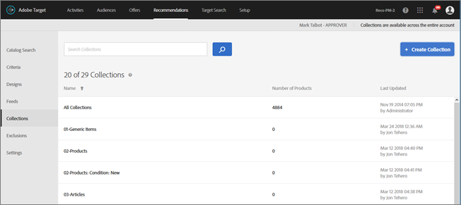
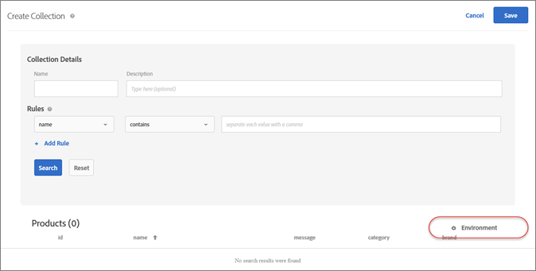

#  Collections {#collections}

A collection is a set of products or items that are eligible for a recommendation.

## Collections {#concept_671BEFFB997D4F1282665BF3CAC00AC5}

A collection is a set of products or items that are eligible for a recommendation. 

Commonly, a collection is a set of similar or related items, such as a single product collection. However, you can group whichever items into a category that makes sense to your business, such as products in a certain price range or color, or items that are likely to be interesting in a particular geographical area.

Use collections to organize your products in logical buckets. For example, if some items are available in one region but not another, you might want to create a collection that excludes items that are unavailable in the visitor's region. You can also use collections to organize seasonal items, or any other organizational parameters that apply to your business.

The backup recommendations generated for each criteria within the recommendation also uses this collection, so only items in the collection are included in the backup recommendation. With collections, you can be sure that only products that make sense to show in a location are displayed.

Collections are rebuilt or updated every time each criteria runs.

You can group your items into catalogs, then create separate recommendations for each collection.

Inclusion criteria allow you to do similar things as a collection, but they must be set up every time you create an activity. Collections allow you to create a set of items one time, then use it whenever it is appropriate to do so without having to set it up again.

When you are creating or editing a [!DNL Recommendations] activity, the collection name appears next to the [!UICONTROL Criteria] label on the activity diagram.

>[!NOTE]
>
>Collections are not applied when using the [!UICONTROL Recently Viewed Items] recommendation key.

## Create a Collection {#task_1256DFF6842141FCAADD9E1428EF7F08}

Create a collection to organize the products you want to show in your recommendations.

1. Click **[!UICONTROL Recommendations]** > **[!UICONTROL Collections]** to display the list of existing collections.

   The "Number of Items" reported for each collection on the [!UICONTROL Collections] list view is the number of products matching the rules for that collection within the configured default Recommendations [host group](/administrating-target/hosts.md) (environment). See [Settings](../../c-recommendations/plan-implement.md#concept_C1E1E2351413468692D6C21145EF0B84) to change the default host group.

   

1. Click **[!UICONTROL Create Collection]**.

   

1. (Conditional) Choose an environment from the **[!UICONTROL Environment]** filter while creating (or updating) a collection to preview the contents of the collection in that environment. By default, results from the default host group are displayed.

   

1. Type a **[!UICONTROL Name]** for the collection.

   You can also enter an optional **[!UICONTROL Description]**.

1. Set the rules used to build the collection.

   For example, your collection might be built around a product ID or category, margin, or any other parameter in the list.

   You can add rules to use multiple parameters to define a collection. Multiple rules are joined with an AND. All specified rules must be matched for the collection to apply.

1. Click **[!UICONTROL Save]**.
You can also create collections using Advanced Search on the Catalog Search page ([!UICONTROL Recommendations] > [!UICONTROL Catalog Search] > [!UICONTROL Advanced Search]). After creating a search using "id > contains," for example, you can then click [!UICONTROL Save As] > [!UICONTROL Collection].

>[!IMPORTANT]
>
>The Advanced Search functionality is case-insensitive; however, products returned at the time of delivery are based on case-sensitive search. This mismatch might lead to confusion. Ensure that you consider case-sensitivity when you create collections based on results using the Advanced Search functionality. For example, if you perform a search for "Holiday," that initial search lists results containing "Holiday" and "holiday." If you then create a catalog with the intent to return products containing "holiday," only products containing "holiday" are returned. Products containing "Holiday" are not returned. 