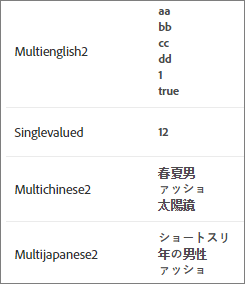

#  Custom entity attributes{#custom-entity-attributes}

Use single- and multi-value custom entity attributes to define additional information about items in your catalog.

## Limits {#limits}

You can include up to 100 custom entity attributes to define additional information about items in your catalog. For example, you might create a custom attribute called `entity.genre` to define a book or movie. Or, a ticket vendor might create attributes for an event venue to include a secondary performer, such as a visiting team in a sporting event or an opening act at a concert.

The maximum length of single-value entity custom attributes is 15,000 characters (for one- and two-byte UTF-8 encoded languages such as English and other Latin-script alphabets) or 10,000 characters (for three-byte UTF-8 encoded languages such as Chinese, Japanese and Korean).

Multi-value entity custom attributes can contain no more than 500 values. Each individual value is limited to 100 characters. The total number of characters across all values must conform to the limitations for the maximum length of single-value entity custom attributes (see above.)

## Custom Entity Attribute Values {#section_313331A9F8194A89B5EDD89363018651}

Custom entity attributes can contain a single value or multiple values. Entity attribute values are displayed in the product view.



A custom entity attribute with a single value is formed the same way as a single-value predefined entity attribute:

```
entity.genre=genre1
```

A multi-value custom entity attribute must be sent as a valid JSON array:

```
entity.genre=[“genre1”, “genre2”]
```

Examples of valid JSON arrays supported by [!DNL Recommendations]:

* `["AB","BC"]` all values are strings 
* `[1,2]` all values are numeric

>[!NOTE]
>
>[!DNL Recommendations] does not support mixed value types in multi-value entity attributes. For example, `["AB",1,true, [1,2,3]]` is a valid JSON array, but it is not supported in [!DNL Recommendations] because it includes mixed value types (string, numeric, boolean, object).

After a custom attribute is sent as a valid JSON array, the attribute is treated as a multi-value attribute for all products in the catalog.

>[!NOTE]
>
>To change an attribute from multi-value to single-value, you must delete your catalog and upload corrected product data. Deleting your catalog does not delete the historical data associated with your product IDs. See [Deleting All Items From the System](../../assets/adobe-recommendations-classic.pdf) in the *Adobe Recommendations Classic* documentation for more information.

**Restrictions**:

* You cannot use predefined entity attribute names for custom entity attributes. (See [Entity Attributes](../../c-recommendations/c-products/entity-attributes.md#reference_3BCC1383FB3F44F4A2120BB36270387F).) 
* The attribute `entity.environment` is reserved by the system and cannot be used for custom entity attributes. Attempts to pass `entity.environment` using `targetPageParams`, feeds, or APIs will be ignored. 
* Arrays must contain a single value type. Mixed-value arrays ( `["AB",1,true]`) are not supported. 
* A multi-value attribute that includes a nested JSON array ( `[10,12,[1,2,3]]`) is treated as a single-value attribute.

## Implementing Multi-Value Attributes {#section_80FEFE49E8AF415D99B739AA3CBA2A14}

Multi-value custom entity attributes are supported when using feeds (CSV), `targetPageParams`, Delivery API, and the Save entities API to upload products. New values replace current values; they are not appended. Empty arrays ( [] ) are treated as having no values.

Double quotes must be escaped. For example, `"[""test"", ""value""]"` is a valid JSON array that can be used in CSV.

You can include up to 500 values in a multi-value attribute.

**Using targetPageParams**

The following example shows how to use `targetPageParams`

```
function targetPageParams() { 
  return { 
    'entity.id':                   '123', 
    'entity.categoryId':            '["A", "A:B", "A:B:C", "A:B:C:D"]',        
    'entity.MultiValueAttribute':   '["X", "Y", "Z"]', 
    'entity.event.detailsOnly':     'true', 
    'excludedIds":                  '[123, 3232, 2323, 4344]', 
    'orderId":                      '123456', 
    'orderTotal":                   '195.32', 
    'productPurchaseId":            '[001,002,003]' 
  }; 
}
```

**Using CSV**

You can manage your CSV files in raw form using a text editor, or you can use spreadsheet software.

The raw CSV will look like this:


The same catalog will look like this in a spreadsheet:


When converting to [!DNL .csv] format, the spreadsheet software adds double quotation marks around cell contents to prevent commas within the cell from acting as column separators. It also adds double quotation marks around JSON string values you include in custom multi-value attributes. This can make working directly with the raw file unwieldy. For example:

* Spreadsheet: `["1","2","3"]` 
* Raw: `"[""1"",""2"",""3""]"`

Use caution when editing a raw catalog CSV file directly.

**Using APIs**

See the [Adobe Recommendations API documentation](http://developers.adobetarget.com/api/recommendations) for information about
using the Delivery and Save entities APIs.

## Using Operators with Multi-Value Attributes {#section_83C2288A805242D9A02EBC4F07DEE945}

When you apply operators to multi-valued custom attributes in algorithm inclusion rules, catalog rules, and exclusion rules, the result will be *true* if at least one value in the list passes the operation (boolean *or*).

In the following example, the rule is `message contains abc`.

Case 1: `entity.genre = ["ab", "bc", "de"]`. The result is false because no value contains `abc`.

Case 2: `entity.genre = ["abcde","de","ef"]`. The result is true because one value contains `abc`.

For negative operators, all attribute values must pass (boolean *and*). For example, if the operator is `notEquals`, the result will be *false* if any value matches.

Refer to the table below for operator behavior in algorithm inclusion rules, catalog rules, and exclusion rules.

| Operator | Behavior | Example |
|--- |--- |--- |
|Equals|If any attribute value equals the input value, results in true.|`genre equals abc`<br>Case 1: `entity.genre = ["ab", "bc", "de"]`. The result is false because no value is equal to `abc`.<br>Case 2: `entity.genre = ["abc", "de", "ef"]`. The result is true because one value is equal to `abc`.<br>Case 3: `entity.genre = ["abcde", "de", "ef"]`. The result is false because `abc` is not equal to any element in the list.|
|Does not equal|If no attribute value equals the input value, results in true.|`genre not equals abc`<br>Case 1: `entity.genre = ["ab", "bc", "de"]`. The result is true because no value is equal to `abc`.<br>Case 2: `entity.genre = ["abc", "de", "ef"]`. The result is false because one value is equal to `abc`.<br>Case 3: `entity.genre = ["abcde", "de", "ef"]`. The result is true because `abc`is not equal to any element in the list.|
|Contains|If any value of attribute contains the input value, results in true.|`genre contains abc`<br>Case 1: `entity.genre = ["ab", "bc", "de"]`. The result is false because no value contains `abc`.<br>Case 2: `entity.genre = ["abcde", "de", "ef"]`. The result is true because one value contains `abc`.|
|Does not contain|If no value of attribute contains the input value results in true.|`genre does not contain abc`<br>Case 1: `entity.genre = ["ab", "bc", "de"]`. The result is true because no value contains `abc`.<br>Case 2: `entity.genre = ["abcde", "de", "ef"]`. The rule will result in false as one value contains`abc`.|
|Starts with|If any value of attribute starts with the input value results in true.|`genre starts with abc`<br>Case 1: `entity.genre = ["ab", "bc", "de"]`. The result is false because no value starts with `abc`.<br>Case 2: `entity.genre = ["abcde", "de", "ef"]`. The result is true because one value starts with `abc`.<br>Case 3: `entity.genre = ["ab", "de", "abc"]`. The result is true because one value starts with `abc` (not necessarily the first element in the list).|
|Ends with|If any value of attribute ends with the input value results in true.|`genre ends with abc`<br>Case 1: `entity.genre = ["ab", "bc", "de"]`. The result is false because no value ends with `abc`.<br>Case 2: `entity.genre = ["deabc", "de", "ef"]`. The result is true because one value ends with `abc`.|
|Greater than or equal to (numeric values only)|Attribute value is converted to double. Attributes that cannot be converted are skipped while running the rule.<br>After processing, any attribute value greater than or equal to the input value results in true.|`price greater than or equal to 100`<br>Case 1: `entity.price = ["10", "20", "45"]`. The result is false because no value is greater than or equal to 100. The value `de` is skipped because it cannot be converted to double.<br>Case 2: `entity.price = ["100", "101", "90", "80"]`. The result is true because as two values are greater or equal to 100.|
|Less than or equal to (numeric values only)|Attribute value is converted to double. Attributes that cannot be converted are skipped while running the rule.<br>After processing, any attribute value less than or equal to the input value results in true.|`price less than or equal to 100`<br>Case 1: `entity.price = ["101", "200", "141"]`. The result is false because no value is less than or equal to 100. The value `de` is skipped because it cannot be converted to double.<br>Case 2: `entity.price = ["100", "101", "90", "80"]`. The result is true because two values are less than or equal to 100.|
|Dynamically matches (only available in item-based algorithms)|If any attribute value matches the input value results in true.|`genre matches abc`<br> Case 1: `entity.genre = ["ab", "bc", "de"]`. The result is false because no value matches `abc`.<br>Case 2: `entity.genre = ["abc", "de", "ef"]`. The result is true because one value matches `abc`.|
|Dynamically does not match (only available in item-based algorithms)|If any attribute value matches the input value results in false.|`genre does not match abc`<br>Case 1: `entity.genre = ["ab", "bc", "de"]`. The result is true because no value matches `abc`.<br>Case 2: `entity.genre = ["abc", "de", "ef"]`. The rule will result in false as one value matches `abc`.|
|Dynamically ranges (only available in item-based algorithms, numeric values only)|If any numeric attribute value lies within specified range results in true.|`price dynamically ranges in 80% to 120% of 100`<br>Case 1: `entity.price = ["101", "200", "125"]`. The result is true because `101` is in the range of 80% to 120% of 100. The value `de` is skipped because it cannot be converted to double.<br>Case 2: `entity.price = ["130", "191", "60", "75"]`. The result is false because no value is in the range of 80% to 120% of 100.|

>[!NOTE]
>
>*Double* is a Java data type. For operators that require numeric values, converting to double eliminates non-numeric values from consideration in the results.

## Multi-Value Attributes in Designs {#section_F672E4F6E1D44B3196B7ADE89334ED4A}

Multi-value attributes will appear as a comma-separated list when referenced in a design.

Example:

When `entity.genre=["genre1","genre2"]` is referenced in a design as `$entity<N>.genre`, the result is `genre1, genre2`. 

>[!MORE_LIKE_THIS]
>
>* [Entity Attributes](../../c-recommendations/c-products/entity-attributes.md#reference_3BCC1383FB3F44F4A2120BB36270387F)
