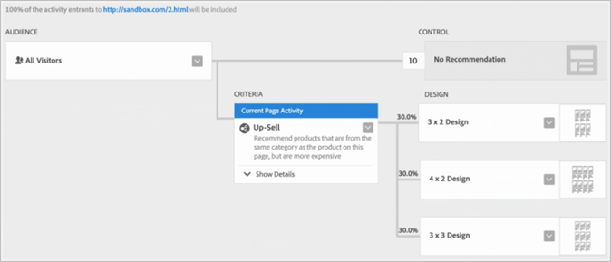

#  Recommendations Classic versus Recommendations activities in Target Premium{#recommendations-classic-versus-recommendations-activities-in-target-premium}

Information to help you choose between Recommendations Classic and Recommendations activities in Target Premium.

>[!NOTE]
>
>Recommendations activities are available as part of the [!DNL Target Premium] solution. They are not available in [!DNL Target Standard] without a [!DNL Target Premium] license.

In the classic [!DNL Recommendations] product, recommendations were displayed by creating a data collection mbox on a page, then adding a display mbox in a specific page location. The [!DNL Recommendations] activity in [!DNL Target Premium] allows you to collect visitor information and create your recommendations anywhere on the page without the need to create an mbox for each location where you want to recommend products or content. A simple JavaScript reference in the header of the page enables recommendations anywhere on the page. Use this JavaScript reference to pass keys to the global [!DNL Target] mbox, such as the `entity.id` and `entity.categoryId` keys.

[!DNL Recommendations Classic] appears as its own card in the [!DNL Experience Cloud] UI. A [!DNL Recommendations] activity is available from within the [!DNL Target Premium] workflow.

[!DNL Recommendations Classic] users can continue to use their [!DNL Recommendations] mboxes in [!DNL Target Recommendations]. They can also combine the classic and [!DNL Target] approaches by keeping their mboxes and using the JavaScript code in the header to activate [!DNL Recommendations] functionality for the other elements on the page. To gain full [!DNL Target] functionality, however, [!DNL Recommendations Classic] users might prefer to delete their old mbox and rely solely on [!DNL Target Recommendations].

The [!DNL Recommendations] activity in [!DNL Target] improves on [!DNL Recommendations Classic] in the following main areas:

## Recommendations as an offer

You can include recommendations inside [!UICONTROL A/B Test] (including [!UICONTROL Auto-Allocate] and [!UICONTROL Auto-Target]) and [!UICONTROL Experience Targeting] (XT) activities. 

This functionality opens up entirely new capabilities, such as:

* Test and target recommendations and non-recommendations content within the same activity.
* Easily experiment with placement of recommendations on the page, including the order of multiple recommendations.
* Automatically push traffic to the best-performing recommendations experience using [!UICONTROL Auto-Allocate].
* Dynamically assign visitors to tailored recommendations experiences based on their profile using [!UICONTROL Auto-Target].

To get started, create an [!UICONTROL A/B Test] or [!UICONTROL Experience Targeting] activity using the [!UICONTROL Visual Experience Composer] and use the [!UICONTROL Insert Before], [!UICONTROL Insert After], or [!UICONTROL Replace With] action to add recommendations to an experience.

For more information, see [Recommendations as an offer](/help/c-recommendations/recommendations-as-an-offer.md).

## Criteria {#section_117709846DAA404580EBE879FFCBD9BA}

[!DNL Target Recommendations] includes a criteria library containing prepackaged sets of rules and configurations. In [!DNL Recommendations Classic], each recommendation was built manually by filling out a form and choosing from the large list of rules. Now, when creating a [!DNL Recommendations] activity, you simply choose a pre-configured criteria set. You can still create custom recommendations, but the criteria library contains many of the most common configurations, pre-built to simplify the process, and using language that people understand. These prepackaged criteria can be used as is, or they can be copied and edited to fit your specific needs.

Criteria are pre-configured and sorted by industry verticals, page types, and implementation. For example, you can look for the criteria that apply to the retail vertical, for use on a product page, showing products from within a particular category (as defined by the `entity.categoryID` parameter).

For more information about using and creating criteria, see [Criteria](../../c-recommendations/c-algorithms/algorithms.md#concept_4BD01DC437F543C0A13621C93A302750).

## Workflow {#section_76B4A26297BF422382DE2C79A2713D3C}

The [!DNL Recommendations] workflow has been simplified. Instead of filling out complicated forms, you follow a visual workflow to:

1. Select the criteria. 
1. Select a pre-configured [design](../../c-recommendations/c-design-overview/create-design.md#task_CC5BD28C364742218C1ACAF0D45E0E14). 
1. Preview the resulting recommendations.

## Visual Preview {#section_639B9E38C9EC4093BF9023EE0F2A15AC}

You can preview your recommendations after you set them up and make any necessary changes without having to create them on the page and then test them. Previews are available from within [!DNL Target].

## Targeting {#section_93295EA0DBA14210B8518AF4802A459F}

In [!DNL Recommendations Classic], there were six targeting options. Recommendations activities use Target's full range of targeting options. Define an audience using either [!DNL Target] or other [!DNL Adobe Experience Cloud] audiences (such as [!DNL Audience Manager] and [!DNL Analytics]), then select the percentage of activity entrants who see each design, and the percentages who see the control.

## Reporting {#section_25C2FCCE4BC1488496C517C0470B5CD6}

In [!DNL Target], [!DNL Recommendations] provides improved reporting that takes advantage of the capabilities provided by [!DNL Target] and the [!DNL Experience Cloud]. Rather than simply showing the lift provided by [!DNL Recommendations] compared to the results without them, you can view complete information about your [!DNL Recommendations] activity.

