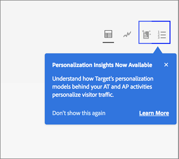
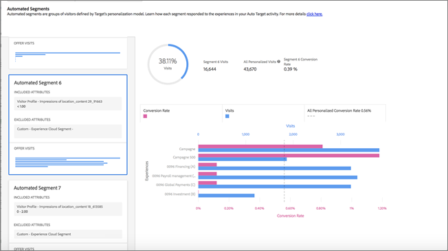
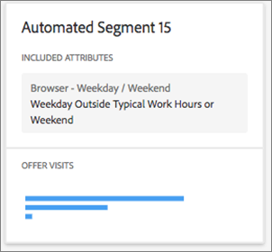

#  Automated Segments report{#automated-segments-report}

Information about the Automated Segments report, one of the two specialized reports available to users of Automated Personalization (AP) and Auto-Target (AT) activities.

>[!NOTE]
>AP and AT activities are available as part of the  Target Premium solution. They are not included with  Target Standard without a Target Premium license.
>
>Personalization Insights reports are available only for AP and AT activities that use a conversion optimization goal. Activities where the optimization goal was changed to conversion from revenue after the activity was already live are also not supported.|

Different visitors respond differently to the offers/experiences in your AP/AT activity. This report shows how different automated segments defined by Target's personalization models responded to the offers/experiences in the activity.

## Accessing and Interpreting the Automated Segments Report {#section_8E8F997AAAF44A1B9EE06EB6FB652801}

1. Click **[!UICONTROL Activities]**, then click the desired [AP](../../c-activities/t-automated-personalization/automated-personalization.md#task_8AAF837796D74CF893CA2F88BA1491C9) or [AT](../../c-activities/auto-target-to-optimize.md#concept_67779E5B7F67427A97D7EA2A6FB919B3) activity from the list.

   If you have many activities, you can filter the list by selecting options from the [!UICONTROL Type], [!UICONTROL Status], [!UICONTROL Reporting Source], [!UICONTROL Experience Composer], [!UICONTROL Metrics Type], and [!UICONTROL Activity Source] drop-down lists. 

1. Click **[!UICONTROL Reports]**.

   The [!UICONTROL Summary] report displays, which provides information about the performance of your activities, represented by the first screen icon. The two additional icons represent the two Personalization Insights reports: Automated Segments and Important Attributes. Note that Auto-Target has an additional graph icon for the graphical view of the [!UICONTROL Summary] report.

   

   >[!IMPORTANT]
   >
   >The [!UICONTROL Automated Segments] report won't be available until at least 15 days after you've activated your activity. During this initial period, you won't be able to access this report or click the [!UICONTROL Automated Segments] icon. After 15 days have passed, assuming there is sufficient personalized traffic in your activity, the [!UICONTROL Automated Segments] report will be available.

1. After 15 days from activating the activity, you can click the **[!UICONTROL Automated Segments]** icon.

   

1. Select the desired date range.

   Unlike the [!UICONTROL Summary] report (performance reporting), [!UICONTROL Personalization Insights], including [!UICONTROL Automated Segments], is available only for fixed date ranges: 15 days, 30 days, 45 days, 60 days, and 90 days. These fixed date ranges allow [!UICONTROL Personalization Insights] to use a large enough range of data to reduce the likelihood that you derive insights from a short-lived pattern in your activity. The two decisions you can make for your date range is the "End Date" and the "Duration." You'll notice that the "Start" is greyed out. The start date automatically changes based on your selections for the end date and duration.

   

   You can access the available fixed date ranges from the [!UICONTROL Choose Duration]drop-down list.

   

1. Review the [!UICONTROL Automated Segments] report data.

   

The following table explains how to interpret the report and describes its elements:

| Element | Details |
|--- |--- |
|Left-hand side panel|The left-hand side panel lists the 20 largest "automated segments" identified by Target's personalization models for this activity. An "automated segment" is like an audience, but it is defined by Target's personalization models instead of by the marketer. Each automated segment is made up of specific values (or value ranges) of specific attributes. Note that automated segments can overlap. Automated segments can be defined by one, two, three, or four attributes. See the examples below for more details. To learn more about Target's personalization models, see [Random Forest Algorithm](/help/c-activities/t-automated-personalization/algo-random-forest.md). To learn more about the attributes Target's personalization models use to create the automated segments, see [Data Collection for Target's Personalization Algorithms](/help/c-activities/t-automated-personalization/ap-data.md).|
|Center graph|The center graphs displays how your activity's content performed for the highlighted automated segment. As you click different segments on the left-hand panel, the center graphs update.|
|Pie charts|The pie charts at the top of the center panel show the size of the automated segment, as well as the total number of personalized visits in the activity (for example, traffic to this activity that was served by the personalization model. It does not include control traffic or traffic served by the overall winner model). Note that the size of the segment is based only on personalized visits. |
|Dual-axis bar chart|The dual-axis bar chart includes visit and conversion information by the offer or experience for that specific automated segment.|
|Pink bar|The pink bar represents the conversion rate, and uses the bottom axis of the graph. You can hover over the bar for more information|
|Blue bar|The blue bar represents the number of visits, and uses the top axis of the graph. You can hover over the bar for more information.|
|Grey dotted line|The grey dotted line represents the conversion rate for all personalized visits in the activity, across all offers/ experiences and automated segments.|

      **Automated Segment Example 1**

      This automated segment is defined based on only one attribute. Visitors included in this automated segment saw this AP activity on a weekday outside of typical working hours or on a weekend.

      

      **Automated Segment Example 2**

      This automated segment is defined based on two attributes. Visitors included in this automated segment who saw this AP activity had fewer than three page views in their current visit and were geographically based within the Latitude 42.57 and 47.29 (approximately between New Hampshire/Oregon and Washington/Maine for a US-based company).

      

1. (Optional) [Download the report in CSV format](../../c-reports/c-report-settings/report-settings.md#section_77E65C50BAAF4AB79242DB3A8778ADEF) for analysis in Excel and other tools.

   >[!NOTE]
   >
   >The Personalization Insights UI report contains select information. The CSV download for the Automated Segments report contains additional details. The Automated Segments report download includes additional Automated Segments beyond the top segments included in the UI, along with how those segments performed against your offers or experiences.

## Automated Segments FAQ {#section_740910A52FA646B4AC9452F98C2F5719}

**Personalization Insights reports are not available yet for my activity. Why is that?**

There are several reasons why the [!UICONTROL Personalization Insights] reports are not yet available for your activity:

* 15 days has not passed since you activated the activity. Automated Segments and Important Attributes reports won't be available until at least 15 days after you've started your activity. During this initial period, you won't be able to access these reports or click the Automated Segments and Important Attributes icons. 
* Your activity has not had sufficient traffic during the specified time frame. After 15 days have passed, assuming there is sufficient personalized traffic in your activity to build the personalization models, Automated Segments and Important Attributes reports will be available. 
* Your activity has a revenue optimization goal. At this time, [!UICONTROL Personalization Insights] is available only for conversion optimization goal activities. We will be adding support for revenue optimization goal activities in a future release.

**What is an attribute?**

An attribute is information about a visitor or his or her specific visit used by the personalization algorithms to learn how to personalize traffic. For example, an attribute might be browser type, location, time of day of visit, and so forth.

For more information about what attributes [!DNL Target] uses in its personalization models, see [Data Collection for Target's Personalization Algorithms](../../c-activities/t-automated-personalization/ap-data.md#reference_255BD3DE7AD04DC9B766E0BC78961058). For more information about how to upload new attributes into Target to use in Target's personalization models, see [Methods to get Data into Target](../../c-implementing-target/c-considerations-before-you-implement-target/c-methods-to-get-data-into-target/methods-to-get-data-into-target.md#concept_0069C0EFB56C4700BB33F2F35C2B9B17).

**What is an automated segment?**

An "automated segment" is like an audience, but it is defined by Target's personalization models instead of by the marketer.

An automated segment is made up of specific values (or value ranges) of specific attributes. See Step 5 above for example automated segments. Note that segments can overlap.

To learn more about the random forest personalization algorithm, which is the basis for Target's personalization models, see [Random Forest Algorithm](../../c-activities/t-automated-personalization/algo-random-forest.md#concept_48F3CDAA16A848D2A84CDCD19DAAE3AA).

**What decides the order of the automated segments? **

A score is computed for each segment, based on its size and how differently it performed to the content in your activity. The combination of these inputs determines the order of the automated segments such that larger segments with larger differences in how they responded to the different content will appear closer to the top of the segment list.

**Why are only some of my offers / experiences showing up in the Automated Segments report?**

AP and AT activities build one model per offer (in the case of AP) and one model per experience (in the case of AT). These activities start serving personalized traffic and create your [!UICONTROL Personalization Insights] with as little as two models built. If you don’t see all of your offers / experiences in [!UICONTROL Personalization Insights], it is likely you don’t have models built for those specific offers/ experiences. You can check your activity’s [!UICONTROL Summary] report and see if there is a clock icon beside that offer / experience. This icon indicates that models aren’t built yet for that offer / experience.

**Why are some offers / experiences with a lower conversion rate receiving a larger amount of traffic compared to other offers / experiences for a certain automated segment?**

There are several potential reasons why you might see more visits to a lower-conversion offer or experience within an automated segment, including:

* A small number of views for some or all of the offers / experiences for a certain automated segment. 
* Lower-volume activities where certain offers / experiences do not have models built, or where models built sooner for some offers / experiences than others. 
* Targeting rules on a specific offer that limits which visitors can see which offers / experiences.

**Is the information in the [!UICONTROL Automated Segments] and [!UICONTROL Important Attributes] reports the same as in the CSV download?**

No, the UI report contains select information. The CSV download contains additional details. The Automated Segment Insights report download includes additional Automated Segments beyond the top segments included in the UI, along with how those segments performed against your offers or experiences. The Important Attributes report includes the top 100 visitor attributes and their relative importance, while the UI only includes the top 10 visitor attributes.

**Can I see [!UICONTROL Personalization Insights] for a custom date range?**

Personalization Insights reporting (both [!UICONTROL Automated Segments] and [!UICONTROL Important Attributes]) is available only for fixed date ranges: 15 days, 30 days, 45 days, 60 days, and 90 days. These fixed date ranges allow [!UICONTROL Personalization Insights] to use a large enough range of data to reduce the likelihood that you derive insights from a short-lived pattern in your activity. You can select these durations for any end-date (where these is enough data in the activity to satisfy the duration).

**How is [!UICONTROL Personalization Insights] created?**

[!UICONTROL Personalization Insights] is created using an Adobe patent-pending technique called MAGIX (Model Agnostic Globally Interpretable Explanations). You can learn more about MAGIX in the Adobe research team’s published paper on the [arXiv.org website](https://arxiv.org/abs/1706.07160).

**Why does the total visitor traffic data in the [!UICONTROL Automated Segments] report not match my AP or AT Summary/Performance report?**

The [!UICONTROL Personalization Insights] reports include only visitors who saw a piece of content selected by Target’s personalization models (i.e. it does not consider control traffic or traffic that is served by the overall winner model). This traffic type is called “personalized” traffic. The summary performance report in AP/AT includes control versus “targeted” traffic. Targeted traffic includes personalized traffic, as well as traffic that was served using the overall winner model and some randomly served traffic used to continue to learn.

**Are the automated segments mutually exclusive?**

No, there is overlap between the automated segments.

**Is [!UICONTROL Personalization Insights] available for revenue-based modeling goals/primary goal?**

At this time, [!UICONTROL Personalization Insights] is available only for conversion optimization goal activities. We will be adding support for revenue optimization goal activities in a future release.

**What are different ways I can leverage the information in Personalization Insights?**

* Discover new audiences to target: If you see a particular automated segment that performs particularly well, you might consider creating an audience so you can reuse that segment in other reports. 
* Test your hypotheses of what type of visitors will respond to which of your experiences. 
* Derive insight into what content worked for what kind of visitors: What offers were responsible for lift across which visitors. 
* Identify underperforming content. 
* Understand what attributes were most critical to how the model learned. 
* See which attributes are used in the personalization models and how important they are. 
* Identify opportunities for additional data points you can pass into Target to further inform your personalization.

