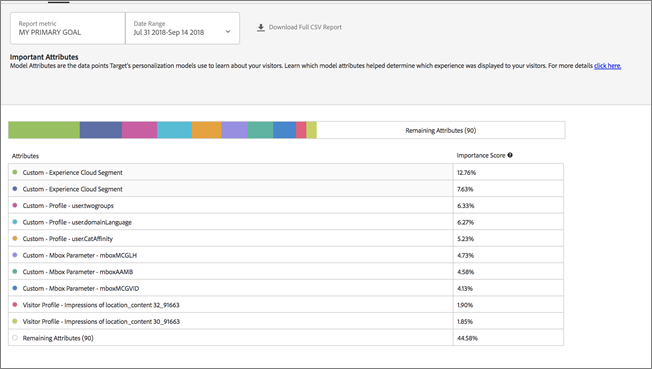

# Important Attributes report

Information about the Important Attributes report, one of the two specialized reports available to users of Automated Personalization (AP) and Auto-Target (AT) activities.

<table id="table_94482816FCA2417A9B0EA7BBCC414715"> 
 <tbody> 
  <tr> 
   <td colname="col1"> 
<b>Notes:</b> 
 
 
     <ul id="ul_D2221BB4EAD54260B69A2E282C789E98"> 
      <li id="li_C4B33688DDE54D95AC116AAA7E638B74"> 
These reports are currently in Beta and will be available soon for everyone to use. Stay tuned for an announcement of the exact date when these reports will be released. 
 </li> 
      <li id="li_19AD73402DB54C199EC506D434ABE96C"> 
AP and AT activities are available as part of the  Target Premium solution. They are not included with  Target Standard without a Target Premium license. 
 </li> 
      <li id="li_E1AC7D9CA0B9418F852B843E3418D898"> 
Personalization Insights reports are available only for AP and AT activities that use a conversion optimization goal. Activities where the optimization goal was changed to conversion from revenue after the activity was already live are also not supported. 
 </li> 
     </ul> 
 </td> 
  </tr> 
 </tbody> 
</table>

In different activities, different attributes are more, or less, important to how the model decides to personalize. This report shows the top attributes that influenced the model and their relative importance.

## Accessing and Interpreting the Important Attributes Report {#section_8E8F997AAAF44A1B9EE06EB6FB652801}

1. Click **[!UICONTROL Activities]**, then click the desired [AP](../../c-activities/t-automated-personalization/t-automated-personalization.md#task_8AAF837796D74CF893CA2F88BA1491C9) or [AT](../../c-activities/c-auto-target-to-optimize.md#concept_67779E5B7F67427A97D7EA2A6FB919B3) activity from the list.

   If you have many activities, you can filter the list by selecting options from the [!UICONTROL Type], [!UICONTROL Status], [!UICONTROL Reporting Source], [!UICONTROL Experience Composer], [!UICONTROL Metrics Type], and [!UICONTROL Activity Source] drop-down lists. 

1. Click **[!UICONTROL Reports]**.

   The [!UICONTROL Summary] report displays, which provides information about the performance of your activities, represented by the first screen icon. The two additional icons represent the two Personalization Insights reports: Automated Segments and Important Attributes. Note that Auto-Target has an additional graph icon for the graphical view of the [!UICONTROL Summary] report.

   

   >[!IMPORTANT]
   >
   >The [!UICONTROL Important Attributes] report won't be available until at least 15 days after you've activated your activity. During this initial period, you won't be able to access this report or click the [!UICONTROL Important Attributes] icon. After 15 days have passed, assuming there is sufficient personalized traffic in your activity, the [!UICONTROL Important Attributes] report will be available.

1. After 15 days from activating the activity, you can click the **[!UICONTROL Important Attributes]** icon.

   

1. Select the desired date range.

   Unlike the [!UICONTROL Summary] report (performance reporting), [!UICONTROL Personalization Insights], including [!UICONTROL Important Attributes], is available only for fixed date ranges: 15 days, 30 days, 45 days, 60 days, and 90 days. These fixed date ranges allow [!UICONTROL Personalization Insights] to use a large enough range of data to reduce the likelihood that you derive insights from a short-lived pattern in your activity. The two decisions you can make for your date range is the "End Date" and the "Duration." You'll notice that the "Start" is greyed out. The start date automatically changes based on your selections for the end date and duration.

   

   You can access the available fixed date ranges from the [!UICONTROL Choose Duration]drop-down list.

   

1. Review the [!UICONTROL Important Attributes] report data.

   

   The following table explains how to interpret the report and describes its elements:

<table id="table_2EE03EE607164B939276BD00A6B3FA2C"> 
 <thead> 
  <tr> 
   <th colname="col1" class="entry"> Element </th> 
   <th colname="col2" class="entry"> Details </th> 
  </tr>
 </thead>
 <tbody> 
  <tr> 
   <td colname="col1"> 
Model Attribute Ranking chart 
 </td> 
   <td colname="col2"> 
The Model Attribute Ranking includes the top 10 attributes that were most important to how Target's personalization model decided what content to show each visitor. The importance score shows, relative to the top 100 attributes, how important a specific attribute was to Target's personalization models in this activity. 
 </td> 
  </tr> 
  <tr> 
   <td colname="col1"> 
Bar graph 
 </td> 
   <td colname="col2"> 
The multi-colored bar graph at the top of the screen allows you to visualize these relative importance scores and maps to the dot's color beside each respective attribute in the table. You can also hover over a specific color in the bar chart to see the attribute it represents. 
 
The importance scores across the top 100 attributes add to 100%. For more information about how to add more attributes that Target's personalization models can use, see <a href="../../c-activities/t-automated-personalization/c-uploading-data-for-target's-personalization-algorithms.md#concept_85EA505B37E54514A1C8AB91553FEED6" format="dita" scope="local"> Uploading Data for Target's Personalization Algorithms</a>. 
 </td> 
  </tr> 
 </tbody> 
</table>

1. (Optional) [Download the report in CSV format](../../c-reports/c-report-settings/c-report-settings.md#section_77E65C50BAAF4AB79242DB3A8778ADEF) for analysis in Excel and other tools.

   >[!NOTE]
   >
   >The Personalization Insights UI report contains select information. The CSV download for the Important Attributes report contains additional details. The Important Attributes report download includes the full list of the top 100 attributes, while the UI report includes the top 10 only. If you are looking for a specific attribute on the report but it is not there, that doesn't mean that the attribute didn't influence the activity, it just didn't make the list for the top 100 attributes.

## Important Attributes FAQ {#section_740910A52FA646B4AC9452F98C2F5719}

** Personalization Insights reports are not available yet for my activity. Why is that?**

There are several reasons why the [!UICONTROL Personalization Insights] reports are not yet available for your activity:

* 15 days has not passed since you activated the activity. Automated Segments and Important Attributes reports won't be available until at least 15 days after you've started your activity. During this initial period, you won't be able to access these reports or click the Automated Segments and Important Attributes icons. 
* Your activity has not had sufficient traffic during the specified time frame. After 15 days have passed, assuming there is sufficient personalized traffic in your activity to build the personalization models, Automated Segments and Important Attributes reports will be available. 
* Your activity has a revenue optimization goal. At this time, [!UICONTROL Personalization Insights] is available only for conversion optimization goal activities. We will be adding support for revenue optimization goal activities in a future release.

**What is an attribute? **

An attribute is information about a visitor or his or her specific visit used by the personalization algorithms to learn how to personalize traffic. For example, an attribute might be browser type, location, time of day of visit, and so forth.

For more information about what attributes [!DNL Target] uses in its personalization models, see [Data Collection for Target's Personalization Algorithms](../../c-activities/t-automated-personalization/r-ap-data.md#reference_255BD3DE7AD04DC9B766E0BC78961058). For more information about how to upload new attributes into Target to use in Target's personalization models, see [Methods to get Data into Target](../../c-implementing-target/c-considerations-before-you-implement-target/c-methods-to-get-data-into-target/c-methods-to-get-data-into-target.md#concept_0069C0EFB56C4700BB33F2F35C2B9B17).

**Is the information in the [!UICONTROL Automated Segments] and [!UICONTROL Important Attributes] reports the same as in the CSV download? **

No, the UI report contains select information. The CSV download contains additional details. The Automated Segment Insights report download includes additional Automated Segments beyond the top segments included in the UI, along with how those segments performed against your offers or experiences. The Important Attributes report includes the top 100 visitor attributes and their relative importance, while the UI only includes the top 10 visitor attributes.

**Can I see Personalization Insights for a custom date range? **

Personalization Insights reporting (both [!UICONTROL Automated Segments] and [!UICONTROL Important Attributes]) is available only for fixed date ranges: 15 days, 30 days, 45 days, 60 days, and 90 days. These fixed date ranges allow [!UICONTROL Personalization Insights] to use a large enough range of data to reduce the likelihood that you derive insights from a short-lived pattern in your activity. You can select these durations for any end-date (where these is enough data in the activity to satisfy the duration).

**How is [!UICONTROL Personalization Insights] created? **

[!UICONTROL Personalization Insights] is created using an Adobe patent-pending technique called MAGIX (Model Agnostic Globally Interpretable Explanations). You can learn more about MAGIX in the Adobe research team’s published paper on the [arXiv.org website](https://arxiv.org/abs/1706.07160).

**Is [!UICONTROL Personalization Insights] available for revenue-based modeling goals/primary goal? **

At this time, [!UICONTROL Personalization Insights] is available only for conversion optimization goal activities. We will be adding support for revenue optimization goal activities in a future release.

**What is the attribute importance score in the Important Attributes report? **

The importance score in the "Attribute Importance Ranking" part of the report provides input into what variables the algorithm used to learn were most important when it determined how to split all the visitors into the segments it identified. It assigned a percentage score to the top 100 attributes used by the model.

**What are different ways I can leverage the information in Personalization Insights?**

* Discover new audiences to target: If you see a particular automated segment that performs particularly well, you might consider creating an audience so you can reuse that segment in other reports. 
* Test your hypotheses of what type of visitors will respond to which of your experiences. 
* Derive insight into what content worked for what kind of visitors: What offers were responsible for lift across which visitors. 
* Identify underperforming content. 
* Understand what attributes were most critical to how the model learned. 
* See which attributes are used in the personalization models and how important they are. 
* Identify opportunities for additional data points you can pass into Target to further inform your personalization.

