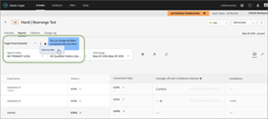
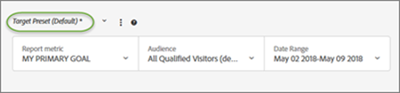
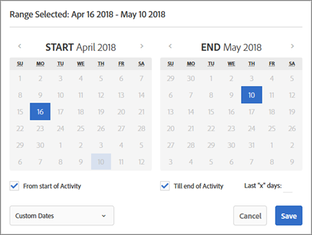
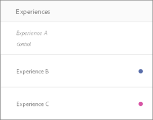
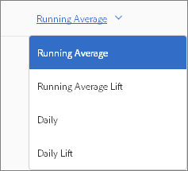
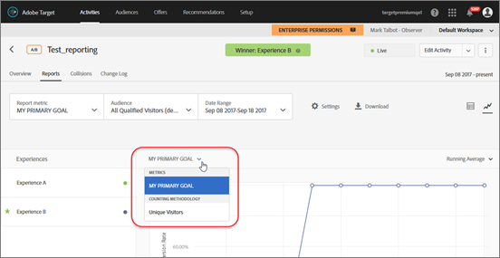

# Report settings{#report-settings}

Information to help you set the elements you want to appear in your report. Report settings can be saved for later use.

To display a report, click **[!UICONTROL Activities]**, click the desired activity from the list, then click the **[!UICONTROL Reports]** tab.

## Target Preset {#section_51F67341465045BEB4F1A2FB638A8EB1}

You can save up to ten different presets of an individual activity's report after configuring it as desired (metrics, date ranges, audiences, advanced settings, and so forth). All Target users can display, edit, and delete the various presets, regardless of who created them.

You can also configure an individual activity's report as desired and then save that configuration as your default/favorite preset. This is the view that displays whenever you view that activity's report going forward.

**Create a Preset or Default Preset**

1. Configure the activity's report as desired (metrics, date ranges, audiences, advanced settings, and so forth). 
1. Next to **[!UICONTROL Target Preset]**, click the three vertical ellipses icon > **[!UICONTROL Save as New]**.

   

   The New Preset dialog box displays:

   

1. Review the information in the Filters and Settings sections to ensure that the report is configured as desired, then specify the **[!UICONTROL Preset Name]** (up to 50 characters). 
1. (Conditional) If you want this to be your default/favorite report view, slide the **[!UICONTROL Set This as Default Preset]** toggle to the On position. 
1. Click **[!UICONTROL Save]**.

**Select a Different Preset**

Select the desired preset from the **[!UICONTROL Target Preset]** drop-down list.

**Edit a Preset**

1. Select the preset that you want to edit. 
1. Edit the report's configuration as desired (metrics, date ranges, audiences, advanced settings, and so forth).

   After you click [!UICONTROL Save] after editing the report's configuration, an asterisk ( &#42; ) displays after the preset name to indicate that the preset has changed, as shown below:

   

1. Click the three vertical ellipses icon > **[!UICONTROL Save as New]** to create a new preset.

   Or

   Click the three vertical ellipses icon > **[!UICONTROL Update]** to update the current preset.

   

**Delete a Preset**

1. Select the preset that you want to delete. 
1. Click the three vertical ellipses icon > **[!UICONTROL Delete]**.

   

1. Click **[!UICONTROL Delete]** again to confirm your deletion.

**Preset Error Handling**

Alerts and messages inside reports let you know if a preset becomes invalid. The alert or message instructs you to choose another audience, metric, host group, or experience to make a valid preset.

The following list describes some of the situations that might cause a preset to become invalid:

* A reporting audience was removed from the activity but is referenced in the preset definition. 
* One (or more) metric was deleted but is referenced in the preset definition. For example, you might delete one or more metrics from the activity and then add new metrics. 
* One (or more) host group (environment) does not exist but is referenced in the preset definition. 
* One (or more) experience was deleted after the preset was created but is referenced in the preset definition. 
* A preset is semantically invalid because referred entities still exist but were updated in a manner that the preset definition has semantically changed. For example, suppose you initially create a preset named "Revenue on Chrome." You later update the activity to measure the Conversion metric instead of Revenue. This update to the activity definition invalidated the preset definition semantically.

## Report Metric {#section_894ABD7148244806B7CE556EBBA2AD62}

Click the **[!UICONTROL Report Metric]** drop-down list to select a different [success metric](../../c-activities/r-success-metrics/r-success-metrics.md#reference_D011575C85DA48E989A244593D9B9924) or multiple metrics to display in the graph and chart.

By default, the primary metric is determined in the success metrics setup when you create the activity. If you change the setup and re-save the activity, the primary metric for reporting is updated.

For more information about selecting multiple metrics to view in reports, see [View Multiple Metrics in a Report](../../c-reports/c-report-settings/c-view-multiple-metrics.md#concept_9E3C3F6F3EC1412FAF252975AC0720B7).

## Audience {#section_70926EB4618945D9AFF2B0564FF3717B}

Click the [!UICONTROL Audience] drop-down list to change the displayed [audience](../../c-target/c-target.md#concept_A782F8481A5041EBA75103CB26376522) for the report.

For more information, see [Audiences](../../c-target/c-target.md#concept_A782F8481A5041EBA75103CB26376522).

## Date Range {#section_A410A768403C4E01891F95CB357E63ED}

The Date Range box displays the reports current date range. Click the drop-down icon to display a calendar that lets you change the report's date range.

Select new **[!UICONTROL Start]** and **[!UICONTROL End]** dates for the report. You can also use the **[!UICONTROL From Start of Activity]** and **[!UICONTROL Till End of Activity]** check boxes.

Click **[!UICONTROL Custom Dates]** to select pre-defined date ranges: Last 7 Days, Last 15 Days, or Last 30 Days. These pre-defined date ranges are rolling ranges. If the start date is less than the number of days chosen, the calendar will show the range from the start date but roll on once the start date becomes older than the number of days chosen as the activity duration increases.

Reports have the following date restrictions:

* Start date of the report must be within the last two years. 
* Daily reports are limited to 100 days. 
* Hourly reports are limited to 15 days.

## Settings {#section_D99CE462107D45CABE0960F820E1E972}

Click the Gear icon to configure report settings, then click **[!UICONTROL Save Settings]** when done.

The following illustration shows the Settings dialog box for an A/B activity:

Depending on the selected activity type, the options vary:

* **Counting Methodology:** Select the desired methodology:

    * Visitors 
    * Visits 
    * Activity Impressions

* **Control:** Select the control experience to use when calculating and comparing lift.  
* **Environment:** Select the environment (host group) to use for the report.  For more information, see [Hosts](../../administrating-target/c-hosts.md#concept_516BB01EBFBD4449AB03940D31AEB66E). 
* **Reset Report Data:** Reset reporting data to remove old data. Current visitors will remain in the activity.  This option is available only for those with approver permissions.

  >[!IMPORTANT]
  >
  >This is a permanent action and cannot be undone.

* **Exclude Extreme Values:** The [!UICONTROL Exclude Extreme Values] toggle applies to activities with Revenue and Engagement metric types only. For more information, see [Excluding Extreme Orders](../../c-reports/c-report-settings/t-excluding-extreme-orders.md#task_2AE7743FFCDD466DAEEB720BE5F33DAA).

## Download {#section_77E65C50BAAF4AB79242DB3A8778ADEF}

Click the Download icon to download report data in a [!DNL .csv] format for quick import into Excel, Access, or other data analysis programs. For more information, see [Downloading Data in a CSV File](../../c-reports/c-downloading-data-in-csv-file.md#concept_3F276FF2BBB2499388F97451D6DE2E75).

## Refresh {#section_E203729F2F314DF3856D2EE67C60B370}

Click the Refresh icon to refresh a report's table and graph view without refreshing the entire page, its configuration, or its date range.

## More Options {#section_AB1B5C695D7045A0A0AC0E2698D2E7DE}

Click the More Options icon (three vertical ellipses) to access the [!UICONTROL Edit Activity] and [!UICONTROL View Experience URLs] options.

## Table View {#section_4E7E75955A964847ADFF2C2314EC0F21}

Click the **[!UICONTROL Table View]** icon to view the report as a table.

## Graph View {#section_0D24B902A8D142468ADB7EEF1D941786}

Click the **[!UICONTROL Graph View]** icon to view the report as a graph.

## Average Lift, Lift Bounds, and Confidence Interval {#section_0D87615B1D3344B3858BA494EEBC16FB}

Reports include several data points and visualization representations that understand the lift bounds and confidence level associated with your activity. This helps you more accurately determine a winner.

For more information, see [Average Lift, Lift Bounds, and Confidence Interval](../../c-reports/c-report-settings/average-lift-bounds-and-confidence-interval.md#topic_AFFDC672A8A34D028B100EF6BE5D8129).

Consider the following:

* Available only when viewing reports in Table View. 
* This feature is not available for activities that use Analytics as the reporting source (A4T).

## Location Contribution {#section_5832F126AC114AE1ABFFF4D9B904393B}

Click the **[!UICONTROL Location Contribution]** icon to switch the report to show contribution by location.

## Experiences {#section_3A450DE1FA7E43F0AAB73165EC3D1C34}

(Available only when viewing the report in Graph View)

Select or deselect experiences on the left side of the chart to display or hide the corresponding experiences from the chart.

If the following illustration, only experiences B and C display in the report:

## Running Average {#section_59066693158C4433B87D07402C2BC6CD}

(Available only when viewing the report in Graph View)

Select the desired graph view:

* Running Average 
* Running Average Lift 
* Daily 
* Daily Lift

>[!NOTE]
>
>The name of this drop-down list varies depending on the selected view, but it'll be one of the four views listed above.

## Counting Methodology {#section_01B0ED5665C74AE1AE97259800190C3E}

(Available only when viewing the report in Graph View)

You can choose the counting methodology for graphs in reports. Note that this is not supported for Automated Personalization (AP) activities.

To access the Counting Methodology option, while viewing a report in graph mode, click the **[!UICONTROL My Primary Goal]** drop-down, then select the counting methodology.

The counting methodology will be the same as the one selected in the [!UICONTROL Settings] dialog, described above.

By default, the graph is plotted in [!UICONTROL Daily] mode.

You can change the mode by clicking the [!UICONTROL Daily] drop-down list, then selecting [!UICONTROL Cumulative].

>[!NOTE]
>
>The name of this drop-down list varies depending on the selected mode.

There are four modes for Auto-Target activities: Daily Control, Daily Targeted, Cumulative Control, and Cumulative Targeted.

The default order in which the graph is plotted is as follows:

* A/B Tests (including Auto-Allocate and Automated Personalization): Order of experience creation, in descending order. 
* Experience Targeting (XT): Order of experiences in the activity. 
* Multivariate Test (MVT): Alphabetical by experience name. 
* Recommendations: Order of experience creation, in descending order.

As you work with the Counting Methodology options, consider the following caveats:

* For an Auto-Target activity, there is no option for selecting "Visitors" as the counting methodology. Auto-Target is the only activity type that you cannot plot by visitors. 
* For activities that use Analytics as the reporting source (A4T), you cannot plot Visitor, Visit, or Impression cumulatively.

**Working with Graphs That Have More Than 16 Experiences in the Activity**

If an activity has fewer than 16 experiences, each experience is plotted in a different color in the graph.

If an activity has more than 16 experiences, the colored lines for the first 16 experiences display in the graph. The remaining experiences are greyed out in the Experiences pane on the left side and no corresponding plot lines display in the graph. The lines for only 16 experiences can be shown at any given time.

If you hover over any of the greyed experiences, a new grey plot line corresponding to that experience temporarily displays in the graph. To display the plot line of a greyed experience in a color, you can deselect an experience that displays in color by clicking its name and then select the desired greyed experience by clicking its name.

As an example, the following illustration shows an activity's graph that has 26 experiences:

The graph displays the lines for the first 16 experiences (some overlap, so it appears that there are fewer than 16 lines). The colored dot in the Experiences pane on the left side next to each experience name indicate that the experience's plot line displays in the corresponding color.

If you scroll down in the Experiences pane, you'll notice that the names for the 17th through 26th experiences are greyed out, as shown in the following illustration:

If you hover over one of the greyed experiences, a new grey plot line corresponding to that experience temporarily displays in the graph.

Suppose you want to display the plot line for Experience R and you don't want to see the line for Experience P. You can click Experience P's name to deselect it and then click Experience R's name to select it, as shown below:

