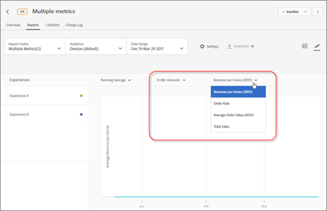

# View multiple metrics in a report

Select multiple metrics to view in a report.

Be aware of the following information as you work with multiple metrics in reports:

* The ability to view multiple metrics is available for A/B and Experience Targeting (XT) activities only. 
* You cannot add more than 20 metrics to a report for an activity that uses Analytics for Target (A4T). You can add as many metrics as you have in your activity to reports for activities that do not use A4T. 
* You cannot use the [!UICONTROL Download] option to download reports to CSV if you have selected multiple metrics. You must select a single metric only to enable the [!UICONTROL Download] option. 
* You cannot view multiple metrics for activities created before the July 2015 Target release (July 30, 2015).

**To select multiple metrics to display in the report:**

1. To display a report, click **[!UICONTROL Activities]**, click the desired activity from the list, then click the **[!UICONTROL Reports]** tab. 
1. Click the **[!UICONTROL Report Metric]** drop-down list to display the [!UICONTROL Shown Metrics] and [!UICONTROL Hidden Metrics] lists.

   

   You can use the [!UICONTROL Search] box to quickly find available metrics to add to the [!UICONTROL Shown Metrics] list.

   Note that you can select multiple metrics from both the [!UICONTROL Table View] and [!UICONTROL Graph View] modes of the report. 

1. Hover your mouse pointer over the desired metrics in the [!UICONTROL Hidden Metrics] list, then click **[!UICONTROL Select]** to move them to the [!UICONTROL Shown Metrics] list.

   Or

   Drag and drop the desired metrics from the [!UICONTROL Hidden Metrics] list to the [!UICONTROL Shown Metrics] list.

   There must be at least one metric in the [!UICONTROL Shown Metrics] list.

   You can rearrange the metrics by dragging and dropping them into the desired order in the [!UICONTROL Shown Metrics] list. The selected order will be reflected in the Table View and Graph View. To remove a metric from the [!UICONTROL Shown Metrics] list, hover your mouse pointer over the metric, then click the **X** icon. 

1. Click **[!UICONTROL Save]** when finished. 
1. While viewing the report in the Table View, hover your mouse pointer on any metric's column header to display a blue arrow. Click the arrow to expand the table to display the [!UICONTROL Lift] and [!UICONTROL Confidence] for that metric.

   

   You can expand only one metric/column at a time. Click the arrow again to collapse the columns. 

1. While viewing the report in the Graph View, the you can select individual metrics to display from the drop-down list:

   

   Likewise, when viewing the report in the Graph View, the Revenue dimension displays as a drop-down list:

   

