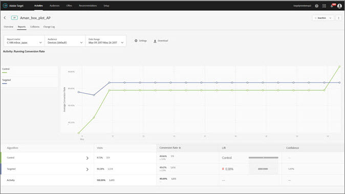

#  Automated Personalization Summary reports{#automated-personalization-summary-reports}

Specialized reports are available to users of Automated Personalization.

>[!NOTE]
>
>Automated Personalization is available as part of the [!DNL Target Premium] solution. It is not included with [!DNL Target Standard] without a [!DNL Target Premium] license.

1. Click **[!UICONTROL Activities]**, click the desired [!UICONTROL Automated Personalization] activity from the list, then click the **[!UICONTROL Reports]** tab.

   If you have many activities, you can filter the list by selecting [!UICONTROL Automated Personalization] from the [!UICONTROL Type] drop-down list. 

1. (Optional) Click the [!UICONTROL Download] icon to download the summary view (for example, comparing Control and Targeted traffic) as broken down by all available success metrics.

>[!NOTE]
>
>The [!UICONTROL Settings] icon is not available for [!UICONTROL Automated Personalization] reports.

[!UICONTROL Automated Personalization] provides the following reports:

## Activity Level Report {#section_6F72FC5C790B4492B3DCECBFFA971337}

The [!UICONTROL Activity Level] report compares the aggregate performance of using an [!UICONTROL Automated Personalization] algorithm to randomly served content (control).

The standard rules of results interpretation for A/B testing still apply, including lift, confidence, trending, duration, and so on. For more information about interpreting results, see [About the Conversion Rate](../c-reports/c-conversion-rate.md#concept_2D9FEDE8F94A485DAC86D611BFBDC844).

## Offer Level Report {#section_CAA6409879E349C6906E2BE8156D87A1}

The [!UICONTROL Offer Level] report for the Random Forest experience compares the performance of each algorithm-applied offer to the same randomly served offer (Control). Thus, offers should not be compared against each other in this view. In the example below, it can be stated that Offer D exhibits a 12.43% lift when served according to the algorithm logic (Random Forest) as opposed to randomly (Control).

Click the experience algorithm (Random Forest or control) to view the Offer Level report.

Offers can be shown within report groups, and these report groups can be collapsed and expanded. Select [!UICONTROL Reporting Group] in the drop-down list to view rolled-up information by reporting groups, rather than by offers.

>[!NOTE]
>
>The clock icon indicates that the algorithm model is still building. The checkmark icon indicates that the base algorithm has been established.

