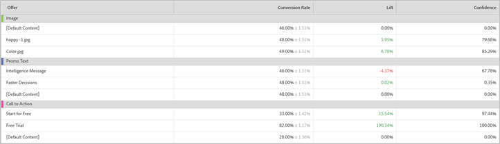

# Location Contribution report (MVT){#location-contribution-report-mvt}

The Location Contribution report shows the performance of each element and each offer.

The top of the report shows the metric, start and end dates, and audience used in the report. You can change any of these factors.

>[!NOTE]
>
>The audience and metric pickers are only available if Analytics is used as the reporting source.

The Location Contribution report includes two tables.

The first table shows the relative influence of each element. This shows you which of the elements where you have added offers is resulting in the most conversions.

The second table provides an offer-level report. It shows the conversion rate, lift, and confidence for each offer in each element. This helps you determine which offers are the most successful. The second column shows values for the selected metric (conversion rate, RPV, AOV, orders, or engagement metrics) of the offer and one standardization.

## Training video: Create an MVT Test

This video demonstrates how to create a multivariate test using the Target three-step guided workflow. The Location Contribution report is described beginning at 8:45.

>[!VIDEO](https://www.youtube.com/watch?v=X8w5IQqEOow)