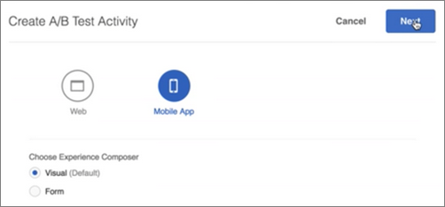
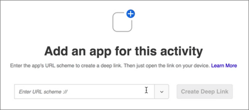

# Mobile App Visual Experience Composer{#mobile-app-visual-experience-composer}

The Visual Experience Composer (VEC) for Native Mobile Apps lets you create activities and personalize content on native mobile apps in a do-it-yourself fashion without continuous development dependencies and app-release cycles.

## Overview {#overview}

The existing [Visual Experience Composer](../../c-experiences/experiences.md#section_34265986611B4AB8A0E4D6ACC25EF91D) gives you a do-it-yourself capability to create activities and personalize experiences that can be dynamically delivered to your web properties via Target's Global Mbox without any developer intervention. You can now take advantage of the VEC to do the same for native mobile applications. The Mobile VEC, available on [AEP SDK v5](https://aep-sdks.gitbook.io/docs/using-mobile-extensions/adobe-target-vec), can be used to create [A/B Test](/help/c-activities/t-test-ab/test-ab.md) and [Experience Targeting (XT)](/help/c-activities/t-experience-target/experience-target.md) activities for mobile apps. Support for other activity types will be available in the future.

The Mobile VEC supports the browsers listed in [Supported browsers](../../c-implementing-target/c-considerations-before-you-implement-target/supported-browsers.md#reference_01B4BF99E7D545A7998773202A2F6100).

## Using the Visual Experience Composer for Native Mobile Apps {#using-the-mobile-vec}

The following illustration represents the process of using the Mobile VEC:

| Process | Details |
|--- |--- |
|Paring|Securely authorize your mobile app and device to work with Target. This step is required only once for a device.|
|Authoring|Author a [Target activity](/help/c-activities/activities.md), with real-time preview of actions performed in the Target UI.|
|Delivery|Target automatically delivers activities in your native mobile app.|

**Pairing:**

The Mobile VEC connects in real-time to the marketer's mobile app for authoring Target activities. In order to enable that, the first step is to securely pair (authorize) the mobile device and app with Target.

1. While creating an A/B Test activity, for example, select **[!UICONTROL Mobile App]**, select **[!UICONTROL Visual (Default)]**, then click **[!UICONTROL Next]**.

   

1. Enter the app's URL, then click **[!UICONTROL Create Deep Link]**.

   

The pairing process contains the following steps:

1. Enter the app's URL scheme that can be used to generate a deep link. A typical deep link looks like:

   `mymobileapp://path?params` 

1. The deep link is available as a QR Code or a URL. The user can scan the QR code from the phone or email/message the URL to him or herself. The deep link URL has an authorization token that is used to securely pair the mobile app and device with Target. 
1. Open the deep link URL on your mobile device. This launches the mobile app. The SDK identifies that the app is launched for pairing and authoring in the VEC.

   The SDK makes a request to the Target server and registers itself. The Target server authorizes the token and establish a real-time connection with the device (currently using web sockets).

   After the connection is established, a real-time view of the app appears in the Target Interface. The app has a red boundary overlay that is an indicator that the app is connected to Target, as shown in the illustration below.

   

   Devices that are already paired can be reconnected by launching the app and opening the authoring interface.

**Authoring:**

After the app is connected and a real-time view of the app appears in the VEC, you can start authoring your activity. At this time the following actions are supported:

| Action | Details |
|--- |--- |
|Swap Image|Swap an image with another one by selecting a different Image Offer or directly setting the CDN URL of an image. Image Offers in Target will be served via [Adobe Scene7](/help/administrating-target/scene7-settings.md).|
|Change Text|Change the text content, color, and font-size in a Text element, Button or Label.|
|Change Background|Change the content or element background for Text area or Buttons.|

Actions performed in the VEC are visible in real-time in the app, thereby allowing for a real-time preview capability during authoring. Actions are associated with relevant Mobile Screens or Views and are associated appropriately.

## Troubleshooting {#troubleshooting}

**The Mobile VEC says that my app has disconnected.**

Your internet connection might have dropped. Relaunch the application after the internet is available and a fresh connection will be established. We recommend authoring a Mobile VEC activity on a Wifi connection.

**The Mobile VEC is not in sync with my mobile app.**

Click the [!UICONTROL Refresh] button in the VEC to sync the display.

## Target Views & Mobile Applications {#target-views}

The Target VEC 2.0 takes advantage of a new concept of Views: a logical group of visual elements that together make up a mobile app experience.

**Introducing Target Views**

Let's consider a shopping app for flowers as an example. The app lets users perform the following tasks:

* List available flowers and bouquets 
* View details 
* Order flowers 
* Control settings, such as payment options and addresses

In this application, each of these tasks can be achieved on a separate screen of the mobile app. As users browse through the app, a screen is rendered allowing them to perform one of the following tasks. If you are an Android developer, you will most likely create four different Android Activity Classes with each class associated with one of these tasks.

In this case, each of these tasks can be considered as Views that your mobile app transitions through. We will refer to these are Target Views—each uniquely characterized. A Target View, or View in short, is a logical container of visual elements that are displayed on the mobile screen. Examples of a View is a screen or an Activity Class in Android.

Mobile apps are rarely made this simple. Let's make it a little more realistic. In the first task, which lists available flowers and bouquets, let's add the ability to create multiple layouts and, therefore, different screens. For example, let's add a "Sort By" feature that has three options:

* By Popularity 
* Price - Low to High 
* Price - High to Low

In this example, whenever a user selects a different "Sort By" option, a new screen displays, even when the Activity Class is the same. Each of these screens can therefore be considered different Target Views.

As a marketer, you're interested in creating different experiences and running distinct offers on each of these views, without asking your developers to set up local mboxes or go through an app release cycle.

## Setting Up Target VEC {#setting-up}

Developers must do the following to enable the Mobile VEC for a mobile app:

* Configure the Adobe Target - VEC extension in Launch
    * The VEC extension is dependent on the Adobe Target Extension. Make sure Adobe Target extension is already configured and enabled.
* Add the Target VEC Extension to your app.
    * [Android - Setting Up the Mobile App](/help/c-target-mobile-app/c-mobile-visual-experience-composer/mobile-visual-experience-composer-android.md) 
    * [iOS - Setting Up the Mobile App](/help/c-target-mobile-app/c-mobile-visual-experience-composer/mobile-visual-experience-composer-ios.md)

## Implementation Methods for Target VEC

The Target VEC extension retrieves the relevant Target experiences for your app through a network request. Offers are retrieved via this network call and applied automatically on the targeted screens. No subsequent network requests are made to retrieve VEC experiences as the user navigates through multiple screens of the app.

The default behavior of the extension is to make a synchronous network request (blocking call) at the time of Application launch. You can use Launch to control the behavior of this network request to meet your application behavior.

### Auto-Fetch Target Activities

This is the default behavior where a network request is initiated automatically by the Target VEC extension. You can use one of the following options to make this request a blocking call or an asynchronous request.

* Fetch in a synchronous call (background is OFF)

  When selected, Target VEC extension makes a network request as a blocking call on App launch. Offers are applied immediately and there is no flicker in the app. This is the default behavior of the extension.

* Fetch in an asynchronous call (background is ON)

  When selected, Target VEC extension makes a network request in the background on App launch but does not block the app from loading. If your experiences are authored on the home screen of your app, the offers may not apply for the home screen if the screen is rendered before the call completes. The app screen rendering is typically identified via the lifecycle events `didFinishLaunchingWithOptions` and `onActivityResumed` on iOS and Android respectively. Offers will be automatically apply on all subsequent screens.

### Fetch Target Activities Programmatically

You can disable the Target VEC extension to make the network request automatically and decide to programmatically call the Extension API. This gives your developers control on how they want to integrate Target VEC offers in the App. The Target VEC extension has two static methods `prefetchOffers` and `prefetchOffersBackground` that can used to programmatically retrieve Target VEC offers.

* The `prefetchOffers` method will hide the current screen until Target VEC offers are fetched. The offers are automatically applied to the current screen if applicable and the screen is visible again.
* The `prefetchOffersBackground` method will not hide the current screen and a call will be made to retrieve the relevant Target offers. Target offers will *not* be applied on the current screen and there will not be a flicker. As the user navigates to subsequent screens, offers will be automatically applied as applicable.

### Handle Target Workspace Restrictions

You can set the `at_property` value for your workspace using the Launch interface. This ensures only activities in that workspace will be delivered to your Mobile App.

## General Guidelines for Target API Calls {#section_C7276795F02540DCA230AEEDF882A833}

To properly add Target Views for Android, here's a simple table that outlines the correct locations to put the `targetView` calls:

| Acceptable TargetView Location | Under the Correct Additions |
|--- |--- |
|At the end of `Activity::onStart`, `Activity::onResume`|It is up to the developer whether to consider `OnStart` and `OnResume` to be the same or different `targetViews`. If the same, use the same `viewName`. If different, use different `viewNames`. These events are automatically added by the SDK.|
|Immediately after an `Activity::SetContent` call|If the UI doesn't change, we can insert a  `targetView` call.|
|Inside of `View::willAppear`|If the selected view that appears in uniquely in one specific view hierarchy.|
|Immediately after an `Activity::SetContentView` call|If the activity doesn't change/amend any of its content in the following code.|

For Android, here's a table for incorrect locations to put the `targetView` calls:

| Unacceptable TargetView Location | Reason |
|--- |--- |
|Within `Activity::onCreate`|The activity has been created, but the view associated with activity is not guaranteed to be complete, and/or attached to the window. This placement might lead to the authoring screen being not sampled or incompletely sampled, and/or the offers being applied in a non-deterministic manner.|
|Inside of `View::didAppear`|The view has already appeared and the application of the offer will create a poor UI experience with flicker.|
|Inside of `View::didLoad`|The view is not attached to the main view hierarchy, and might be instantiated, but are not guaranteed to be shown on the app UI.|

## Delivery {#delivery}

Target activities authored using the Mobile VEC are automatically delivered in mobile apps. These activities are prefetched on app launch(based on launch configuration) and applied as the user navigates through different Target Views, often mapped directly to the screens.

When calling the `TargetVEC.prefetchOffersBackground()` API method, Target offers are fetched from the Target Edge and cached locally.. This allows for a smoother user experience, as Target offers are immediately applied from cache when Target views are triggered with `targetView()` calls, instead of being fetched over the network.

For additional flexibility, you can also call `TargetVEC.prefetchOffers()` API, which will prehide the current layout until Target offers are prefetched and applied to visible Target view(possibly causing flicker).

`TargetVEC.prefetchOffersBackground()` can also be called repeatedly as the user navigates a customer app to refresh the local Target offer cache with the most appropriate content (following the latest updates of the current user's Target profile).

Note that each time Target offers are prefetched, the offers for the last Target view triggered with `AdobeTargetMobile.targetView()` are also applied, if possible.

## Known Limitations {#limitations}

* The Mobile VEC can currently be used to create [A/B Test](/help/c-activities/t-test-ab/test-ab.md) and [Experience Targeting (XT)](/help/c-activities/t-experience-target/experience-target.md) activities for Mobile Apps. Support for other activity types will be available in the future. 
* Preview feature is not supported yet. It will be made available in upcoming release.
* When trying to reconnect the app to the Mobile VEC, you must exit the app completely and relaunch it.

  If the mobile app is already open during any of the scenarios listed below, you must close the app and then reopen it. However, you *must* close the app by closing it from the recent apps section and *not* by pressing the Back button. There might be intermittent connection issues if the app is closed by pressing the Back button.

  There are several situations in which you must relaunch the app in order to connect to the Mobile VEC if the app is already open:

    * While creating a new activity, after you select the mobile app, the device list dialog box displays. If the app is already open, you must close and then relaunch the app to get its device shown as available for selection. 
    * The device dialog box displays when you start editing an activity. If the app is already open, you must close and then relaunch the app to get its device shown as available for selection. 
    * The device dialog box displays when you navigate from the "Goals & Settings" step back to the "Authoring" step (Step 1). If the app is already open, you must close and then relaunch the app to connect back to the Mobile VEC.

  Ensure that you close the app by closing it from the recent apps section and not by pressing the [!UICONTROL Back] button.

