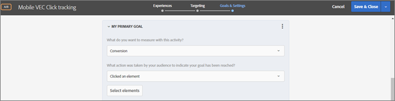
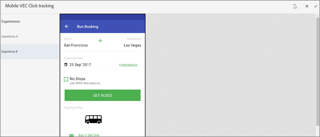
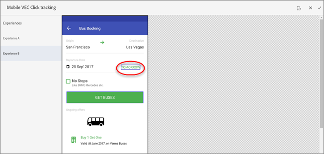
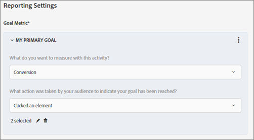

# Set up click tracking in the Mobile VEC{#set-up-click-tracking-in-the-mobile-vec}

The Mobile VEC supports setting up of click tracking goals for [!DNL Target] activities.

1. When setting your goals on the Goals & Settings page for your activity , select the [!UICONTROL Conversion] success metric.

   

1. For the action, select **[!UICONTROL Clicked an Element]**, then click **[!UICONTROL Select Elements]**.

   Your mobile app opens in the Mobile Visual Experience Composer (VEC).

   

1. Select any elements that you want to track.

   See the [!UICONTROL Considerations] section below for tips on selecting elements.

   

1. Click the check mark at the top of the screen to save your selections.

You can also edit and change the click selections or delete them if you need to start fresh.

When an activity entrant clicks a selected element, that click is counted as a conversion.

## Considerations {#considerations}

There are several things to consider when selecting elements:

* When more than one element is selected and if a visitor clicks any one of these elements, the click is counted. To count each click separately, set up individual success metrics for each element.  
* Click events are sent to Target as soon as the user clicks the element. 
* In the Mobile VEC, only those elements that have a click handler attached are allowed to be selected. 
* You can browse to any section of the app, but make sure that [views](/help/c-target-mobile-app/c-mobile-visual-experience-composer/mobile-visual-experience-composer.md#target-views) are defined for the section where you are selecting elements for click tracking. 
* While editing an activity, if the device is already selected in Step 1, you don't need to select the device again. However, if you land directly on the click-track page, you will be shown the device selection screen to select an authorized device.