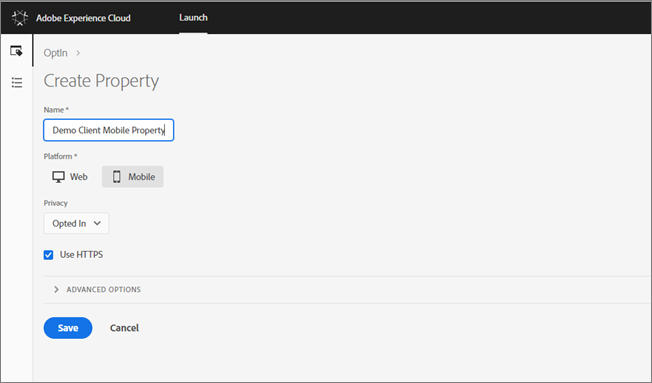
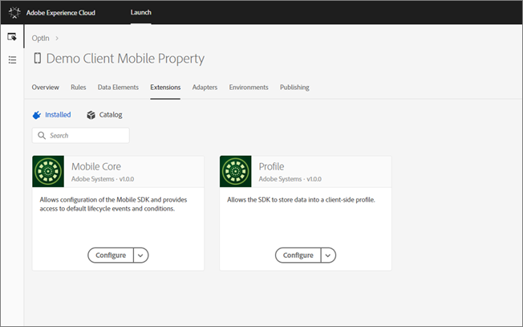
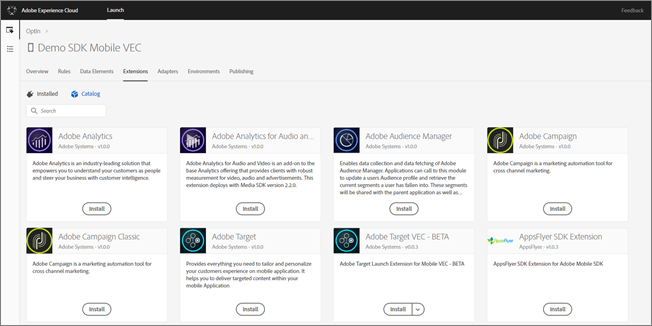
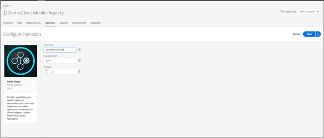
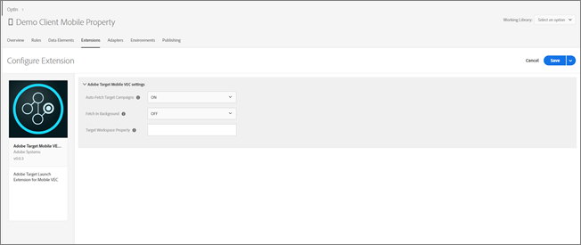
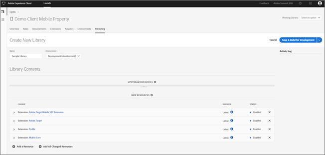
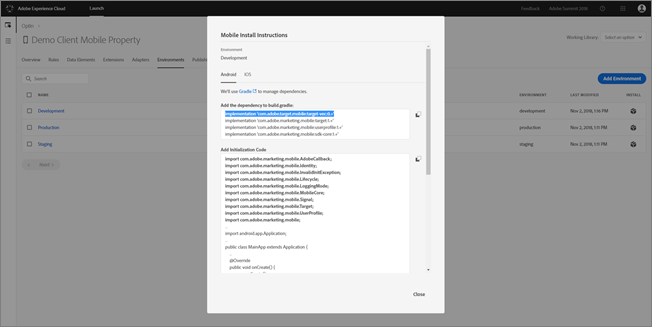

# Use Adobe Launch to set up the Mobile App VEC{#use-adobe-launch-to-set-up-the-mobile-app-vec}

Information about using Adobe Launch to set up the Visual Experience Composer (VEC) for Native Mobile apps.

>[!NOTE]
>
>The Visual Experience Composer for Native Mobile Apps is currently offered as a Beta feature available to select customers to obtain feedback to help us improve the feature before making it available to all customers. Please talk to your Customer Success Manager or Adobe Client Care to participate in this Beta program.

The Adobe Target VEC SDK is required to power Target in your mobile apps for creation and delivery of visual experiences. The SDK is dependent on the Adobe Experience Platform SDK (V5 SDK), which is comprised of the Mobile Core and a series of Adobe Experience Cloud solutions that depend on the Mobile Core.

Each extension (such as Target) registers with the Mobile Core to provide features specific to the solution or service it represents.

To start implementing the SDK, you'll need to first create a mobile property in the Adobe Experience Platform Launch. You'll set up configuration required by the Mobile Core and any extensions you add, and then publish the configuration into an environment. When you implement the SDK in your app, you'll reference the environment to get going.

>[!NOTE]
>
>The Target VEC extension requires that the Target extension is also included. The Target VEC extension cannot act as a standalone extension.

## Set Up the Adobe Target VEC SDK {#section_7971AFE35B234CCDB6E177709D6BED80}

1. Create a new mobile property in [!DNL Adobe Launch] (specify the name and select [!UICONTROL Mobile] as the platform).

   

1. Click the **[!UICONTROL Extensions]** tab.

   By default, the [!UICONTROL Mobile Core] and [!UICONTROL Profile] extensions are included. These extensions are required for each Experience Cloud solution.

   

1. Click **[!UICONTROL Catalog]**.

   You can see that there are many other extensions, such as [!DNL Adobe Analytics], [!DNL Adobe Audience Manager], [!DNL Adobe Campaign], [!DNL Adobe Target], and [!DNL Adobe Target VEC Extension].

   

1. Select the [!UICONTROL Adobe Target] extension and add target specific details, such as `ClientCode`, `EnvironmentId`, and timeout values.

   These properties were already present in V4 and have been migrated to the latest SDK version.

   

   Save the configuration and then add the [!UICONTROL Target Mobile VEC Extension]. 

1. After adding the [!UICONTROL Target Mobile VEC Extension], you will be presented with a screen with properties specific to the Target VEC, such as:

    * **Auto-Fetch Target Campaigns:** When switched ON, Target VEC activities are automatically fetched when the app is launched. See the Mobile Developer documentation for the best practices when controlling this yourself. 
    * **Fetch in Background:** When enabled, Target VEC activity offers are fetched only in background and cached, without being applied to the current app screen. These offers will subsequently be applied as Target Views are being triggered. See the Mobile Developer documentation for the best practices. 
    * **Target Workspace Property:** Copy and paste the `at_property` value of your property from the Target UI.

      >[!NOTE]
      >
      >This property will be available when the Mobile VEC is made available to all customers.

      

    * Return to the **[!UICONTROL Extensions]** tab and verify that the relevant extensions are installed.

      

## Publish the Configuration {#section_4E1E5F9B5748439BA9B5BE4F4DA26487}

In this section, you'll create library of changes and then deploy the library to a development environment.

1. On the **[!UICONTROL Publishing]** tab, click **[!UICONTROL Add New Library]** under the **[!UICONTROL Development]** section of the publishing workflow. 
1. Specify a name for the library and select a development environment from the **[!UICONTROL Environment]** drop-down list. 
1. Add the configuration changes to be deployed. 
1. Click **[!UICONTROL Add All Changed Resources]**.

   Or

   To add only some changes, click **[!UICONTROL Add a Resource]**. 

1. Click **[!UICONTROL Save & Build for Development]**.

   The library will build and then show under the [!UICONTROL Development] section of the publishing workflow. 

1. Click the down arrow for the library and select **[!UICONTROL Submit for Approval]**.

The configuration contained in the library is deployed to the development environment and the library is shown under the [!UICONTROL Submitted] section of the publishing workflow.

## Get the SDK {#section_8684564C920C4C5D9FD58558E2D7F8A6}

The Adobe Target VEC SDK is available via Gradle and Cocoapods.

>[!NOTE]
>
>Support for iOS coming soon.

1. Open the mobile property in [!DNL Adobe Launch], then click the **[!UICONTROL Environments]** tab to view instructions for adding the SDKs to an app. 
1. Find the platform needed in the table and click on the box icon under the **[!UICONTROL Install]** column. 
1. On the **[!UICONTROL Mobile Install Instructions]** pop-up, choose **[!UICONTROL Android]** or **[!UICONTROL iOS]**. 
1. Follow the instructions for using Gradle with Android or CocoaPods with iOS.

The necessary dependencies and initialization code can be copied from the pop-up to the app project.

Android:

The Target VEC extension dependency can be added as "implementation com.adobe.marketing.mobile:target-vec:0.+".

iOS:

Support to be added in an upcoming release. 
