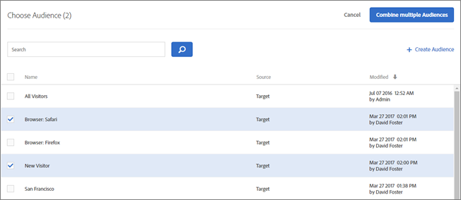
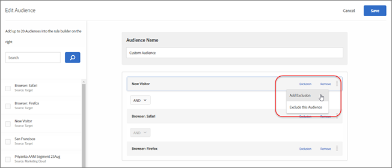
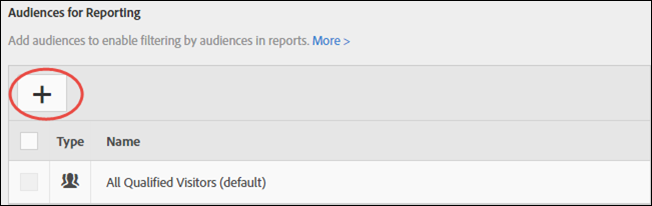

# Combine multiple audiences

Combine multiple audiences (including Adobe Experience Cloud audiences and Target audiences) on the fly to create ad hoc audiences. You can also create exclusion rules and exclude audiences from a rule.

Suppose that you have a "New Visitors" audience and a "Chrome Users" audience. For a specific activity, you might want to combine these existing audiences to target new visitors using Chrome browsers. Instead of creating a third audience and storing it in the [!UICONTROL Audiences] library, you can combine these two audiences during activity creation or while editing an existing activity.

As another example, you can target all loyalty customers by including a specific [!DNL Audience Manager] segment for loyalty status and combining it with a [!DNL Target] segment made up of people who signed up for your loyalty program during the current session, instead of creating a third, permanent audience.

You can combine up to ten audiences using AND and OR operators.

You can create and use combined audiences in various places throughout the [!DNL Target] UI. This section contains the following information:

## Create a Combined Audience While Creating an Activity {#section_2F1CE9434CC04174B4BA2BFC89B85D77}

You can create an ad hoc combined audience on the activity's [!UICONTROL Target] page during the three-step guided workflow.

1. While creating an [activity](../../c-activities/c-activities.md#concept_D317A95A1AB54674BA7AB65C7985BA03), on the **[!UICONTROL Target]** page, click the **[!UICONTROL Edit Audience]** icon, then click **[!UICONTROL Change Audience]**.

   

1. On the [!UICONTROL Choose Audience] page, select the check boxes next to the desired audiences that you want to use as building blocks for your combined audience.

   

1. Click **[!UICONTROL Combine Multiple Audiences]** in the top right corner.

   

1. (Conditional) Edit the new combined audience as desired.

   The [!UICONTROL Edit Audience] dialog box lets you drag and drop additional audience building blocks from the left side into the new combined audience as well as add exclusion rules and exclude audiences.

    1. You can use drag-and-drop functionality to add audiences within an existing section as a level 2 building block. To add a level 1 building block, select the check box next to the desired audience, then click **[!UICONTROL Add to Rules]**.

       For example, suppose in the previous example, you now want to include Firefox users in the combined audience. Search for and drag the "Browser: Firefox" audience into the "Browser: Safari" box on the right side, as in the following example:

       

       Notice that the operator between the two browser-type audiences is "AND." Select the And drop-down list and change it to "OR" to create a new combined audience for new visitors using either Safari or Firefox. Be careful to avoid creating rules that exclude all potential audience members. For example, it is not possible for someone to visit a page using browser x AND browser y simultaneously.

       >[!NOTE]
       >
       >The operator (AND or OR) must remain the same as you combine audiences. You cannot mix & match operators.

    1. To add an exclusion to a rule, click **[!UICONTROL Exclusion]** > **[!UICONTROL Add Exclusion]**.

       

       Drag and drop an audience in the box:

       

       For example, to exclude San Francisco visitors from new visitors, you could drag the San Francisco audience into the box, as shown below:

       

       This combined audience includes all new visitors to your site (excluding those from San Francisco) using Safari or Firefox. 
    
    1. To exclude an audience from a rule, click **[!UICONTROL Exclusion]** > **[!UICONTROL Exclude this Audience.]**.

       For example, you could create a combined audience that includes all new visitors to your site, excluding those using Firefox. Excluding visitors using Firefox is easier and quicker than creating a combined audience that explicitly includes multiple browsers (Safari, Chrome, and Internet Explorer), but does not include Firefox.

1. Provide a descriptive name for the combined audience, then click **[!UICONTROL Save]**.

## Create a Combined Audience for Use in Metric Targeting {#section_A42E795AFCBD4575809C5942039910F0}

You can create an ad hoc combined audience on the activity's [!UICONTROL Goals & Settings] page to use in metric targeting. For example to create targeting based on conversion using a combined audience:

1. While editing or creating an [activity](../../c-activities/c-activities.md#concept_D317A95A1AB54674BA7AB65C7985BA03), on the **[!UICONTROL Goals & Settings]** page, select **[!UICONTROL Conversion]** for the success metric, then select **[!UICONTROL Viewed an Mbox]** as the action. 
1. Select the desired mbox in the **[!UICONTROL Search mbox]** field.

   

1. Click the gear icon, then click **[!UICONTROL Add Audience Targeting]**. 
1. Click the **[!UICONTROL Add Audience/Targeting Condition]** link to display the [!UICONTROL Choose Audience] dialog box.

   

1. Proceed with [Step 2](../../c-target/c-audiences/c-combining-multiple-audiences.md#section_2F1CE9434CC04174B4BA2BFC89B85D77) under "Create a Combined Audience While Creating an Activity" to create the combined audience.

## Create a Combined Audience for Use in Reporting {#section_4682D342EFBB43C38E54B99B3A1E14CD}

You can create an ad hoc combined audience on the activity's [!UICONTROL Goals & Settings] page to use in reporting.

1. While editing or creating an [activity](../../c-activities/c-activities.md#concept_D317A95A1AB54674BA7AB65C7985BA03), on the **[!UICONTROL Goals & Settings]** page, click the **[!UICONTROL Add Audience]** icon under [!UICONTROL Audiences for Reporting] to display the [!UICONTROL Choose Audience] page.

   

1. Proceed with [Step 2](../../c-target/c-audiences/c-combining-multiple-audiences.md#section_2F1CE9434CC04174B4BA2BFC89B85D77) under "Create a Combined Audience While Creating an Activity" to create the combined audience.

## Create a Combined Audience While Editing an Activity {#section_364A12CE96E04B61B7C18113AA586C2C}

You can create an ad hoc combined audience while editing an existing activity.

1. From the [!UICONTROL Activities] page, hover over the desired activity, then click the **[!UICONTROL Edit]** icon.

   Or

   Click the desired activity to open it, then click **[!UICONTROL Edit Activity]**. 

1. Click the gear icon > **[!UICONTROL Audiences]** > **[!UICONTROL Multiple Audiences]**. 
1. Click the more options icon (three vertical ellipses) next to the activity's current audience, then click **[!UICONTROL Change Audience]**. 
1. Proceed with [Step 2](../../c-target/c-audiences/c-combining-multiple-audiences.md#section_2F1CE9434CC04174B4BA2BFC89B85D77) under "Create a Combined Audience While Creating an Activity" to create the combined audience.

