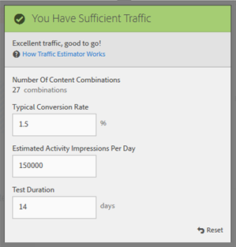

# Create a Multivariate Test

**Creating Multivariate Tests (9:25)** 

This video demonstrates how to plan and create a multivariate test using the Target three-step guided workflow. 

* Define and design a multivariate test
* Create a multivariate test

>[!VIDEO](https://vimeo.com/X8w5IQqEOow) 

The Target point-and-click editor enables you to pick any location and add multiple offers. 

The multivariate test takes a page-first report. In other words, the test runs on a specific URL, with the experiences you design for that page. 

>1. Click **[!UICONTROL  Create Activity]** > **[!UICONTROL  Multivariate Test]**.

>        
>1. [ Specify the URL](../../../c_activities/c_multivariate_testing/t_create_multivariate_test/c_url.md#concept_C12E4A85FF3B4E518E3110F6CF1AF9C0) for the page you want to test, then click **[!UICONTROL  Create Activity]**.

>        

>       >[!NOTE]
>       >
>       >Use a complete URL, including the HTTP or HTTPS at the beginning.

>       If a message appears, asking you to enable your browser for mixed content, follow the instructions in the message. After enabling your browser for mixed content, begin again at Step 1. 

>       The Visual Experience Composer opens. 

>       For troubleshooting information about the VEC, should you have problems, see [ Troubleshooting the Visual Experience Composer](../../../c_experiences/r_troubleshoot_composer/r_troubleshoot_composer.md#reference_77743144F10143A3A89D56E116D296E4). 
>1. Type a name for the activity.

>        

>       The following characters are not allowed in an activity name: 

>       |  Character  | Description  |
>       |---|---|
>       |  /  | Forward slash  |
>       |  ?  | Question mark  |
>       |  #  | Number sign  |
>       |  :  | Colon  |

>1. [ Create the offers in each location](../../../c_activities/c_multivariate_testing/t_create_multivariate_test/c_add_offers.md#concept_DCE6B45C30F7419B8EC17AFDEE8D8AA6).

>        

>       You can add the following kinds of offers: 

>    
>    * HTML
>    * Image
>    * Text

>1. [ Preview your experiences](../../../c_activities/c_multivariate_testing/t_create_multivariate_test/t_preview_experiences.md#task_21A700587E88453A9FC2210C0DE53A28).

>        

>       You can view each experience, and exclude any you do not want to include in your test. 
>1. [ Use the Traffic Estimator](../../../c_activities/c_multivariate_testing/t_create_multivariate_test/t_traffic_estimator.md#task_71AA6922AFD447EA8C5E610A78ABA714) to test the feasibility of your test plan.

>          
>1. Choose the audience and percentage of qualifying visitors that you want to enter the activity.

>        

>       For example, you might limit entries to 50% of all visitors or 45% of your "Californians" audience. 

>       >[!NOTE]
>       >
>       >In addition to selecting an existing audience, you can combine multiple audiences to create ad hoc combined audiences rather than creating a new audience. For more information, see[ Combining Multiple Audiences](../../../c_target/c_audiences/c_combining-multiple-audiences.md#concept_A7386F1EA4394BD2AB72399C225981E5). 

>1. [ Review the test summary](../../../c_activities/c_multivariate_testing/t_create_multivariate_test/r_test_summary.md#reference_971AB225963A4DC18EEB5B0E20F0A4A7) and make any desired changes, then click **[!UICONTROL  Continue]**..

>        
>1. [ Specify the goals and settings](../../../c_activities/c_multivariate_testing/t_create_multivariate_test/r_goals_and_settings.md#reference_B25389FD6F3A4989801E740364B089CC) for the test.

>        
>1. Click **[!UICONTROL  Save and Close]** to create the activity.

