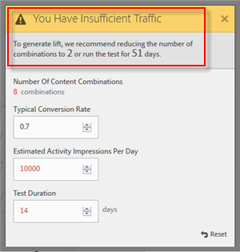

# Estimate the Traffic Required for a Successful Test

The Traffic Estimator predicts the sample size needed to ensure the following: 

* 95% confidence This means that the chance of reporting a false positive if there is no real lift is 5% (100% - confidence level). 

* 80% statistical power This means that the test has a 80% probability of detecting a true lift of 25% or more. 

* 25% minimum reliably detectable lift Target computes the amount of traffic required to have an 80% chance of detecting a true lift of 25% or more. 

The test uses the Bonferroni correction to correct for multiple comparisons. This method is known for being conservative, which is balanced out by enforcing a relatively large minimum reliably detectable lift. 

The Traffic Estimator also provides feedback that lets you know whether you have sufficient traffic for the test you designed to succeed. 

>1. From the Experience Composer, click ** [!UICONTROL  Traffic] **.

>       The Traffic Estimator opens. You can click ** [!UICONTROL  Traffic] ** again to hide the Traffic Estimator. 

>        
>1. Provide the typical conversion rate, estimated activity impressions per day, and test duration.

>    
>    * Number of Content Combinations Calculated automatically based on the number of experiences being created as a part of your activity after any exclusions. 

>    * Typical Conversion Rate The conversion rate is expressed as a percentage, based on your estimation or past data from your analytics system 

>    * Estimated Activity Impressions Per Day This is the number of visitors who are likely to view this page based on the targeting criteria. This could be based on your analytics data. 

>    * Test Duration The number of days you want the activity to run. 

>       The Traffic Estimator uses these statistics to determine what adjustments are needed to run a successful test. 

>       Near the top of the Traffic Estimator, the values you entered are calculated and the results are shown. 

>        

>       As you change the numbers, the estimate changes. For example, if you are testing a large number of experiences and your conversion rate and impressions are too low, the Traffic Estimator shows how long the test will need to run to be successful. Or, if your traffic is low, the Traffic Estimator might suggest a lower number of experiences so you can run the test the desired number of days. 

>       If you do not have sufficient traffic, you can do one or both of the following: 

>    
>    * Reduce the number of combinations of offers and the number of locations.
>    * Increase the duration of the test.

>       Adjust the numbers until the Traffic Estimator says you have sufficient traffic, then design your test accordingly. 

>        
