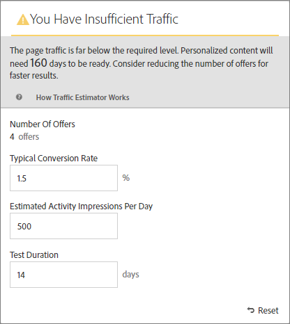

# Estimate the Traffic Required for Success

Because an Automated Personalization activity uses multiple offer combinations, it is important to know how much traffic is required to provide meaningful results. The Traffic Estimator uses statistics about your page and the number of experiences being tested to estimate the amount of traffic and the test duration needed to make the activity successful. 

The Traffic Estimator determines if there is enough traffic to generate personalized models, by comparing the estimated page impressions and typical conversion rate for the pages. Ideally, for a successful activity, the correct sample size ensures that personalized content is ready within 50% of the activity duration or 14 days, whichever is less. This allows sufficient time for obtaining personalized content and learning which content to deliver. 

Remember that Target randomly serves experiences until the personalization algorithms are built. The checkmark icon beside each offer shows when the model for that offer is ready and Target is able to begin delivering personalized content. Because lift is expected only after the models are ready, the visual indication allows you to set the right expectation. Use the traffic estimator in the Visual Experience Composer (VEC) to get a guideline of when the models will be ready. 

>1. From the Experience Composer, click ** [!UICONTROL  Traffic] **.

>       The Traffic Estimator opens. You can click ** [!UICONTROL  Traffic] ** again to hide the Traffic Estimator. 

>        
>1. Provide the typical conversion rate (or the conversion rate you expect from this activity), estimated activity impressions per day, and test duration.

>    
>    * Number of Content Combinations Calculated automatically based on the number of experiences being created as a part of your activity after any exclusions. 

>    * Typical Conversion Rate The conversion rate is expressed as a percentage, based on your estimation or past data from your analytics system. 

>    * Estimated Visits Per Day This is the number of visits per day from visitors who are able to view the activity, based on the targeting criteria. This could be based on your analytics data. Note this number should be visits, not unique visitors. 

>    * Test Duration The number of days you want the activity to run. 

>       The Traffic Estimator uses these statistics to determine what adjustments are needed to run a successful test. 

>       Near the top of the Traffic Estimator, the values you entered are calculated and the results are shown. 

>        

>       As you change the numbers, the estimate changes. For example, if you are testing a large number of combinations and your conversion rate and impressions are too low, the Traffic Estimator shows how long the test will need to run to be successful. Or, if your traffic is low, the Traffic Estimator might suggest a lower number of offer combinations so you can run the test the desired number of days. 

>       If you do not have sufficient traffic, you can do one or all of the following: 

>    
>    * Consider using Auto-Target instead of Automated Personalization to create experiences with several offer changes in one experience variation. 

>    * Reduce the number of offer combinations within your Automated Personalization activity.
>    * Increase the duration of the activity. 

>       Adjust the numbers until the Traffic Estimator says you have sufficient traffic, then design your test accordingly. 

>        

>       If the traffic is sufficient, the Traffic icon shows a green check. If it is insufficient, the icon shows a red warning label. 
