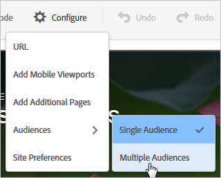

# Multiple Experience Versions in an A/B Test

Users can switch between experience audiences as their profile changes. They are not stuck in the same experience for the activity's lifetime. 

For example, if your site uses a consistent design across pages or products and you want to use the same experience for multiple audiences (such as visitors with different browser languages), you can set up multiple versions of the experience. You might present the same experience to English and Japanese speakers, with the only difference being that the text is presented in the visitor's language. Data is collected for the experience, regardless of language, so the report shows the performance of the experience, rather than the version. 

Without the ability to set up experience versions, you would have to set up different tests for each language (in this example), then manually aggregate the results to try to get an idea how a single experience with both languages might perform. This produces less accurate results. For some tests, these calculations might not even be useful because of the way visitors are randomized. 

By creating different versions of an experience, you receive more accurate information without the need for manual calculations and assumptions. 

**Scenario** 

You are testing two experiences, a geo-targeted banner vs. a generic banner. The banner for each geography needs to be different, but the overall test is to determine whether geotargeting is better than showing generic content. If you set up a separate experience for each location, you would actually be measuring how each geo performs against the other, rather than whether geotargeting helps meet your success goals when measured against the generic banner. 

In this case, what you need are geo-specific versions of the experience, so you can test the geotargeted experience against a non-geotargeted control. 

>1. [ Create an A/B activity](t_test_create_ab.md#task_68C8079BF9FF4625A3BD6680D554BB72) as you normally would.

>1. Select the experience, then click ** [!UICONTROL  Configure] ** > ** [!UICONTROL  Audiences] ** > ** [!UICONTROL  Multiple Audiences] **.

>        
>1. Click ** [!UICONTROL  Add Audience] **, then select the first audience you want to target. Repeat for each audience.

>        

>       If the audience does not yet exist, click [ Create Audience](t_create-audience.md#task_E18BD77A9A8F4ED0AC50569F94556558) and set it up. 

>       If a visitor qualifies for more than one audience, the content for all audiences is returned, with the last one in the list actually rendering on the page. 
>1. Continue setting up the activity.

