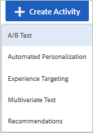
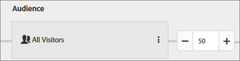

# Create an A/B Test

This video demonstrates how to create an A/B test using the [!DNL  Target] three-step guided workflow. 

<table id="table_C56F4BE9B867463380013C584D97DAD2"> 
 <thead> 
  <tr> 
   <th class="entry" colspan="2"> Creating A/B Tests </th> 
   <th colname="col3" class="entry"> 8:36 </th> 
  </tr>
 </thead>
 <tbody> 
  <tr> 
   <td colspan="2"> 
 
     
 
      <iframe src="https://www.youtube.com/embed/JG0dbWDAvtk/" frameborder="0" webkitallowfullscreen="true" mozallowfullscreen="true" oallowfullscreen="true" msallowfullscreen="true" allowfullscreen="allowfullscreen" scrolling="no" width="550" height="345">https://www.youtube.com/embed/JG0dbWDAvtk/</iframe>
     
 
 </td> 
   <td colname="col3"> 
 
     <ul id="ul_B17C3EFA4B664415AE0159E418FF45C4"> 
      <li id="li_916224D2105348BE93D60015B2F43D4F">Create an A/B activity in Adobe Target </li> 
      <li id="li_0FED234A3A054DEAB62C4F58BAB47F7F">Allocate traffic using a manual split or automatic traffic allocation </li> 
     </ul> 
 </td> 
  </tr> 
 </tbody> 
</table>

**To Create an A/B test:** 

>1. From the [!UICONTROL  Activities] list, click ** [!UICONTROL  Create Activity] ** > ** [!UICONTROL  A/B Test] **.

>        

>       >[!NOTE]
>       >
>       >The available activity types depend on your [!DNL  Target] account. Some activity types might not appear in your list. 

>       For information about the various activity types, see [ Activities](../../c_activities.md#concept_D317A95A1AB54674BA7AB65C7985BA03). 

>        
>1. Select ** [!UICONTROL  Visual Experience Composer] **, if necessary.

>       For troubleshooting information about the VEC, should you have problems, see [ Troubleshooting the Visual Experience Composer](../../c_experiences/r_troubleshoot_composer.md#reference_77743144F10143A3A89D56E116D296E4). 

>       If you prefer to use the Form-Based Experience Composer, select that option. See [ Form-Based Experience Composer](https://marketing.adobe.com/resources/help/en_US/target/target/t_form_experience_composer.html). 
>1. Specify your [ activity URL](../../c_activities/t_test_ab/t_test_create_ab/c_ab_activity_url.md#concept_D28549AAA0A14E3BB5F05F32BE8ABC90), then click ** [!UICONTROL  Create] **.

>       If your account is configured with a default URL, that URL appears by default. You can change from the default to another URL. 

>       The [!UICONTROL  Visual Experience Composer] opens, showing the page specified in the URL. 

>        
>1. Type a name for the activity in the space provided.

>        

>       The following characters are not allowed in an activity name: 

>       |  Character  | Description  |
>       |---|---|
>       |  /  | Forward slash  |
>       |  ?  | Question mark  |
>       |  #  | Number sign  |
>       |  :  | Colon  |

>1. Create any new experiences by changing the elements on the page.
>   The [!UICONTROL  Visual Experience Composer] displays two tabs on the left side after you create a new activity: Experience A and Experience B. Experience A is the control experience. Your focus will be on the Experience B tab, which you can modify as desired. Experience B is the alternate experience you can add to your test. You can add multiple experiences to the test. You can also delete Experience A from the activity if you don't want to include a default site experience as an option. 

>   For more information about adding and modifying experiences in the [!UICONTROL  Visual Experience Composer], see [ Add Experience](../../c_activities/t_test_ab/t_test_create_ab/t_ab_add_experience.md#task_454646F2895242D3B92DC395A0CE1A00). To modify Experience B, start with Step 3. 
>
>1. Click ** [!UICONTROL  Target] ** at the top of the [!UICONTROL  Visual Experience Composer] to move to the next step in the three-step guided workflow.

>       The flow diagram opens. 

>        

>       The flow diagram leads you through the steps of choosing the audience for the activity and setting up experiences. 
>1. In the [!UICONTROL  Audience] box, click the edit icon (   ), then [ select the audience](../../c_activities/t_test_ab/t_test_create_ab/c_ab_audience.md#concept_A268236C1224451DB7844BF67F41A087) for your activity.

>1. Choose the percentage of qualifying visitors that you want to enter the activity.

>        

>       For example, you might limit entries to 50% of all visitors or 45% of your "Californians" audience. 
>1. Set up your traffic allocation.

>       You can show multiple experiences to the same audience. A diagram displays showing your selected audience and the experiences you've added to the activity. 

>       If you select ** [!UICONTROL  Manual] **, specify the percentage of entrants you want to see each experience. You can split the percentages evenly between all experiences, or specify higher or lower percentages for each experience. The total for all experiences must equal 100%. 

>       If you select ** [!UICONTROL  Auto-allocate to best experience] **, most activity entrants are automatically directed to higher-performing experiences. Some visitors are allocated to all experiences, to maintain exploration of experiences and to recognize changes in performance trends. See [ Automated Traffic Allocation](../../c_activities/automated_traffic_allocation.md#concept_A1407678796B4C569E94CBA8A9F7F5D4). 

>       **First Look: **If you select ** [!UICONTROL  Auto-target to optimize] **, Target uses advanced machine learning algorithms to automatically target visitors with the best experience to maximize your goals. 

>       >[!NOTE]
>       >
>       >This "First Look" offering is enabled for a few customers in this release for testing and feedback.

>       For more information, see [ Auto-Target to Optimize](../../c_activities/c_auto-target-to-optimize.md#concept_67779E5B7F67427A97D7EA2A6FB919B3). 

>       You can also click ** [!UICONTROL  Add Experience] ** to add another experience to the activity. 
>1. When you are satisfied with your audience and experience choices, click ** [!UICONTROL  Next] ** to move to the third step of the three-step guided workflow.
>1. Specify the [ goals and settings](../../c_activities/t_test_ab/t_test_create_ab/r_ab_goals_and_settings.md#reference_B25389FD6F3A4989801E740364B089CC) for the activity.

>        
>1. Click ** [!UICONTROL  Save] **.
