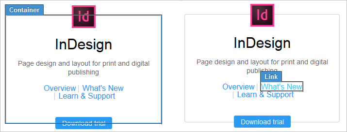

# Experiences

An activity typically contains more than one experience. For example, visitors from the Salt Lake City area might see an offer for a $30 discount on ski boots, while visitors from San Diego see an offer for a discount on wet suits. Or, you might test a page with different special offers for returning visitors. Each of these offers is presented in a separate experience. 

The following experience composers are available: 

* [ Visual Experience Composer](c_experiences.md#section_34265986611B4AB8A0E4D6ACC25EF91D)
* [ Form-Based Experience Composer](c_experiences.md#section_3643394BD424463C8768F2907DEBCC22)

## Visual Experience Composer and Enhanced Experience Composer {#section_34265986611B4AB8A0E4D6ACC25EF91D}

The Visual Experience Composer is one of the main features of Adobe Target. The Visual Experience Composer is an editor that enables marketers and designers to create and change content using a visual interface. Many design choices can be made without requiring direct editing of the code. Editing HTML and JavaScript is also possible using the editing options available in the composer. 

The videos below provide information about using the Visual Experience Composer. 

<table id="table_A3A70CC0C9F54131BB9F098B4DA8C9D6"> 
 <thead> 
  <tr> 
   <th class="entry" colspan="2"> Visual Experience Composer (1 of 2) </th> 
   <th colname="col3" class="entry"> 7:17 </th> 
  </tr>
 </thead>
 <tbody> 
  <tr> 
   <td colspan="2"> 
    
 
     <iframe src="https://www.youtube.com/embed/2KUDgu6Mscg/" frameborder="0" webkitallowfullscreen="true" mozallowfullscreen="true" oallowfullscreen="true" msallowfullscreen="true" allowfullscreen="allowfullscreen" scrolling="no" width="550" height="345">https://www.youtube.com/embed/2KUDgu6Mscg/</iframe>
    
 </td> 
   <td colname="col3"> 
 
     <ul id="ul_FF4FEC7BC7A34461BAA54FBE18A8E63B"> 
      <li id="li_7D6D4CB2E771430F84D2B658F8611532">Change the content of a page </li> 
      <li id="li_745F20CC95DF4BE48173991CB42EC50A">Change the layout of a page </li> 
     </ul> 
 </td> 
  </tr> 
 </tbody> 
</table>

<table id="table_C56F4BE9B867463380013C584D97DAD2"> 
 <thead> 
  <tr> 
   <th class="entry" colspan="2"> Visual Experience Composer (2 of 2) </th> 
   <th colname="col3" class="entry"> 7:29 </th> 
  </tr>
 </thead>
 <tbody> 
  <tr> 
   <td colspan="2"> 
 
     
 
      <iframe src="https://www.youtube.com/embed/qwUKEp8en_k/" frameborder="0" webkitallowfullscreen="true" mozallowfullscreen="true" oallowfullscreen="true" msallowfullscreen="true" allowfullscreen="allowfullscreen" scrolling="no" width="550" height="345">https://www.youtube.com/embed/qwUKEp8en_k/</iframe>
     
 
 </td> 
   <td colname="col3"> 
 
     <ul id="ul_B17C3EFA4B664415AE0159E418FF45C4"> 
      <li id="li_916224D2105348BE93D60015B2F43D4F">Rename and duplicate an experience </li> 
      <li id="li_0FED234A3A054DEAB62C4F58BAB47F7F">Create a redirect experience </li> 
      <li id="li_79866ECECA2D4ACB9AE991B2922ADA84">Target an activity to a single URL or a group of URLs </li> 
      <li id="li_67ED273861FC493785AC049CC0B37E6A">Create a multi-page activity </li> 
      <li id="li_F4646D966373499DA6A32ED62411DF57">Preview and build experience for responsive websites </li> 
      <li id="li_4CA9280B227C4ACBB3EDDC23AB8ECCC3">Use overlays to highlight types of elements </li> 
     </ul> 
 </td> 
  </tr> 
 </tbody> 
</table>

This video is a recording of "[ Office Hours](c_adobe-customer-care-office-hours.md#concept_58EA30379D3B48C4848BA2A8C464A5B7)," an initiative led by the Adobe Customer Care team. 

<table id="table_DC2EFE9B1E1D4FB69CB0D44AE1B2367E"> 
 <thead> 
  <tr> 
   <th class="entry" colspan="2"> Visual Experience Composer (VEC) </th> 
   <th colname="col3" class="entry"> 50:23 </th> 
  </tr>
 </thead>
 <tbody> 
  <tr> 
   <td colspan="2"> 
 
     
 
      <iframe src="https://video.tv.adobe.com/v/20784/" frameborder="0" webkitallowfullscreen="true" mozallowfullscreen="true" oallowfullscreen="true" msallowfullscreen="true" allowfullscreen="allowfullscreen" scrolling="no" width="550" height="345">https://video.tv.adobe.com/v/20784/</iframe>
     
 
 </td> 
   <td colname="col3"> 
 
     <ul id="ul_044D29C124734032A0CF838ADE50BE23"> 
      <li id="li_0D6C087EA751405C91028871A46B72F8"> 
How the VEC works 
 </li> 
      <li id="li_B5BF1A9E1897473B93A6B962D0743790"> 
How to avoid common issues with the VEC 
 </li> 
      <li id="li_7E254C2E78EE4D658E9F01156B2FB16B"> 
Work-around practices you can use with the VEC 
 </li> 
     </ul> 
 </td> 
  </tr> 
 </tbody> 
</table>

On the Target ** [!UICONTROL  Setup] ** > ** [!UICONTROL  Preferences] ** tab, you can enter the Default Visual Experience Composer URL. 

 

This URL determines where you start when you open the Visual Experience Composer. If you do not enter a default, then you start with a blank page when you open the editor, and specify a URL at that time. 

>[!NOTE]
>
>Certain browsers, such as Firefox, might block a page from displaying in the Visual Experience Composer if the page contains mixed content (for example, a non-secure page in a secure site). If your page does not display, click the icon to the left of the URL in the browser address bar and click ** [!UICONTROL  Disable protection on this page] **. This issue does not affect the display of your pages to site visitors. 

Content inside an iframe on the page can't be modified in Visual Experience Composer. To edit content within an iframe, ensure that the iframe document is Target-enabled, then load that iframe URL in the Visual Experience Composer. 

You can use the drop-down menus across the top of the page to view your page as it would appear to different audiences or with different experiences. You can provide a name for each experience in the second drop-down list. For example, if you are testing the location of the Home link in your nav bar, you might name an experience where the Home link appears first something like, "Home link" to make it easier to identify the experiences in the list. 

>[!NOTE]
>
>Changes to the structure of a page that affect the locations used in an activity created on that page could cause issues with experience editing. If a location has been changed outside the Visual Experience Editor, Target might not be able to find the location where the content was changed.

As you move your mouse around the page, a context-sensitive box follows the cursor, highlighting the elements on the page. 

 

Click the Overlays icon to change the way the highlight displays. For example, you can choose to highlight only images or mboxes or links, and you can change the color of the highlight. You can also specify a highlight color and type of fill used to highlight different element types. 

Click on a highlighted element for a menu of options available for that element type For example, you can click on an image and select ** [!UICONTROL  Edit Image] ** to change the image, or click on a button and change the HTML. You can use the buttons at the top left of the page to toggle the overlays on and off. 

You can also click ** [!UICONTROL  Browse] **, then navigate to a page that is available from the primary page, such as a shipping page or shopping cart, and test changes on that page. You can also access page elements that are available when you hover, such as flyout menus and mini-carts. When you are finished browsing to the page, click ** [!UICONTROL  Compose] ** to edit the experience. For example, you might want to change the design of a shopping cart drop-down or a carousel of images. This functionality is currently available for A/B tests, A/B tests with Analytics, and experience targeting. 

>[!NOTE]
>
>If a hover state depends on JavaScript, make sure ** [!UICONTROL  Disable JavaScript] ** is not selected. JavaScript must be enabled to edit JavaScript elements. 

For information about the options available in the Visual Experience Composer, see [ Visual Experience Composer Options](r_viztarget_options.md#reference_3BD1BEEAFA584A749ED2D08F14732E81). 

## Form-Based Experience Composer {#section_3643394BD424463C8768F2907DEBCC22}

The Form-Based Experience Composer enables Target Standard A/B tests, Experience Targeting and Recommendations activities to be delivered in emails, mobile apps, kiosks, and other places that don't work with a Visual Experience Composer. 

This video provides a demo of the form-based composer: 

<table id="table_47FED9E4494B4ABB9BBD4D082534BC45"> 
 <thead> 
  <tr> 
   <th class="entry" colspan="2"> Form-Based Experience Composer </th> 
   <th colname="col3" class="entry"> 4:35 </th> 
  </tr>
 </thead>
 <tbody> 
  <tr> 
   <td colspan="2"> 
 
     
 
      <iframe src="https://www.youtube.com/embed/R9hcD9D1VPY/" frameborder="0" webkitallowfullscreen="true" mozallowfullscreen="true" oallowfullscreen="true" msallowfullscreen="true" allowfullscreen="allowfullscreen" scrolling="no" width="550" height="345">https://www.youtube.com/embed/R9hcD9D1VPY/</iframe>
     
 
 </td> 
   <td colname="col3"> 
 
     <ul id="ul_3B9FF13D85254CBF84E539960B764CF0"> 
      <li id="li_317BEB0C637349818D3C1784803C0FE9">Create an activity using the Form-Based Experience Composer </li> 
      <li id="li_996E0C8D914E42DE90F6552B3C1161B9">Understand when to use Form-Based Experience Composer vs. the Visual Experience Composer </li> 
      <li id="li_B5B119535AD3488CAAAD8EEF45AD3418">Use refinements to target a location </li> 
     </ul> 
 </td> 
  </tr> 
 </tbody> 
</table>

See [ Form-Based Experience Composer](t_form_experience_composer.md#task_FAC842A6535045B68B4C1AD3E657E56E) for more information. 
