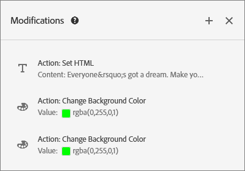
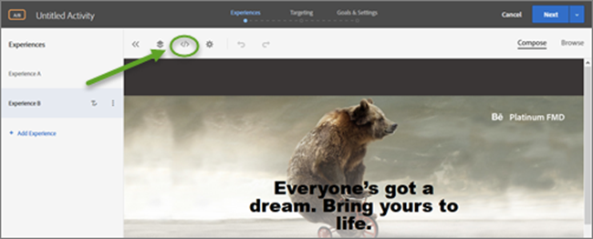
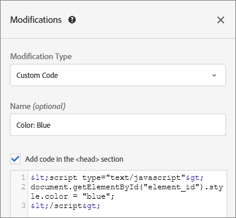

# Modifications

The Modifications page shows all changes that have been made to your page in the Visual Experience Composer (VEC) and lets you make additional changes by clicking each element on the page and [ selecting an action ](../c_experiences/r_viztarget_options.md#reference_3BD1BEEAFA584A749ED2D08F14732E81). Each change you make appears as a separate action or element in the [!UICONTROL  Modifications] list. You can also add modifications, including the following modification types: CSS Selector, Mbox. and Custom Code. 

This section contains the following information: 


* [ Modifications Overview ](../c_experiences/c_vec_code_editor.md#section_EE27E7572AA74397BBDED563B2B3D509) 

* [ Add Modifications ](../c_experiences/c_vec_code_editor.md#section_C7ABCD5731A048CB8F90EDC31A32EDF9) 

* [ Custom Code Use Cases ](../c_experiences/c_vec_code_editor.md#section_26CB3360097D400FB02E20AE5FDBA352) 

* [ Custom Code Best Practices ](../c_experiences/c_vec_code_editor.md#section_10DFFD9FB92A43C1BB444A45E0272B28) 

* [ Troubleshooting Custom Code ](../c_experiences/c_vec_code_editor.md#section_6C965CBC31C348D7AA5B57B63DAB9E7F) 


## Modifications Overview {#section_EE27E7572AA74397BBDED563B2B3D509}

The [!UICONTROL  Modifications] page shows all changes that have been made to your page in the VEC. Each change you make appears as a separate action or element in the [!UICONTROL  Modifications] list. 

 

Use the Modifications page to make small changes to the selector that Target chooses when you use the VEC to configure how content is delivered. You can change either the content or an HTML attribute. You can also edit the code to create the equivalent of an HTML offer within an mbox. 

Use the Modifications page to: 


* View an action taken in the visual composer. 

   

* Edit an existing action. Hover over the desired modification, then click the **[!UICONTROL  Edit]** icon. 

   

  Make your changes. 

   

* Delete an existing action. Hover over the desired modification, then click the **[!UICONTROL  Delete]** icon. 

   

* Add a new modification. Click **[!UICONTROL  Add Modification]** or the + icon, then specify your changes as described below. 

   

  Note that after one modification is created, Target displays a + icon at the top of the Modifications panel instead of the Add Modification button at the bottom of the panel. 


## Add Modifications {#section_C7ABCD5731A048CB8F90EDC31A32EDF9}


1. To display the [!UICONTROL  Modifications] page for a selected experience, in the VEC, click the **[!UICONTROL  Modifications]** &lt;/&gt; icon. 

    


   >[!NOTE]
   >
   >To open the Modifications panel in the Form-based Experience Composer, create or edit an HTML offer. For more information, see[ Form-Based Experience Composer ](../c_experiences/t_form_experience_composer.md#task_FAC842A6535045B68B4C1AD3E657E56E). 


   The [!UICONTROL  Modifications] page opens, splitting the screen between the visual mode on the left and the Modifications panel on the right. Notice that Experience A in the following illustration has no previous modifications. 

    

   Experience B shows the previous modifications in the [!UICONTROL  Modifications] panel on the right. 

    

1. To add a modification: 


    * If no previous modifications for the experience have been made, click the **[!UICONTROL  Add Modification]** button at the bottom of the [!UICONTROL  Modifications] panel on the right side. 

    * If there are previous modifications for the experience, click the + icon at the top of the [!UICONTROL  Modifications] panel on the right side. 


   The Modifications panel displays: 

    

1. From the **[!UICONTROL  Modifications Type]** drop-down list, choose the desired type: 


<table id="table_A888E2C356F54C02A726FEAE7ED6185F"> 
 <thead> 
  <tr> 
   <th colname="col1" class="entry"> Modifications Type </th> 
   <th colname="col2" class="entry"> Details </th> 
  </tr> 
 </thead>
 <tbody> 
  <tr> 
   <td colname="col1"> <p>CSS Selector </p> </td> 
   <td colname="col2"> <p>In the CSS Element Selector box, specify the desired CSS element that you want to modify, select an action type ( <span class="wintitle"> Set Content </span> or <span class="wintitle"> Set Attribute </span>), then fill in the required information and the desired content. </p> </td> 
  </tr> 
  <tr> 
   <td colname="col1"> <p>Mbox </p> </td> 
   <td colname="col2"> <p>Specify the Mbox name and the desired content. </p> </td> 
  </tr> 
  <tr> 
   <td colname="col1"> <p>Custom Code </p> </td> 
   <td colname="col2"> <p>Specify an optional name, select or deselect the <span class="uicontrol"> Add Code in the &amp;lt;HEAD&amp;gt; Section </span> check box, as desired, then add your custom code. </p> <p>If you select <span class="wintitle"> Add Code in the &amp;lt;HEAD&amp;gt; Section </span>, custom code is added to the <span class="codeph"> &amp;lt;head&amp;gt; </span> section and its execution does not wait for body or page-load events. Add only <span class="codeph"> &amp;lt;script&amp;gt; </span> and <span class="codeph"> &amp;lt;style&amp;gt; </span> elements. Adding <span class="codeph"> &amp;lt;div&amp;gt; </span> tags and other elements might cause remaining <span class="codeph"> &amp;lt;head&amp;gt; </span> elements to pop into the <span class="codeph"> &amp;lt;body&amp;gt; </span>. If you are using <span class="filepath"> mbox.js </span> version 60 or later or any version of <span class="filepath"> at.js </span>, all offers will deliver asynchronously. </p> <p>If you deselect <span class="wintitle"> Add Code in the &amp;lt;HEAD&amp;gt; Section </span>, custom code executes immediately following the &lt;body&gt; tag. Wrap all code in a single &lt;div&gt; to preserve DOM structure. If you are using <span class="filepath"> mbox.js </span> version 60 or later or any version of <span class="filepath"> at.js </span>, all offers will deliver asynchronously. </p> <p> <p>Note:  Scripts are run asynchronously. This means that you cannot, for example, use <span class="codeph"> document.write </span> or similar script methods. </p> </p> <p>Custom code provides a non-visual interface to view, edit, and add new actions within the VEC, the Form-based Experience Composer, and the HTML offers editor. The panel provides a code view of an experience to help you build more complex experiences, fine tune existing experiences, and troubleshoot issues. </p> <p>Custom code is intended for advanced users who are comfortable with HTML, JavaScript, and CSS. The code view can help you tweak or fine-tune changes, or fix selector issues</p> <p> <p>Note:  Custom code is currently available for A/B and Experience Targeting (XT) activities only. Custom code is disabled for overlay and if a redirect offer is applied. </p> </p> <p>Custom code supports the following use cases: </p> <p> 
     <ul id="ul_5612D085CBAB4175AD3787FEF21701A3"> 
      <li id="li_B5CFE5DA1A5F4C35BF095ECE603F3412"> <p>Add custom JavaScript, HTML, or CSS to be executed at top of the page </p> </li> 
      <li id="li_E11F179098A547269CEB58D774657BAC"> <p> View or edit the code generated by VEC after making modifications </p> </li> 
      <li id="li_35E99B0A170341F6A3B62B1C1420832B"> <p> Set HTML content for a selector (CSS selectors only) </p> </li> 
      <li id="li_6859FB37F27247E0A800FD83AD79237C"> <p> Set an attribute on an HTML element </p> </li> 
      <li id="li_63D920387AF44EB6942ABCEB3804F6D6"> <p> Add offer content to be delivered in a regional mbox </p> </li> 
      <li id="li_53ECF8C835914C3FAE7045E9C11F7077"> <p>Swap on DOM-ready, using jQuery </p> </li> 
      <li id="li_37397281932844D398FF495E6ED44102"> <p>Swap on DOM-ready, no jquery (Does not support Internet Explorer 8) </p> </li> 
      <li id="li_FE3061CCEA7E482381C1A5D1F64AF66D"> <p> Swap with DOM-polling via "elementOnLoad" plugin </p> </li> 
      <li id="li_1415787F9A674599B0D5E651EE2F516F"> <p> Custom redirect </p> </li> 
     </ul> </p> <p>Custom code provides: </p> <p> 
     <ul id="ul_CBB17806FBF34774A8160A61204ED014"> 
      <li id="li_22665F583F1742E280D5BC7EC4203007"> <p>Line numbers for better usability. </p> </li> 
      <li id="li_B0D863CDAD2E46A4B133BB86886EB527"> <p>Syntax highlighting to help you avoid incorrect syntax for HTML offers. </p> </li> 
      <li id="li_BCE0092DF6A345CFA85AF20F8B3AC880"> <p>The ability to create multiple custom codes and provide an optional name for each. </p> <p>Creating multiple custom codes makes future debugging easier. For example, instead of creating a single custom code to accomplish several modifications, you can create a separate custom code for each modification with a descriptive name. Having separate custom codes makes your modifications more modular and manageable. Note that the execution of multiple custom codes in an activity is not guaranteed to happen in the sequence in which they were created. </p> </li> 
     </ul> </p> <p>The Modifications panel splits the screen between the visual mode and the code mode. Both modes remain in sync. Every modification made visually has a corresponding row in the code view. Similarly, every change that is committed in the code view displays in the visual experience. Clicking on any row in the code view selects the corresponding element on the visual page. </p> <p>Custom code supports HTML, scripts, and styles. Any valid HTML code or script can be added or edited. </p> </td> 
  </tr> 
 </tbody> 
</table>


1. Add additional modifications as necessary. 


## Custom Code Use Cases {#section_26CB3360097D400FB02E20AE5FDBA352}

The **[!UICONTROL  Custom Code]** panel contains code that is executed at the beginning of the page load. 

You can execute the JavaScript code in the ` &amp;lt;head&amp;gt;` tag. Execution of code does not wait for the ` &amp;lt;body&amp;gt;` tag to be present in the DOM. 

Selectors for subsequent visual actions depend on the HTML elements added in this tab. 

The Custom Code panel is commonly used to add JavaScript or CSS to the top of the page. 

 

Use the **[!UICONTROL  Custom Code]** tab to: 


* Use JavaScript inline or link to an external JavaScript file 

  For example, to change an element's color: 


  ```
  <script type="text/javascript"> 
  document.getElementById("element_id").style.color = "blue"; 
  </script> 
  
  ```


* Configure a style inline or link to an external stylesheet 

  For example, to define a class for an overlay element: 


  ```
  <style> 
  .overlay 
  { position: absolute; top:0; left: 0; right: 0; bottom: 0; background: red; } 
  </style> 
  
  ```


* Add HTML snippets to define new elements 

  For example, use the following HTML snippet to create an overlay ` &amp;lt;div&amp;gt;` using the CSS class defined above: 


  ```
  &amp;lt;div&amp;nbsp;class="overlay"&amp;gt;&amp;lt;/div&amp;gt;
  ```


* Swap on DOM-ready, using jQuery 


  ```
  <style>#default_content {visibility:hidden;}</style> 
  <script> 
  jQuery( document ).ready(function() { 
      jQuery("#default_content").html( "<span style='color:red'>Hello <strong>Again</strong></span>" ); 
      jQuery("#default_content").css("visibility","visible"); 
  }); 
  </script> 
  
  ```


* Swap on DOM-ready, no jQuery (does not support Internet Explorer 8) 


  ```
  <style>#default_content {visibility:hidden;}</style> 
  <script> 
  document.addEventListener("DOMContentLoaded", function(event) {  
      document.getElementById("default_content").innerHTML = "<span style='color:red'>Hello <strong>Again</strong></span>"; 
      document.getElementById("default_content").style.visibility="visible"; 
  }); 
  </script> 
  
  ```


* Swap with DOM-polling via ` elementOnLoad` plugin 

  The advantage of this is the swap occurs earlier than on DOM-ready. The plugin handles pre-hiding and reveal, and requires an id on the element. 


  ```
  <style>#default_content {visibility:hidden;}</style> 
  <script> 
  /*elementOnLoad DOM Swizzling v3 ==>Mbox.js Extra Javascript*/window.elementOnLoad=function(e,l){var m=document.getElementById(e);if(m){setTimeout(function(){l(m);setTimeout(function(){m.style.visibility='visible';m.style.display='block'},20)},20)}else{setTimeout(function(){elementOnLoad(e,l)},20)}},addEvent=function(a){var d=document,w=window,wa=w.addEventListener,da=d.addEventListener,e='load',o='on'+e;if(wa){wa(e,a,false)}else if(da){da(e,a,false)}else if(d.attachEvent){w.attachEvent(o,a)}};addEvent(function(){setTimeout("elementOnLoad=function(){}",500)}); 
  elementOnLoad('default_content',function(e){ 
      e.innerHTML = "<span style='color:red'>Hello <strong>Again</strong></span>"; 
  }); 
  </script> 
  
  ```


* Custom redirect passing existing params, ` s_tnt` param (for legacy integration to Analytics), referrer param, and mbox session 


  ```
  <style type="text/css">body{display:none!important;}</style> 
  <script type="text/javascript"> 
   var qs='';window.location.search?qs=window.location.search+'&amp;':qs='?'; 
   window.location.replace('//www.mywebsite.com/'+qs+'s_tnt=${campaign.id}:${campaign.recipe.id}:${campaign.recipe.trafficType}&amp;s_tntref='+encodeURIComponent(document.referrer)+'&amp;mboxSession='+mboxFactoryDefault.getSessionId().getId()+''+window.location.hash+''); 
  </script> 
  
  ```


* Add Adobe Target Experience Templates for use in custom code. Target Experience Templates are pre-coded samples with configurable inputs to be used to execute common marketer use-cases. These Experience Templates are provided free to developers and marketers as a starting point to execute common use-cases, either via the VEC or the Form-based Experience Composer. Use-cases include lightboxes, carousels, countdowns, and more. 

  For more information, see [ Target-Experience-Templates ](https://github.com/Adobe-Marketing-Cloud/target-experience-templates). 


## Custom Code Best Practices {#section_10DFFD9FB92A43C1BB444A45E0272B28}

** Always wrap the custom code in one element.** 

For Example: 


```
<div id="custom-code"> 
// My Code goes here 
</div>
```


In the case that any modifications are needed, make changes inside this container. 

If you do not need the custom code anymore, just leave this container empty, but do not remove it. This ensures other experience modifications are not affected. 

** Do not use the element ID "CDQID" for modifications to the page made in the Code Editor.** 

Target applies a new element ID with the value "CDQID" to any element on the page that's modified by Target. Because this ID is applied by Target, it should not be used for any further modifications or adjustments in the Code Editor. 

**Do not perform document.write actions in custom code scripts.** 

Scripts are executed asynchronously. This often causes ` document.write` actions to appear in the wrong place on your page. Using ` document.write` in scripts created in custom code is not recommended. 

**If you create an element and then modify it, do not delete the original element.** 

Each change creates a new element in the Modifications panel. Because the second action modifies Element 1, if you delete Element 1, that action no longer has anything to modify, so the change no longer works. See "Troubleshooting," below, for more information. 

**Be careful if you use the custom code feature for two activities that target the same URL.** 

If you use the custom code feature for two activities that target the same URL, the JavaScript is injected into the page from both activities. Target automatically determines the order of delivered content. Make sure the code does not depend on placement. It is up to you to make sure there are no conflicts in the code. 

## Troubleshooting Custom Code {#section_6C965CBC31C348D7AA5B57B63DAB9E7F}

***I received a warning that an action cannot be applied due to structural changes in a page. What does this mean?*** 

This message indicates that the structure of your page has changed since the activity was last saved. 

The missing selectors might be reached using Browse mode. We recommend that you delete and then re-create each experience to ensure that your content looks as you expect, as indicated in the warning message. 

 

* **When I delete an element, I see a warning tells me that says "Deleting this action may impact subsequent actions." What does this mean?** * 

For example, if you have taken two actions: 


* Added a class to Element 1
* Edited the HTML for Element 1


Each change creates a new element in the Modifications panel. Because the second action modifies Element 1, if you delete Element 1, the second action no longer has anything to modify, so the change no longer works. 

In other words, if you add an element with text, then in a separate action you edit that element with different text, the Modifications panel shows both actions as separate elements. When you edited the element, you created a new element that modifies the original one you created, containing the edited text. If you then delete the original element, the edited text won't be able to find the element that was edited, and will not display. The second element remains in the list of elements, but it does not affect the page because the element it changes no longer exists. 

* **An element I created using ` document.write` in a script does not appear where I expect it to.** * 

Scripts are executed asynchronously. This often causes ` document.write` actions to appear in the wrong place on your page. Adobe does not recommend using ` document.write` in scripts created in the custom code. 

* **My JavaScript displays errors in the custom code.** * 

Any inline JavaScript which is not a valid JavaScript shows errors in the custom code. 

* **I cannot undo a change in my custom code.** * 

Currently, undo is not supported for edit and delete actions from the Modifications panel and in custom code. Undoing one of these operations could cause the experience in the VEC to appear inconsistent with the actual actions visible in the custom code. However, the actions in the custom code are in the correct state and there is no impact on delivery. This is a UI issue. To refresh the experience, save it and open it again, or go to the next step and come back. Either of these actions reloads the experience and so it appears as expected and is consistent with the actions in the Modifications panel. 

***Custom code does not produce the expected results in Internet Explorer 8.*** 

Target no longer supports IE8. 
