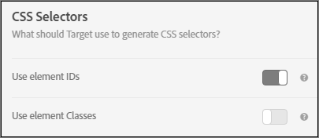

# Element Selectors Used in the Visual Experience Composer

You can find basic information about CSS selectors in the [ Selectors ](https://developer.mozilla.org/en-US/docs/Web/Guide/CSS/Getting_started/Selectors) document on the Mozilla Developer Network (MDN). 

You can set whether to use element classed or element IDs in your account preferences. Click ** [!UICONTROL  Setup &amp;gt; Preferences] **, then choose your preferred CSS selectors. 

 


>[!NOTE]
>
>Element Classes are available as selectors in A/B Test, Automated Personalization, and Multivariate Test activities.


For information about when to use CSS selectors and when to use unique IDs, see [ Visual Experience Composer Best Practices and Limitations ](../c_experiences/c_experience_composer_best_practices.md#concept_E284B3F704C04406B174D9050A2528A6). 

## How Adobe Target Generates a Selector for an Element {#section_D89D954BCBFB486CA081BE183776A475}

Target uses a simple algorithm to create a selector. Here is very brief explanation of the generation logic: 


1. If an element has an id, for example ` id="container"`, then the selector for the element is ` #container`. For Example: 


   ```
   <div class="wrapper"> 
     <div id="container"> <!-- Selector is computed for this element --> 
       <ul class="navigation"> 
         <li class="item active"> Home </li> 
         <li class="item"> Men </li> 
         <li class="item"> Women </li> 
         <li class="item"> Kids </li> 
       </ul> 
     </div> 
   </div> 
   
   ```


1. If an element contains a class attribute, Target attempts to leverage the first class of any classes present on the element. Target attempts to parse the parent element until it finds the ` &amp;lt;HTML&amp;gt;` element or an element with an id. Whenever an element contains an id and the selector is computed on its descendant child, this element's id contributes to the selector. 

   For example: 


   ```
   <div class="wrapper"> 
     <div id="container"> <!-- id is present here. It contributes to selector --> 
       <ul class="navigation"> 
         <li class="item active"> Home </li> <!-- Selector is computed for this element --> 
         <li class="item"> Men </li> 
         <li class="item"> Women </li> 
         <li class="item"> Kids </li> 
       </ul> 
     </div> 
   </div>
   ```


   In this example: 

   Selector: ` #container` > ` ul.navigation:eq(0)` > ` li.item:eq(0)` (" &gt; " indicates the immediate child.) 

   ` eq` tells the index there's an element that has "tagName=UL" and the first class is ` navigation`. Therefore, ` index` is 0. See the [ Selectors ](https://developer.mozilla.org/en-US/docs/Web/Guide/CSS/Getting_started/Selectors) article in MDN for more information. 

1. If an element does not contain a class, Target uses ` tagName` for the element and traverses up the parent element until either the ` &amp;lt;HTML&amp;gt;` element or an element with an id is found. For example: 


   ```
   <div class="wrapper"> 
     <div id="container"> <!-- id is present here. It contributes to selector --> 
       <ul class="navigation"> 
         <li> Home </li> 
         <li> Men </li> 
         <li class="active"> Women </li> 
         <li> Kids </li><!-- Selector is computed for this element --> 
       </ul> 
     </div> 
   </div>
   ```


   Selector: ` #container` > ` ul.navigation(0)` > ` li:nth-of-type(4)` 

   You can learn more about [ nth-of-type on the CSS Tricks web page ](https://css-tricks.com/almanac/selectors/n/nth-of-type/). 


In the above process: 


* You can use any CSS selector as long as it uniquely identifies an element in the DOM.
* The approach above is the one used by Target. Target does not mandate that you use this approach. You can add any selector as long as point #1 is true.
* You can use any attribute in the selector. This document only uses class name as an example.

