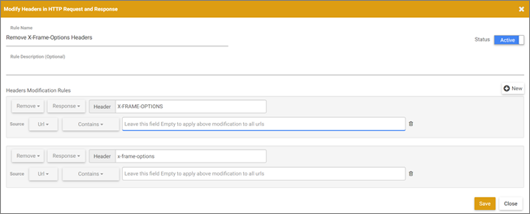

# Troubleshooting the Visual Experience Composer and Enhanced Experience Composer

The VEC is one of the main features of Adobe Target. The VEC is an editor that enables marketers and designers to create and change content using a visual interface. Many design choices can be made without requiring direct editing of the code. Editing HTML and JavaScript is also possible using the editing options available in the composer. 

The EEC is an extension of the VEC that helps you edit an experience for an iframe-busting site or pages that do not yet include the Target implementation. If you have trouble opening your page in the VEC, try the EEC. 

For information about the VEC and the EEC, see [ Experiences ](../c_experiences.md#concept_A2E10F6AFB3D4AEAB6951EE14688848D). 

## Troubleshooting Issues That are Common to Both the VEC and to the EEC {#section_AB0AAAE955DD42EBAD44114417FBC00B}

The following issues are common to both the VEC and to the EEC: 

* [ When I try to edit a page, all I see is a spinner instead of my page. (VEC and EEC) ](../c_experiences/r_troubleshoot_composer.md#section_313001039F79446DB28C70D932AF5F58) 

* [ Content Security Policy (CSP) headers block the Target libraries on my website. (VEC and EEC) ](../c_experiences/r_troubleshoot_composer.md#section_89A30C7A213D43BFA0822E66B482B803) 

* [ My hosted target.js file fails to load on subsequent page reloads. (VEC and EEC) ](../c_experiences/r_troubleshoot_composer.md#section_87F6418C2CD142A7B4D1E7037935F81F) 

* [ The VEC or EEC appears broken or does not initialize... ](../c_experiences/r_troubleshoot_composer.md#section_5AC3BA8F8FBB451EA814F298D0645E54) 

* [ The VEC or EEC does not show my rotating banners... ](../c_experiences/r_troubleshoot_composer.md#section_8B5BE6EB050B42D6A14A054724C41330) 

* [ When I change one element on the page, multiple elements change. (VEC and EEC) ](../c_experiences/r_troubleshoot_composer.md#section_309188ACF34942989BE473F63C5710AF) 

* [ I can't edit experiences for an iFrame-busting site. (VEC and EEC) ](../c_experiences/r_troubleshoot_composer.md#section_9FE266B964314F2EB75604B4D7047200) 

* [ I want to set up tests on pages that don... ](../c_experiences/r_troubleshoot_composer.md#section_DE63BCCB5B124E10A71FA579B582A80A) 

* [ Bold and italic text styles with Edit Text/HTML or Change text/HTML do not show on my page. Sometimes the text disappears after applying these style changes. (VEC and EEC) ](../c_experiences/r_troubleshoot_composer.md#section_7A71D6DF41084C58B34C18701E8774E5) 

* [ For Automated Personalization activities, image swapping appears broken in the VEC or EEC. (VEC and EEC) ](../c_experiences/r_troubleshoot_composer.md#section_88AABFDFE6A3420299B0D508B12A3994) 

## Troubleshooting Issues That are Specific to the VEC Only {#section_FB07E7F92B22413981CCEF7EDD101AE1}

The following issues are specific the VEC only: 

* [ When I open my website in the Visual Experience Composer... ](../c_experiences/r_troubleshoot_composer.md#section_8A7D3F4AD2CC4C3B823EE9432B97E06F) 

* [ My page does not display in the VEC (VEC only) ](../c_experiences/r_troubleshoot_composer.md#section_87B3BEA4B6174CFDA6C9A69A1A051FA1) 

* [ My page won't open in the EEC, or loads slowly. Activities or experiences load slowly in the VEC. (VEC only) ](../c_experiences/r_troubleshoot_composer.md#section_71E7601BE9894E3DA3A7FBBB72B6B0C1) 

* [ When launching a URL for a VEC activity, the console displays the following error message: "Uncaught ReferenceError:_AT is not defined." (VEC only) ](../c_experiences/r_troubleshoot_composer.md#section_BB5B9B629AC4452496A82943EFF72B85) 

* [ The VEC appears broken when I use browse mode. (VEC only) ](../c_experiences/r_troubleshoot_composer.md#section_FA2A18E8FD6A4274B2E395DBAA2FB407) 

## Troubleshooting Issues That are Specific to the EEC Only {#section_0457F31318C149F1B60D076DB059F122}

The following issues are specific to the EEC only: 

* [ The EVEC won't load an internal QA URL that is not accessible on public IP (EEC only) ](../c_experiences/r_troubleshoot_composer.md#section_D29E96911D5C401889B5EACE267F13CF) 

* [ The EEC won't load on secure pages on my site that use TLS 1.2 (EEC only) ](../c_experiences/r_troubleshoot_composer.md#section_C5B31E3D32A844F68E5A8153BD17551F) 

* [ I'm seeing timeouts or "access denied" errors when loading sites with proxy enabled (EEC only) ](../c_experiences/r_troubleshoot_composer.md#section_60CBB9022DC449F593606C0E6252302D) 

## Issues Related to the Visual Experience Composer (VEC) and Enhanced Experience Composer (EEC) {#section_EE5D791D31A44EA18691D52684E8E493}

## When I try to edit a page, all I see is a spinner instead of my page. (VEC and EEC) {#section_313001039F79446DB28C70D932AF5F58}

This can happen if the URL contains a # character. To fix the issue, switch into Browse mode in the Visual Experience Composer, and then switch back to Compose mode. The spinner should go away and the page should load. 

## Content Security Policy (CSP) headers block the Target libraries on my website. (VEC and EEC) {#section_89A30C7A213D43BFA0822E66B482B803}

If your website's CSP headers block Target libraries, then loads the website but prevents editing, ensure that the Target libraries are not blocked. 

 

As a workaround, you can configure a Requestly rule to remove CSP headers, as shown below: 

 

You can configure a similar Requestly rule for any header that causes a resource to not load inside the VEC. 

## The VEC or EEC appears broken or does not initialize when re-editing a saved activity. (VEC and EEC) {#section_5AC3BA8F8FBB451EA814F298D0645E54}

If the website has changed outside of the Visual Experience Composer after the experience was defined, selectors on which actions were taken earlier cannot be found when the activity is opened for re-editing. The page appears broken, and no warning displays. 

## The VEC or EEC does not show my rotating banners and other content containing JavaScript. (VEC and EEC) {#section_8B5BE6EB050B42D6A14A054724C41330}

By default, the Visual Experience Composer blocks JavaScript elements. You can work with these elements if you disable JavaScript in the Visual Experience Composer settings. Depending on how the site is set up, some items might continue to display incorrectly or to remain unavailable. 

## My hosted target.js file fails to load on subsequent page reloads. (VEC and EEC) {#section_87F6418C2CD142A7B4D1E7037935F81F}

This issue happens when customers have an ` mbox.js` version earlier than 57 (i.e. version 56 or earlier). 

We recommend that all VEC users upgrade to the [ latest version of ` mbox.js` ](../c_seting_up_target/c_implementing_target/t_mbox_download/r_mboxjs_change_log.md#reference_DBB5EDB79EC44E558F9E08D4774A0F7A), or at least upgrade to version 57. You might also consider [ making the transition to ` at.js` ](../c_seting_up_target/c_implementing_target/c_target-atjs-implementation.md#concept_8AC8D169E02944B1A547A0CAD97EAC17). 

## When I change one element on the page, multiple elements change. (VEC and EEC) {#section_309188ACF34942989BE473F63C5710AF}

If the same DOM element ID is used on multiple elements on the page, changing one of those elements changes all elements with that ID. To prevent this from happening, an ID should be used only once on each page. This is a standard HTML best practice. For more information, see [ Page Modification Scenarios ](../c_experiences/r_troubleshoot_composer/c_vec_scenarios.md#concept_A458A95F65B4401588016683FB1694DB). 

## I can't edit experiences for an iFrame-busting site. (VEC and EEC) {#section_9FE266B964314F2EB75604B4D7047200}

This issue can be addressed by enabling the Enhanced Experience Composer. Click ** [!UICONTROL  Setup] ** > ** [!UICONTROL  Preferences] **, then select the check box that enables the Enhanced Experience Composer. The Enhanced Experience Composer uses an Adobe-managed proxy to load your page for editing. This allows editing on iFrame-busting sites and allows editing on sites and pages where you have not yet added Adobe Target code. The activities do not deliver to the site until the code has been added. Some sites may not load via the Enhanced Experience Composer, in which case you can uncheck this option to load the Visual Experience Composer via an iFrame. [] 

>[!NOTE]
>
>Your locally hosted pages or pages that are not accessible outside your network are not accessible to the Adobe proxy server and cannot be opened in the EEC. These pages might include staging URLs, User Acceptance Testing (UAT) URLs, or locally hosted pages.

## I want to set up tests on pages that don't have the mbox/target implementation done yet. (VEC and EEC) {#section_DE63BCCB5B124E10A71FA579B582A80A}

See "I can't edit experiences for an iFrame-bursting site" above. 

## Bold and italic text styles with Edit Text/HTML or Change text/HTML do not show on my page. Sometimes the text disappears after applying these style changes. (VEC and EEC) {#section_7A71D6DF41084C58B34C18701E8774E5}

If you use ** [!UICONTROL  Edit Text/HTML] ** in the Visual Experience Composer for A/B or Experience Targeting activities or ** [!UICONTROL  Change Text/HTML] ** for Automated Personalization or Multivariate Test activities to make text bold or italic, those styles might not be applied on the page or the text disappears from the page in the Visual Experience Composer. This is because the way the rich-text editor applies these styles might interfere with the website markup. 

If you see this issue: 

1. Click the ** [!UICONTROL  HTML] ** button in the rich-text editor to enter source editing mode.
1. Find the styles text elements. 
    * For bold text, change ` &amp;lt;strong&amp;gt;` elements to ` &amp;lt;b&amp;gt;`.
    * For italic text, change ` &amp;lt;em&amp;gt;` elements to ` &amp;lt;i&amp;gt;`.

## For Automated Personalization activities, image swapping appears broken in the VEC or EEC. (VEC and EEC) {#section_88AABFDFE6A3420299B0D508B12A3994}

Adding an image offer to a location takes the full dimension of the original image space in the VEC or EEC. On delivery, the image is not expanded and is shown as it is, so there is no impact on delivery. 

## Issues Related to the Visual Experience Composer (VEC) Only {#section_767D7207D0FD4AB398A3193A878C4ABE}

## When I open my website in the Visual Experience Composer, the Target libraries do not load. (VEC only) {#section_8A7D3F4AD2CC4C3B823EE9432B97E06F}

Target adds two parameters ( ` mboxEdit=1` and ` mboxDisable=1`) while opening the website in the Visual Experience Composer. 

If your website (specially Single Page Apps), trims our parameters or actually removes them while navigating from one page to another (without a page reload) the Target functionality breaks and the Target libraries do not load. 
To avoid this problem, ensure that you do not trim or remove these two parameters. 
## My page won't open in the EEC, or loads slowly. Activities or experiences load slowly in the VEC. (VEC only) {#section_71E7601BE9894E3DA3A7FBBB72B6B0C1}

Several issues can affect page performance in the Target experience composers. Some common issues include: 

* You do not have an mbox on the page.
* Your site uses proxy blocking, which does not allow the page to be opened in either experience composer.
* Your site doesn't allow itself to be opened in an iFrame.

If issues occur in the Enhanced Experience Composer, try turning off the Enhanced Experience Composer and use the Visual Experience Composer instead. 

To disable the Enhanced Experience Composer, go to ** [!UICONTROL  Setup] ** > ** [!UICONTROL  Preferences] ** and turn off the ** [!UICONTROL  Enable Enhanced Experience Composer] ** option. 

Some users see the following error message in the console: 

 

If neither the Visual Experience Composer nor the Enhanced Experience Composer works, use a browser extension like Requestly (Chrome or Firefox) or Modify Response Headers (Firefox) that can overwrite the X-Frames header options for your site and allow them to be loaded in iFrames, enabling the VEC. If you are unable to use browser extensions, use the Form Composer. 

**To use the Requestly extension on Chrome or Firefox: ** 

1. Turn off the Enhanced Experienced Composer. 

1. Install the Requestly browser extension on Chrome or Firefox. 

1. Open the extension and configure it using the following: 

1. Select ** [!UICONTROL  Modify headers] **. 

1. Enter the following: 

    * Rule name 

    * Modification rules 
    
        * Toggle ** [!UICONTROL  Add] ** to ** [!UICONTROL  Remove] **. 

        * Toggle ** [!UICONTROL  Request] ** to ** [!UICONTROL  Response] **. 

        * Enter "X-Frame-Options" as the header name. 

        * Repeat previous steps and enter "x-frame-options" as the header name. 

          >[!NOTE]
          >
          >Headers that are manipulated via Requestly are case sensitive.

        * Change ** [!UICONTROL  Equals] ** to ** [!UICONTROL  Contains] ** as the condition for the source URL and enter the URL of the activity that you are trying to load in the VEC. 

       

1. Click ** [!UICONTROL  Save] **. 

    

   You should now be able to load the page quickly with the Visual Experience Composer. 

**To use the Modify Response Headers extension on Firefox: ** 

1. Install the Modify Response Headers on Firefox and restart the browser. 

1. From your Firefox extensions, select the Modify Response Headers extension. 

1. Click ** [!UICONTROL  Preferences] **. 

1. Select ** [!UICONTROL  Filter] ** from the Action drop down. 

1. In the Header Name field, enter: ** [!UICONTROL  X-Frame-Options] **. 

1. Repeat Steps 4 and 5 to add a filter with ** [!UICONTROL  x-frame-options] **. 

1. Click ** [!UICONTROL  Add] **. 

1. Click ** [!UICONTROL  Start] **. 

 

After setting up an extension, open Target. Your pages should now load in the Visual Experience Composer, even if the Enhanced Experience Composer is disabled. 

## My page does not display in the VEC (VEC only) {#section_87B3BEA4B6174CFDA6C9A69A1A051FA1}

* The browser is not supported.
* The browser is blocking a non-secure page on a secure site. Click the icon to the left of the URL in the browser address bar and click ** [!UICONTROL  Disable protection on this page] ** 

* You entered an invalid URL.
* You have not entered a default URL in your account setup page.

## When launching a URL for a VEC activity, the console displays the following error message: "Uncaught ReferenceError:_AT is not defined." (VEC only) {#section_BB5B9B629AC4452496A82943EFF72B85}

This error occurs if you try to deliver Visual Experience Composer (VEC) campaigns and you have not updated ` mbox.js` downloaded from the Target user interface with the [!UICONTROL  Support Visual Experience Composer Activities] option enabled ( [!UICONTROL  Setup] > [!UICONTROL  Implementation] > [!UICONTROL  mbox.js] > [!UICONTROL  Edit mbox.js Settings]). 

Ensure that this setting is enabled, then download and update ` mbox.js` on your website. 

## The VEC appears broken when I use browse mode. (VEC only) {#section_FA2A18E8FD6A4274B2E395DBAA2FB407}

While using browse mode, if you access a URL that does not have target.js or contains a frame-buster header, the Visual Experience Composer appears broken. Due to browser security concerns, Target cannot access the URL you navigated to. 

## Issues Related to the Enhanced Experience Composer (EEC) Only {#section_F6BED494AE654A36B6E1F510174FF1A2}

## The EEC won't load an internal QA URL that is not accessible on public IP. (EEC only) {#section_D29E96911D5C401889B5EACE267F13CF}

This can be resolved by whitelisting the following IP addresses. These IP addresses are for Adobe's server used for the Enhanced Experience Composer proxy. They are only required for activity editing. Visitors to your site do not need these IP addresses whitelisted 

Ask your IT team to whitelist the following IP addresses: 

<table id="table_E8DFD24B9B684CF182CEAFCA13ADD9C4"> 
 <thead> 
  <tr> 
   <th colname="col1" class="entry"> Region </th> 
   <th colname="col2" class="entry"> IP Addresses </th> 
  </tr> 
 </thead>
 <tbody> 
  <tr> 
   <td colname="col1"> 
United States 
 </td> 
   <td colname="col2"> 
52.55.99.45 
 </td> 
  </tr> 
  <tr> 
   <td colname="col1"> 
Europe, Middle East, and Africa (EMEA) 
 </td> 
   <td colname="col2"> 
52.51.238.221 
 </td> 
  </tr> 
  <tr> 
   <td colname="col1"> 
Asia-Pacific (APAC) 
 </td> 
   <td colname="col2"> 
52.193.67.35 
 </td> 
  </tr> 
 </tbody> 
</table>

You might see the following error message in Target: 

` Error: Your website domain (ISP) is blocking the Enhanced Experience Composer. You can whitelist the Enhanced Experience Composer's IP addresses or turn off Enhanced Experience Composer in [!UICONTROL  Configure] > [!UICONTROL  Page Delivery] menu.` 

 

The following are reasons that you might see this error message and remedies to fix the situation: 

* **Issue: **Your website domain (ISP) is blocking the Enhanced Experience Composer. 

  **Remedy: **Whitelist the IP addresses listed above. 

* **Issue: **The IP addresses are whitelisted but your website does not support TLS version 1.2. Target currently uses the default configuration of 1.2. Prior to the Target 18.4.1 (April 25, 2018), the default configuration supported TLS 1.0. For more information, see [ TLS (Transport Layer Security) Encryption Changes ](../c_seting_up_target/c_implementing_target/c_target-requirements/c_tls-transport-layer-security-encryption.md#concept_CC1001E9D3AE4BABAF90B8311B0A6451). 

  **Solution: **See the following question (The Enhanced Visual Experience Composer won't load on secure pages on my site that use TLS 1.2). 

## The EEC won't load on secure pages on my site that use TLS 1.0. (EEC only) {#section_C5B31E3D32A844F68E5A8153BD17551F}

You might see the error message described above in "The Enhanced Visual Experience Composer won't load on secure pages on my site." if the above IP addresses are whitelisted but your website does not support TLS version 1.2. Target currently uses the default configuration of 1.2. Prior to the Target 18.4.1 (April 25, 2018), the default configuration supported TLS 1.0. For more information, see [ TLS (Transport Layer Security) Encryption Changes ](../c_seting_up_target/c_implementing_target/c_target-requirements/c_tls-transport-layer-security-encryption.md#concept_CC1001E9D3AE4BABAF90B8311B0A6451). 

To check the TLS version on your website using Firefox (other browsers have similar steps): 

1. Open the affected website in Firefox. 

1. Click the ** [!UICONTROL  Show Site Information] ** icon on the browser's address bar. 

    

1. Click ** [!UICONTROL  Show Connection Details] ** > ** [!UICONTROL  More Information] **. 

    

1. Examine the TLS version information under Technical Details: 

    

1. If you find that your website is showing TLS 1.0, see [ TLS (Transport Layer Security) Encryption Changes ](../c_seting_up_target/c_implementing_target/c_target-requirements/c_tls-transport-layer-security-encryption.md#concept_CC1001E9D3AE4BABAF90B8311B0A6451) for information about Target's TLS support policy. To remedy the situation for now (valid until September 12, 2018), reach out to [ Customer Care ](../r_problem.md#reference_ACA3391A00EF467B87930A450050077C) for configuration with your TLS version and the domain. 

## I'm seeing timeouts or "access denied" errors when loading sites with proxy enabled. (EEC only) {#section_60CBB9022DC449F593606C0E6252302D}

Make sure proxy IPs are not blocked in your environment. 
